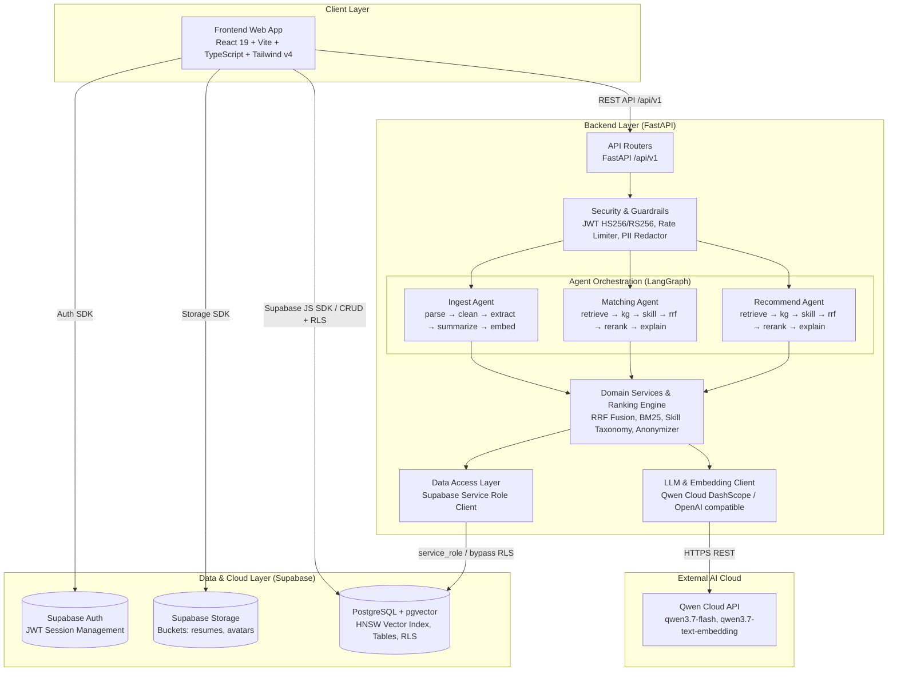
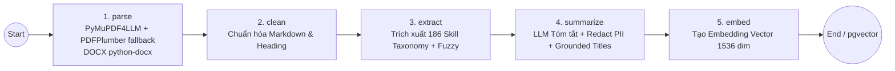
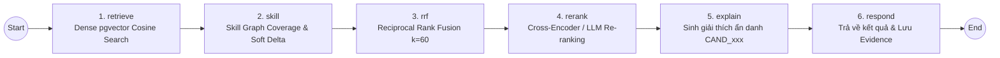

# NextJob — AI-Powered Two-Way Recruitment Platform
### Đồ án Chuyên ngành P-099 | Team Matikanefukukitaru

> **NextJob** là nền tảng tuyển dụng thông minh thế hệ mới, giải quyết triệt để bài toán lặp lại hồ sơ và kết nối không hiệu quả giữa Ứng viên và Nhà tuyển dụng thông qua hệ thống **AI Multi-Agent (LangGraph)**, **Hybrid Search Retrieval (pgvector + BM25 + Skill Graph)** và cơ chế **Dòng hồ sơ Master tái sử dụng**.

---

## 📌 Mục Lục

1. [Vấn Đề & Giải Pháp](#-vấn-đề--giải-pháp-problem--solution)
2. [Đối Tượng Người Dùng & Tính Năng Cốt Lõi](#-đối-tượng-người-dùng--tính-năng-cốt-lõi)
3. [Kiến Trúc Hệ Thống & AI Multi-Agent](#-kiến-trúc-hệ-thống--ai-multi-agent)
4. [Tech Stack](#-tech-stack)
5. [Cấu Trúc Thư Mục Repository](#-cấu-trúc-thư-mục-repository)
6. [Yêu Cầu Hệ Thống & Cài Đặt Local](#-yêu-cầu-hệ-thống--cài-đặt-local)
7. [Cấu Hình Biến Môi Trường (.env)](#-cấu-hình-biến-môi-trường-env)
8. [Khởi Chạy & Hướng Dẫn Sử Dụng Nhanh](#-khởi-chạy--hướng-dẫn-sử-dụng-nhanh)
9. [Tổng Hợp API Endpoints](#-tổng-hợp-api-endpoints)
10. [Kiểm Thử & Đánh Giá Độc Lập (Evaluation Benchmarks)](#-kiểm-thử--đánh-giá-độc-lập-evaluation-benchmarks)
11. [Bảo Mật Đa Tầng & Guardrails](#-bảo-mật-đa-tầng--guardrails)
12. [Hướng Dẫn Triển Khai (Deployment & CI/CD)](#-hướng-dẫn-triển-khai-deployment--cicd)
13. [Deliverables Checklist & Đội Ngũ Phát Triển](#-deliverables-checklist--đội-ngũ-phát-triển)

---

## 🎯 Vấn Đề & Giải Pháp (Problem & Solution)

### 1. Bối cảnh & Thực trạng
- **Đối với Ứng viên (Job Seeker)**:
  - Phải nhập liệu lặp đi lặp lại thông tin cá nhân/kinh nghiệm mỗi khi nộp đơn hoặc tạo CV mới trên các nền tảng khác nhau.
  - Các trang tuyển dụng truyền thống chỉ gợi ý việc làm dựa trên lịch sử xem/nộp đơn đơn thuần ("việc làm tương tự"), không phân tích sâu năng lực cốt lõi, khoảng trống kỹ năng (skill gaps) hay độ tương thích thực tế.
- **Đối với Nhà tuyển dụng (Recruiter)**:
  - Tốn hàng chục giờ sàng lọc thủ công hàng trăm CV với cấu trúc trình bày khác nhau.
  - Thiếu công cụ đối chiếu khách quan giữa yêu cầu công việc (JD) và hồ sơ thực tế, dễ bỏ sót ứng viên tiềm năng hoặc tuyển sai người do CV bị thổi phồng.

### 2. Giải pháp từ NextJob
- **Trình dựng CV từ Dòng hồ sơ Master (Profile Lines)**: Tách nhỏ thông tin thành các khối nội dung tái sử dụng; hỗ trợ kéo-thả, chọn lọc linh hoạt và xuất ra hơn 10 mẫu template CV chuẩn ATS chỉ trong vài giây.
- **Pipeline Ingest CV layout-aware & Bảo vệ PII**: Bóc tách tự động các định dạng PDF (kể cả dạng nhiều cột phức tạp của TopCV) / DOCX, chuẩn hóa sang Markdown, trích xuất 186+ kỹ năng chuẩn hóa và làm sạch thông tin định danh cá nhân (PII) trước khi vector hóa.
- **Gợi ý Việc làm & Khớp nối Ứng viên Hai chiều (Two-Way Hybrid Matching)**:
  - Chiều *CV ➔ JD*: Giúp ứng viên tìm việc làm phù hợp nhất kèm giải thích lý do cụ thể và chỉ ra kỹ năng cần bổ sung.
  - Chiều *JD ➔ CV Pool*: Giúp nhà tuyển dụng xếp hạng ứng viên theo độ phù hợp thực tế thông qua kết hợp Vector Search (pgvector HNSW), Keyword Search (BM25), Skill Graph Coverage và Cross-Encoder / LLM Reranking.
- **Đánh giá Năng lực Kỹ thuật Chuyên sâu (Repo Evaluation & AI Interview)**: Quét và phân tích trực tiếp repository GitHub của ứng viên kết hợp phỏng vấn mô phỏng tương tác thông minh.

---

## 👥 Đối Tượng Người Dùng & Tính Năng Cốt Lõi

```text
                               ┌─────────────────────────────────────────┐
                               │             NEXTJOB PORTAL              │
                               └────────────────────┬────────────────────┘
                     ┌──────────────────────────────┼──────────────────────────────┐
                     ▼                              ▼                              ▼
          ┌─────────────────────┐        ┌─────────────────────┐        ┌─────────────────────┐
          │      CANDIDATE      │        │      RECRUITER      │        │        ADMIN        │
          └──────────┬──────────┘        └──────────┬──────────┘        └──────────┬──────────┘
                     │                              │                              │
        • Khám phá & Lưu việc làm       • Quản lý Tin tuyển dụng        • Duyệt đơn đăng ký NTD
        • Kho Dòng hồ sơ Master         • Bàn tuyển dụng (Dashboard)    • Phân quyền Role hệ thống
        • Trình dựng CV (10 mẫu)        • AI Gợi ý Ứng viên (Matching)  • Giám sát tài khoản
        • Tủ hồ sơ CV (Vault)           • Quản lý trạng thái hồ sơ
        • AI Gợi ý Việc làm             • AI Phỏng vấn tự động
        • AI Đánh giá CV (Assessment)   • Đánh giá GitHub Repo
        • Theo dõi Đơn ứng tuyển
```

### 1. Dành cho Ứng viên (Candidate)
* **Khám phá Việc làm (`/jobs`, `/jobs/:id`)**: Tìm kiếm theo từ khóa/công ty/địa điểm, lọc theo hình thức làm việc, lưu tin yêu thích (`saved_jobs`), nộp đơn ứng tuyển trực tiếp (`job_submits`).
* **Kho Dòng hồ sơ Master (`/profile`)**: Quản lý các block thông tin (Kinh nghiệm, Học vấn, Kỹ năng, Chứng chỉ, Dự án) để tái sử dụng xuyên suốt.
* **Tủ hồ sơ CV (`/cv-vault`)**: Tải lên hồ sơ định dạng PDF/DOCX (tối đa 10MB), tự động bóc tách kỹ năng, đặt CV mặc định, xem trước file an toàn qua Supabase Signed URL.
* **Trình dựng CV Trực quan (`/cv-builder`)**:
  - Giao diện chia đôi màn hình: kéo-thả sắp xếp dòng hồ sơ từ kho Master qua `@dnd-kit`.
  - Hỗ trợ **10 mẫu template chuyên nghiệp**: *Modern, Sidebar, Classic, Compact, Elegant, Minimal, Professional, Creative, Timeline, Two Column*.
  - Xuất file PDF linh hoạt: Bản dựng hình ảnh độ nét cao (khớp 100% tiếng Việt) hoặc Bản chữ sắc nét chuẩn ATS.
* **AI Gợi ý Việc làm Cá nhân hóa (`/ai-suggestions`)**: Chatbot tương tác đối thoại, tự động đối chiếu CV mặc định với pool việc làm đang mở, phân nhóm trực quan (*Phù hợp cao ≥45%*, *Bình thường ≥30%*, *Chưa phù hợp <30%*) kèm giải thích chi tiết.
* **AI Đánh giá CV (`/cv-assessment`)**: Chấm điểm CV theo tiêu chuẩn ngành, chỉ ra điểm mạnh, điểm yếu và đề xuất hành động nâng cấp hồ sơ.
* **Quản lý Đơn ứng tuyển (`/applications`)**: Theo dõi lộ trình xét duyệt hồ sơ theo thời gian thực (*Pending ➔ Reviewing ➔ Interviewed ➔ Offered / Rejected*), hỗ trợ rút đơn an toàn.
* **Đăng ký làm Nhà tuyển dụng (`/recruiter-register`)**: Nộp hồ sơ pháp lý doanh nghiệp kèm giấy phép kinh doanh chờ phê duyệt từ Admin.

### 2. Dành cho Nhà tuyển dụng (Recruiter)
* **Bàn tuyển dụng Thông minh (`/dashboard`)**:
  - Tạo, cập nhật và quản lý tin tuyển dụng (chuyển trạng thái linh hoạt: *Bản nháp / Đang tuyển / Đã đóng / Lưu trữ*).
  - Quản lý danh sách hồ sơ ứng tuyển theo từng tin, cập nhật trạng thái kèm ghi chú lịch sử.
* **AI Gợi ý & Xếp hạng Ứng viên (`/ai-candidates`)**:
  - Tự động quét pool ứng viên đã nộp đơn cho vị trí đang tuyển.
  - Áp dụng mô hình **Hybrid Ranking (pgvector + BM25 + Skill Graph + LLM Reranking)**.
  - Tự động ẩn danh thông tin cá nhân (`CAND_001`, `CAND_002`...) trước khi đưa vào LLM để đảm bảo tính khách quan và bảo vệ dữ liệu.
  - Sinh giải thích ngắn gọn, súc tích (1-2 câu tiếng Việt) nêu rõ lý do phù hợp.
* **AI Phỏng vấn Mô phỏng (`/ai-interview`)**: Khởi tạo phiên phỏng vấn tương tác thông minh với các câu hỏi thích ứng theo yêu cầu JD và năng lực ứng viên.
* **Đánh giá Mã nguồn GitHub (`/repo-evaluation`)**: Nhập đường dẫn repository GitHub của ứng viên để phân tích chất lượng code, độ phủ test, kiến trúc dự án và mức độ đáp ứng kỹ năng thực tế.

### 3. Dành cho Quản trị viên (Admin)
* **Phê duyệt Doanh nghiệp (`/admin`)**: Tiếp nhận, xem xét giấy phép kinh doanh, phê duyệt hoặc từ chối đơn đăng ký nhà tuyển dụng; tự động nâng role và khởi tạo bản ghi công ty (`companies`).
* **Quản lý & Điều chỉnh Phân quyền (`/admin`, `/profile`)**: Tra cứu người dùng và linh hoạt gán role (*candidate / recruiter / admin*).

---

## 🏗 Kiến Trúc Hệ Thống & AI Multi-Agent

### 1. Sơ đồ Kiến trúc Tổng thể (Overall Architecture)



---

### 2. Chi tiết các AI Agent Pipelines (LangGraph)

#### A. Ingest Agent (`backend/app/agents/ingest/`)
Quy trình tự động kích hoạt khi ứng viên tải lên CV (PDF/DOCX) hoặc xuất CV từ CV Builder:



1. **`parse`**: Bóc tách layout nhị phân sang Markdown qua `pymupdf4llm`. Nếu số lượng ký tự $< 600$ (thường gặp ở CV 2 cột phức tạp), hệ thống tự động kích hoạt fallback `pdfplumber` để phân tách cột theo tọa độ trục hoành ($x$-coordinates). Đọc tệp `.docx` qua `python-docx`.
2. **`clean`**: Loại bỏ ký tự rác OCR (`\x00`, `\ufeff`), chuẩn hóa khoảng trắng và định dạng tiêu đề Markdown (`## Heading`).
3. **`extract` (Extract-First)**: Quét trực tiếp trên văn bản gốc dựa trên từ điển 186 kỹ năng chuẩn hóa và đồ thị `skill_graph.json` với `rapidfuzz` (ngưỡng tương đồng 88). Chạy **trước** bước summarize để đảm bảo không bị mất kỹ năng do LLM cắt ngắn.
4. **`summarize`**: Sử dụng `qwen3.7-flash` (JSON Mode) tóm tắt kinh nghiệm làm việc, áp dụng cơ chế lọc chức danh chống bịa đặt (`grounded_titles`) và xóa sạch thông tin PII.
5. **`embed`**: Gọi mô hình `qwen3.7-text-embedding` tạo vector 1536 chiều và lưu trữ nguyên tử vào bảng `public.embedded_resumes` (pgvector HNSW index).

---

#### B. Matching Agent (`backend/app/agents/matching/`)
Quy trình hỗ trợ Nhà tuyển dụng xếp hạng ứng viên cho một vị trí công việc:



* **Reciprocal Rank Fusion (RRF)**: Kết hợp bảng xếp hạng Semantic Search (Dense Cosine Distance) và Keyword Search (BM25) theo công thức:
  $$\text{RRF\_Score}(d) = \sum_{m \in M} \frac{w_m}{k + r_m(d)} \quad (k = 60)$$
* **Bảo vệ PII trong Prompting**: Thay thế danh tính thật bằng các mã định danh ẩn danh (`CAND_001`, `CAND_002`...) trước khi gửi vào LLM sinh giải thích, sau đó khôi phục lại ID nguyên bản.
* **Deterministic Fallback**: Tự động sinh giải thích dựa trên bằng chứng kỹ năng thực tế nếu LLM gặp sự cố mạng hoặc timeout.

---

#### C. Recommend Agent (`backend/app/agents/recommend/`)
Quy trình gợi ý việc làm cho ứng viên (CV ➔ JD):
* Truy xuất tin tuyển dụng đang hoạt động từ bảng cache vector `public.embedded_jobs`.
* Áp dụng bộ lọc ràng buộc kỹ năng tiên quyết (**Must-have Constraints Gating**).
* Thực thi RRF Fusion và LLM Reranking để trả về danh sách việc làm phù hợp nhất kèm giải thích lý do.

---

## 💻 Tech Stack

| Thành phần | Công nghệ / Thư viện | Vai trò & Mục đích sử dụng |
|---|---|---|
| **AI / Orchestration** | `LangGraph`, `LangChain` | Quản lý stateful multi-agent workflows và conditional routing |
| **LLM & Embeddings** | `Qwen Cloud (DashScope)` / OpenAI API | `qwen3.7-flash` (Chat/Summarize/Rerank), `qwen3.7-text-embedding` (1536 dim) |
| **CV Processing** | `pymupdf4llm`, `pdfplumber`, `python-docx`, `rapidfuzz` | Parse layout PDF/DOCX, trích xuất cấu trúc văn bản và 186 Skill Taxonomy |
| **Backend Framework** | `FastAPI`, `Pydantic v2`, `Uvicorn` | RESTful API hiệu năng cao, validate schema chặt chẽ, async I/O |
| **Database & Vector** | `Supabase Local / Cloud`, `PostgreSQL 15+`, `pgvector` | Lưu trữ dữ liệu quan hệ, tìm kiếm vector cosine với chỉ mục **HNSW** |
| **Auth & Security** | `Supabase Auth`, `PyJWT`, `Token Bucket Rate Limiter` | Xác thực JWT (HS256 local / RS256 JWKS cloud), chống brute-force và IDOR |
| **Frontend Framework** | `React 19`, `Vite 8`, `TypeScript 5.7` | Giao diện Single Page Application (SPA), type-safe, tốc độ tải tức thì |
| **Styling & UI Components** | `Tailwind CSS v4`, `Framer Motion`, `Lucide React` | Giao diện Responsive hiện đại, hỗ trợ Dark/Light mode và chuyển động mượt mà |
| **CV Builder Tooling** | `@dnd-kit`, `html2canvas`, `jsPDF` | Kéo thả sắp xếp nội dung và xuất file PDF chất lượng cao đa chế độ |
| **Testing & Quality** | `pytest`, `pytest-asyncio`, `respx`, `ruff` | Kiểm thử tự động (98+ tests), mock HTTP client, linting & code formatting |
| **DevOps & Infra** | `Docker`, `AWS EC2 (t4)`, `Vercel`, `Supabase Cloud` | Triển khai hạ tầng phân tán, container hóa dịch vụ & CI/CD tự động |

---

## 📁 Cấu Trúc Thư Mục Repository

```text
team-Matikanefukukitaru/
├── backend/                         # Source code Backend (FastAPI)
│   ├── app/
│   │   ├── agents/                  # LangGraph AI Multi-Agent Workflows
│   │   │   ├── ingest/              # Pipeline xử lý & vector hóa CV
│   │   │   ├── matching/            # Pipeline gợi ý ứng viên cho nhà tuyển dụng (JD -> CV)
│   │   │   ├── recommend/           # Pipeline gợi ý việc làm cho ứng viên (CV -> JD)
│   │   │   ├── interview/           # Agent phỏng vấn mô phỏng thông minh
│   │   │   ├── evaluation/          # Agent đánh giá mã nguồn GitHub & CV
│   │   │   └── routing/             # Intent classifier & request router
│   │   ├── api/
│   │   │   ├── routes/              # HTTP Route Handlers (admin, resumes, chat, candidates...)
│   │   │   └── schemas/             # Pydantic Request/Response DTOs
│   │   ├── services/                # Business logic, RRF Fusion, Skill Graph, Anonymizer
│   │   ├── repositories/            # Data Access Layer (Supabase Postgres)
│   │   ├── clients/                 # HTTP/SDK Clients (Qwen LLM, Supabase Client)
│   │   ├── core/                    # Core Security, JWT Verification, Exceptions
│   │   ├── guardrails/              # Rate Limiter, PII Redaction, Input Sanitization
│   │   ├── config/                  # Quản lý cấu hình tập trung (env.py)
│   │   └── main.py                  # Điểm khởi động FastAPI application
│   ├── Dockerfile                   # Dockerfile cho Backend
│   └── requirements.txt             # Python dependencies
├── frontend/                        # Source code Frontend (React 19 + Vite)
│   ├── src/
│   │   ├── pages/                   # Các trang màn hình chính (20 pages)
│   │   ├── components/              # Shared UI Components, Protected & Role Routes
│   │   ├── context/                 # React Contexts (Auth, Lang, Theme, Toast)
│   │   ├── lib/                     # Supabase client, API client, SSE streaming helper
│   │   └── types.ts                 # TypeScript type definitions
│   ├── package.json                 # Node dependencies & scripts
│   └── vite.config.ts               # Cấu hình Vite & Tailwind v4
├── supabase/                        # Hạ tầng Cơ sở dữ liệu Supabase
│   ├── migrations/                  # Các file SQL Migration theo phiên bản
│   ├── seed.sql                     # Dữ liệu khởi tạo mẫu (Users, Profiles, Jobs, Resumes)
│   └── config.toml                  # Cấu hình Supabase Local
├── evaluation/                      # Framework đánh giá chất lượng Ingest & Matching
│   └── ingest_eval_v2/              # Golden Dataset 41 CVs & Automated LLM-judge Evaluator
├── tests/                           # Kiểm thử tự động (Unit, API, Agents Integration)
│   ├── unit/                        # Kiểm thử đơn vị các node LangGraph & services
│   ├── api/                         # Kiểm thử các endpoint FastAPI
│   └── conftest.py                  # Fixtures & cấu hình pytest
├── docs/                            # Tài liệu kỹ thuật chi tiết
│   ├── architecture.md              # Kiến trúc hệ thống tổng thể & phân tầng
│   ├── user-guide.md                # Hướng dẫn sử dụng giao diện web
│   ├── guardrail-input-output-design.md # Đặc tả an toàn PII & Guardrails
│   └── DEPLOYMENT.md                # Hướng dẫn triển khai Vercel, Render & Supabase Cloud
├── scripts/                         # Tiện ích phát triển, mock data & smoke test
├── dev.ps1                          # Script chạy toàn bộ stack trên Windows với 1 lệnh
└── render.yaml                      # Cấu hình Render Blueprint cho Backend
```

---

## ⚙️ Yêu Cầu Hệ Thống & Cài Đặt Local

### Yêu Cầu Phần Mềm
* **Python**: `3.11+`
* **Node.js**: `18+` (khuyến nghị dùng `pnpm` hoặc `npm`)
* **Docker Desktop**: Cần thiết để khởi chạy Supabase Local Stack (PostgreSQL, Auth, Storage, Studio)
* **Supabase CLI**: Sử dụng thông qua `npx supabase` (không bắt buộc cài global)

---

### Hướng Dẫn Cài Đặt Từng Bước (Step-by-Step)

#### Bước 1: Khởi tạo Backend (Python Virtual Environment)
Mở terminal tại thư mục gốc dự án:

* **Trên Windows (PowerShell)**:
  ```powershell
  python -m venv .venv
  .\.venv\Scripts\Activate.ps1
  python -m pip install -U pip
  pip install -r requirements.txt
  copy backend\.env.example .env
  ```

* **Trên macOS / Linux**:
  ```bash
  python3 -m venv .venv
  source .venv/bin/activate
  python -m pip install -U pip
  pip install -r requirements.txt
  cp backend/.env.example .env
  ```

#### Bước 2: Cài đặt Dependencies cho Frontend
* **Trên Windows (PowerShell)**:
  ```powershell
  cd frontend
  copy .env.example .env
  pnpm install   # hoặc npm install
  cd ..
  ```

* **Trên macOS / Linux**:
  ```bash
  cd frontend
  cp .env.example .env
  pnpm install   # hoặc npm install
  cd ..
  ```

#### Bước 3: Khởi động Supabase Local Stack
*Đảm bảo Docker Desktop đang chạy trước khi thực hiện lệnh sau:*

```bash
npx supabase start
npx supabase db reset
npx supabase status
```

> Lệnh `npx supabase db reset` sẽ tự động chạy toàn bộ migration trong `supabase/migrations/` và nạp dữ liệu mẫu từ `supabase/seed.sql`.

---

## 🔐 Cấu Hình Biến Môi Trường (.env)

Sau khi chạy `npx supabase status`, cập nhật các khóa kết nối vào file **`.env` ở thư mục gốc** và **`frontend/.env`**:

### 1. File `.env` (Thư mục Gốc / Backend)

| Tên biến | Bắt buộc | Giá trị mẫu / Mô tả |
|---|:---:|---|
| `APP_ENV` | Không | `development` (hoặc `production`) |
| `CORS_ORIGINS` | Không | `http://localhost:3000,http://localhost:5173` |
| `SUPABASE_URL` | **Có** | Lấy từ `API URL` (`http://127.0.0.1:54321`) |
| `SUPABASE_ANON_KEY` | **Có** | Lấy từ `anon key` trong lệnh `npx supabase status` |
| `SUPABASE_SERVICE_ROLE_KEY` | **Có** | Lấy từ `service_role key` (cho phép backend bypass RLS an toàn) |
| `SUPABASE_JWT_SECRET` | **Có** | Chuỗi bí mật JWT (mặc định local có trong `.env.example`) |
| `QWEN_API_KEY` | **Có** | API Key từ Alibaba Cloud DashScope (dùng cho AI Matching / Ingest) |
| `QWEN_BASE_URL` | Không | `https://dashscope-intl.aliyuncs.com/compatible-mode/v1` |
| `LLM_MODEL` | Không | `qwen3.7-flash` (mặc định) |
| `EMBEDDING_MODEL` | Không | `qwen3.7-text-embedding` (mặc định, sinh vector 1536 dim) |

### 2. File `frontend/.env` (Frontend Client)

| Tên biến | Bắt buộc | Giá trị mẫu |
|---|:---:|---|
| `VITE_API_BASE_URL` | **Có** | `http://localhost:8000` |
| `NEXT_PUBLIC_SUPABASE_URL` | **Có** | `http://127.0.0.1:54321` |
| `NEXT_PUBLIC_SUPABASE_ANON_KEY` | **Có** | Điền `anon key` của Supabase |

---

## 🚀 Khởi Chạy & Hướng Dẫn Sử Dụng Nhanh

### 1. Khởi chạy toàn bộ hệ thống (1 Lệnh duy nhất trên Windows)
```powershell
.\dev.ps1
```
*Script sẽ tự động khởi động Supabase, chạy Backend Uvicorn trên cổng 8000 và chạy Frontend Vite trên cổng 3000.*

---

### 2. Khởi chạy thủ công từng dịch vụ (Manual Run)

* **Terminal 1 — Supabase & Backend**:
  ```bash
  npx supabase start
  # Kích hoạt .venv rồi chạy:
  uvicorn backend.app.main:app --reload --host 0.0.0.0 --port 8000
  ```

* **Terminal 2 — Frontend**:
  ```bash
  cd frontend
  pnpm dev       # Chạy tại http://localhost:3000
  ```

---

### 3. Danh sách Địa chỉ Truy cập Dịch vụ

| Dịch vụ | URL | Chức năng |
|---|---|---|
| **Frontend Web App** | [http://localhost:3000](http://localhost:3000) | Giao diện người dùng NextJob |
| **API Documentation** | [http://localhost:8000/docs](http://localhost:8000/docs) | Swagger UI tương tác trực tiếp API |
| **API Health Check** | [http://localhost:8000/health](http://localhost:8000/health) | Kiểm tra trạng thái máy chủ backend |
| **Supabase Studio** | [http://127.0.0.1:54323](http://127.0.0.1:54323) | Giao diện quản trị Database, Auth, Storage |

---

```powershell
.\.venv\Scripts\python.exe scripts\seed_upload_generated_cvs.py
```
### 4. Tài khoản Đăng nhập Mẫu (Seed Accounts)
Hệ thống đi kèm sẵn 3 tài khoản mẫu được kích hoạt sẵn với mật khẩu chung: **`password123`**:

| Email | Vai trò (Role) | Chức năng kiểm thử chính |
|---|---|---|
| `candidate@example.com` | `candidate` | Tìm việc, tạo CV, tải CV, xem gợi ý việc làm AI, nộp đơn |
| `recruiter@example.com` | `recruiter` | Đăng tin tuyển dụng, xem danh sách ứng viên, AI matching |
| `admin@example.com` | `admin` | Phê duyệt đơn đăng ký nhà tuyển dụng, chỉnh sửa role |

> 💡 **Khởi tạo dữ liệu CV mẫu & Vector Embedding**:
> Sau khi chạy `db reset`, dữ liệu CV đã có trong SQL nhưng chưa có file vật lý trên Storage. Để nạp file PDF và tự động sinh vector embedding:
> ```bash
> python scripts/seed_mock_cvs.py
> ```

---

## 📡 Tổng Hợp API Endpoints

Tất cả các endpoint (ngoại trừ `/health`) đều yêu cầu Bearer JWT Token gửi qua Header `Authorization: Bearer <access_token>` từ Supabase Auth.

| Nhóm chức năng | Phương thức | Đường dẫn Endpoint | Quyền hạn (Role) | Mô tả chi tiết |
|---|:---:|---|:---:|---|
| **Hệ thống** | `GET` | `/health`, `/api/v1/health` | Public | Kiểm tra tình trạng hoạt động của API server |
| **Hồ sơ cá nhân** | `GET` | `/api/v1/profiles/me` | Authenticated | Lấy thông tin chi tiết tài khoản hiện tại |
| | `PATCH` | `/api/v1/profiles/me` | Authenticated | Cập nhật thông tin cá nhân |
| **Xử lý CV & Ingest** | `POST` | `/api/v1/resumes/{id}/ingest` | Candidate / Recruiter | Thực thi pipeline bóc tách, trích skill & vector hóa CV |
| **AI Matching & Chat** | `POST` | `/api/v1/chat` | Authenticated | Đối thoại AI, nhận gợi ý việc làm hoặc ứng viên (Rate-limited) |
| **Đánh giá Năng lực** | `POST` | `/api/v1/candidates/repo-eval` | Recruiter / Candidate | Phân tích chất lượng mã nguồn GitHub ứng viên |
| | `POST` | `/api/v1/evaluation/cv-assess` | Candidate | Đánh giá & chấm điểm CV theo tiêu chuẩn ngành |
| **Quản trị Admin** | `PATCH` | `/api/v1/admin/profiles/{id}` | Admin | Thay đổi quyền hạn (role) của tài khoản bất kỳ |
| | `POST` | `/api/v1/admin/recruiter-forms/{id}/review` | Admin | Phê duyệt hoặc từ chối đơn đăng ký nhà tuyển dụng |

---

## 📊 Kiểm Thử & Đánh Giá Độc Lập (Evaluation Benchmarks)

Hệ thống tích hợp bộ công cụ đánh giá độc lập **Golden Dataset** (`evaluation/ingest_eval_v2/`) nhằm liên tục kiểm định chất lượng bóc tách và vector hóa CV trên **41 CV mẫu** (bao gồm CV tổng hợp và CV thực tế dạng nhiều cột từ TopCV.vn).

### Các Tiêu Chí Đánh Giá Cốt Lõi:
1. **Parse Success Rate**: Tỷ lệ bóc tách thành công layout và văn bản từ định dạng PDF/DOCX.
2. **PII Leakage Prevention**: Tỷ lệ lọc sạch thông tin nhạy cảm (Email, SĐT, CCCD...) kiểm định qua Regex và LLM-Judge.
3. **Summarization Faithfulness**: Mức độ trung thực của bản tóm tắt, ngăn chặn hiện tượng LLM tự bịa đặt kỹ năng hoặc chức danh.
4. **Skill Extraction Precision & Recall**: Độ chính xác đối chiếu với từ điển 186 kỹ năng chuẩn hóa.
5. **Latency Profiling**: Thời gian xử lý chi tiết qua từng node trong đồ thị LangGraph.

### Lệnh Chạy Benchmark:
*Đảm bảo đã cấu hình `OPENAI_API_KEY` hoặc `QWEN_API_KEY` trong `.env`*:

```bash
# Chạy đánh giá toàn bộ 41 CV trong Golden Dataset
python -m evaluation.ingest_eval_v2.run_eval

# Chạy thử nhanh trên 5 CV ngẫu nhiên
python -m evaluation.ingest_eval_v2.run_eval --limit 5
```

> Báo cáo chi tiết sau khi chạy sẽ được tự động xuất ra tệp `evaluation/ingest_eval_v2/results/report.md`.

---

## 🛡 Bảo Mật Đa Tầng & Guardrails

Hệ thống tuân thủ nguyên tắc **Phòng vệ theo chiều sâu (Defense-in-Depth)**:

1. **Xác thực Đa tầng (JWT Authentication & Fail-Fast)**:
   - Xác thực token bằng Supabase JWT qua `backend/app/core/security.py`.
   - Hỗ trợ giải mã thuật toán **HS256** cho môi trường Local và **RS256/ES256** qua JWKS cho môi trường Production.
   - Cơ chế *Fail-Fast*: Server sẽ từ chối khởi động nếu phát hiện cấu hình thiếu an toàn (ví dụ: dùng secret mặc định trên Production hoặc `CORS_ORIGINS=*`).
2. **Quyền Riêng tư & Bảo vệ PII Tuyệt đối**:
   - **Tầng Ingest**: Loại bỏ tự động số điện thoại, email, địa chỉ, ngày sinh và CCCD trước khi lưu vào vector store.
   - **Tầng Prompting**: Mã hóa danh tính ứng viên thành mã ẩn danh (`CAND_001`, `CAND_002`...) trước khi gửi tới LLM.
3. **Chống Chi tiêu Vượt mức & Tấn công DoS (Rate Limiter)**:
   - Bộ giới hạn tần suất dựa trên IP và User ID (`InMemoryRateLimiter`) giới hạn tối đa 20 requests/phút cho các endpoint nhạy cảm (`/chat`, `/ingest`).
4. **Kiểm soát Quyền Truy cập Dữ liệu (IDOR Prevention & RLS)**:
   - Kiểm tra quyền sở hữu công việc (`owner_id`, `recruiter_id`) chặt chẽ tại tầng Service trước khi thực thi truy vấn.
   - Bảng nhạy cảm `public.embedded_resumes` được cô lập hoàn toàn khỏi Data API công khai, chỉ backend `service_role` mới có quyền truy cập.

---

## 🧪 Kiểm Thử Tự Động (Automated Testing)

```bash
# Chạy toàn bộ 98+ Unit Tests & Integration Tests
pytest tests/ -v

# Chạy kiểm thử riêng cho các Agent LangGraph
pytest tests/unit/test_matching_graph.py tests/unit/test_ingest_graph.py -v

# Kiểm tra định dạng & Linting mã nguồn Python
ruff check backend/ tests/
ruff format --check backend/ tests/

# Kiểm tra Typecheck Frontend
cd frontend && pnpm lint
```

---

## 🌐 Hướng Dẫn Triển Khai (Deployment & CI/CD)

Dự án được cấu hình sẵn sàng triển khai trên hạ tầng điện toán đám mây:
* **Database, Auth & Storage**: [Supabase Cloud](https://supabase.com) (tự động đẩy SQL Migration qua GitHub Actions).
* **Backend API & AI Agents**: [AWS EC2 (t4 family)](https://aws.amazon.com/ec2/) / [Render](https://render.com) (Dockerized FastAPI Container).
* **Frontend Web**: [Vercel](https://vercel.com) (Single Page Application tối ưu hóa toàn cầu).

> 📖 Xem hướng dẫn triển khai chi tiết từng bước tại tài liệu [`DEPLOYMENT.md`](DEPLOYMENT.md).  
> 📑 Xem phân tích kiến trúc hạ tầng & lý do lựa chọn chi tiết tại Báo cáo phân tích hệ thống [`reports/bao_cao_phan_tich_thiet_ke_he_thong.md`](reports/bao_cao_phan_tich_thiet_ke_he_thong.md).

---

## 📋 Deliverables Checklist

- [x] **Source Code**: Mã nguồn hoàn chỉnh Backend (FastAPI), Frontend (React 19) & Database Schema (Supabase).
- [x] **README.md**: Tài liệu hướng dẫn chi tiết, cấu trúc phân tầng và quy trình vận hành.
- [x] **Architecture Specifications**: Sơ đồ kiến trúc tổng thể ([`docs/architecture.md`](docs/architecture.md)).
- [x] **Security & Guardrails Report**: Báo cáo bảo vệ PII & kiểm soát truy cập ([`SECURITY_REPORT.md`](SECURITY_REPORT.md)).
- [x] **Evaluation Benchmarks**: Bộ đánh giá chất lượng Ingest trên 41 CV ([`evaluation/ingest_eval_v2/`](evaluation/ingest_eval_v2/)).
- [x] **Deployment Guide**: Hướng dẫn CI/CD triển khai trên Vercel, Render & Supabase ([`DEPLOYMENT.md`](DEPLOYMENT.md)).
- [x] **Weekly Journal & Worklog**: Nhật ký tiến độ và phân công nhiệm vụ ([`JOURNAL.md`](JOURNAL.md), [`WORKLOG.md`](WORKLOG.md)).
- [x] **Slide Presentation**: Slide thuyết trình báo cáo đồ án ([`Slide.pdf`](Slide.pdf)).

---

## 👥 Đội Ngũ Phát Triển (Team Matikanefukukitaru)

| Thành viên | Vai trò | Mã sinh viên | Trách nhiệm chính |
|---|---|:---:|---|
| **Nguyễn Việt Linh** | Product Owner / PM | `2A202601211` | Quản lý tiến độ, thiết kế yêu cầu sản phẩm & kiến trúc tổng thể |
| **Trần Duy Khánh** | AI Engineer | `2A202601696` | Xây dựng LangGraph Agents (Ingest, Matching, Recommend), Benchmark Evaluation |
| **Nguyễn Văn Dương** | Fullstack Developer | `2A202601400` | Phát triển Frontend UI/UX, tích hợp Supabase SDK & API Backend |
| **Ngô Trọng Bảo** | Fullstack Developer | `2A202601024` | Xây dựng FastAPI endpoints, cơ sở dữ liệu Supabase & CI/CD Pipeline |

---

<div align="center">
  <sub>Được phát triển với đam mê bởi Team Matikanefukukitaru — AI20K Build Phase Cohort 3.</sub>
</div>
