# BÁO CÁO PHÂN TÍCH VÀ THIẾT KẾ HỆ THỐNG
## NỀN TẢNG TUYỂN DỤNG THÔNG MINH HAI CHIỀU TÍCH HỢP TRÍ TUỆ NHÂN TẠO (NEXTJOB)

**Đồ án Chuyên ngành:** P-099  
**Đơn vị thực hiện:** Nhóm Matikanefukukitaru — AI20K Build Phase Cohort 3  
**Ngày hoàn thành:** 30/08/2026  
**Trạng thái tài liệu:** Tài liệu Thiết kế Kỹ thuật & Báo cáo Học thuật Toàn diện (Production-Ready Spec)

---

## 📑 MỤC LỤC

1. [CHƯƠNG 1: TỔNG QUAN DỰ ÁN VÀ TÍNH CẤP THIẾT](#chương-1-tổng-quan-dự-án-và-tính-cấp-thiết)
   - 1.1. Bối cảnh và Đặt vấn đề
   - 1.2. Mục tiêu Nghiên cứu và Phát triển Hệ thống
   - 1.3. Đối tượng Sử dụng và Phạm vi Nghiên cứu
   - 1.4. Các Khái niệm và Thuật ngữ Cốt lõi
2. [CHƯƠNG 2: PHÂN TÍCH YÊU CẦU HỆ THỐNG](#chương-2-phân-tích-yêu-cầu-hệ-thống)
   - 2.1. Phân tích Yêu cầu Chức năng (Functional Requirements - FR)
   - 2.2. Phân tích Yêu cầu Phi chức năng (Non-Functional Requirements - NFR)
   - 2.3. Mô hình Hóa Ca sử dụng (Use Case Modeling & Specifications)
3. [CHƯƠNG 3: PHÂN TÍCH VÀ THIẾT KẾ DỮ LIỆU](#chương-3-phân-tích-và-thiết-kế-dữ-liệu)
   - 3.1. Mô hình Thực thể - Liên kết (Entity-Relationship Diagram - ERD)
   - 3.2. Đặc tả Lược đồ Cơ sở Dữ liệu Quan hệ (Relational Schema)
   - 3.3. Thiết kế Không gian Vector và Chỉ mục HNSW (pgvector Store)
   - 3.4. Đồ thị Tri thức Kỹ năng Chuẩn hóa (Skill Taxonomy & Knowledge Graph)
4. [CHƯƠNG 4: THIẾT KẾ KIẾN TRÚC HỆ THỐNG](#chương-4-thiết-kế-kiến-trúc-hệ-thống)
   - 4.1. Kiến trúc Tổng thể Phân tầng (Multi-tier System Architecture)
   - 4.2. Kiến trúc Phân tầng Mã nguồn Backend (Clean Layered Architecture)
   - 4.3. Thiết kế Hệ thống AI Multi-Agent với LangGraph
   - 4.4. Thuật toán Xếp hạng Lai (Hybrid Ranking & Reciprocal Rank Fusion)
   - 4.5. Thiết kế Hệ thống Phòng vệ An ninh Ba Lớp (Three-Layer Guardrail Architecture)
5. [CHƯƠNG 5: THIẾT KẾ CHI TIẾT GIAO DIỆN VÀ TƯƠNG TÁC](#chương-5-thiết-kế-chi-tiết-giao-diện-và-tương-tác)
   - 5.1. Thiết kế Giao diện Người dùng (Frontend UX/UI & Component Architecture)
   - 5.2. Đặc tả Giao diện Lập trình Ứng dụng (RESTful API Specifications)
   - 5.3. Sơ đồ Tuần tự Chi tiết (Sequence Diagrams cho các Luồng Nghiệp vụ Chính)
6. [CHƯƠNG 6: THIẾT KẾ TRIỂN KHAI, KIỂM THỬ VÀ ĐÁNH GIÁ](#chương-6-thiết-kế-triển-khai-kiểm-thử-và-đánh-giá)
   - 6.1. Kiến trúc Triển khai Hạ tầng Đám mây & Lý do Lựa chọn Nền tảng
   - 6.2. Chiến lược Kiểm thử Tự động (Automated Testing Strategy)
   - 6.3. Khung Đánh giá Thực nghiệm (Empirical Evaluation Benchmark với Golden Dataset)
7. [CHƯƠNG 7: KẾT LUẬN VÀ HƯỚNG PHÁT TRIỂN](#chương-7-kết-luận-và-hướng-phát-triển)
   - 7.1. Tổng kết Kết quả Đạt được
   - 7.2. Đánh giá Ưu điểm và Hạn chế
   - 7.3. Định hướng Phát triển Tương lai
8. [TÀI LIỆU THAM KHẢO](#tài-liệu-tham-khảo)

---

# CHƯƠNG 1: TỔNG QUAN DỰ ÁN VÀ TÍNH CẤP THIẾT

## 1.1. Bối cảnh và Đặt vấn đề

Thị trường tuyển dụng nhân sự trong kỷ nguyên số đang chứng kiến sự bùng nổ mạnh mẽ về số lượng hồ sơ ứng viên (CV) và tin tuyển dụng (Job Description - JD). Tuy nhiên, phương thức kết nối giữa Ứng viên (Job Seeker) và Nhà tuyển dụng (Recruiter) trên các nền tảng truyền thống đang bộc lộ những rào cản mang tính cố hữu:

1. **Gánh nặng Nhập liệu và Phân mảnh Dữ liệu Hồ sơ**:
   - Ứng viên phải lặp đi lặp lại thao tác nhập thông tin học vấn, kinh nghiệm, dự án mỗi khi tạo hồ sơ hoặc ứng tuyển trên các trang web tuyển dụng khác nhau.
   - Khi chỉnh sửa hoặc cập nhật một kỹ năng mới, ứng viên phải thủ công sửa đổi hàng loạt file CV tĩnh (PDF/Word), dẫn đến sự thiếu nhất quán và lãng phí thời gian.
2. **Hạn chế của Hệ thống Quản trị Tuyển dụng Truyền thống (ATS - Applicant Tracking System)**:
   - Các hệ thống ATS cổ điển chủ yếu sử dụng bộ lọc từ khóa chính xác (Exact Keyword Matching). Phương pháp này bỏ sót các ứng viên tiềm năng có kỹ năng tương đương nhưng dùng thuật ngữ khác (ví dụ: `ReactJS` vs `React`, `Golang` vs `Go`, `Postgres` vs `PostgreSQL`).
   - Ngược lại, ứng viên có thể lạm dụng kỹ thuật "nhồi nhét từ khóa" (Keyword Stuffing) để đánh lừa bộ lọc mà không thực sự sở hữu năng lực đáp ứng công việc.
3. **Mô hình Khớp nối Đơn tuyến và Thiếu Tính Giải thích (Lack of Explainability)**:
   - Phần lớn các nền tảng hiện nay chỉ gợi ý việc làm dựa trên lịch sử lướt web hoặc địa điểm địa lý đơn thuần ("việc làm tương tự"), không phân tích được khoảng trống năng lực (Skill Gaps) hay lộ trình phát triển của ứng viên.
   - Khi gợi ý ứng viên cho nhà tuyển dụng, các mô hình học máy dạng "hộp đen" (Black-box ML) đưa ra điểm số mà không kèm theo lý do cụ thể, khiến nhà tuyển dụng không có cơ sở tin cậy để ra quyết định mời phỏng vấn.
4. **Nguy cơ Xâm phạm Quyền Riêng tư và Rò rỉ Dữ liệu Nhạy cảm (PII Leakage)**:
   - Hồ sơ ứng viên chứa đựng nhiều thông tin định danh cá nhân (Personally Identifiable Information - PII) như số căn cước công dân, số điện thoại, địa chỉ nhà riêng, ngày sinh, đường dẫn mạng xã hội.
   - Việc chuyển trực tiếp toàn bộ nội dung CV thô vào các mô hình ngôn ngữ lớn (LLM) đám mây mà không qua bộ lọc an ninh có nguy cơ vi phạm nghiêm trọng các quy định bảo vệ dữ liệu cá nhân (GDPR / Nghị định 13/2023/NĐ-CP).

## 1.2. Mục tiêu Nghiên cứu và Phát triển Hệ thống

Dự án **NextJob** được xây dựng nhằm giải quyết triệt để các bất cập trên thông qua một nền tảng tuyển dụng thông minh thế hệ mới, vận hành theo mô hình hai chiều với các mục tiêu cụ thể:

* **Xây dựng Cơ chế Dòng Hồ sơ Master (Master Profile Lines)**: Tách nhỏ toàn bộ dữ liệu ứng viên thành các khối thông tin độc lập, có thể tái sử dụng, kéo thả và xuất bản ra hơn 10 mẫu template CV chuẩn ATS sắc nét chỉ trong vài giây.
* **Hiện đại hóa Quy trình Xử lý Hồ sơ (Layout-aware Parsing & Extract-First Taxonomy)**: Bóc tách tự động các tệp PDF/DOCX phức tạp (bao gồm định dạng CV nhiều cột từ TopCV), trích xuất chuẩn xác hơn 186 kỹ năng công nghệ và làm sạch dữ liệu PII trước khi đưa vào bộ nhớ vector.
* **Xây dựng Cơ chế Khớp nối Hai chiều Lai ghép (Two-Way Hybrid Matching Engine)**:
  - *Chiều CV $\rightarrow$ JD (Candidate Recommendation)*: Giúp ứng viên khám phá cơ hội nghề nghiệp tối ưu, phân tích độ phù hợp và chỉ ra kỹ năng cần trau dồi.
  - *Chiều JD $\rightarrow$ CV Pool (Recruiter Candidate Matching)*: Giúp nhà tuyển dụng xếp hạng ứng viên dựa trên sự kết hợp giữa Tìm kiếm Vector ngữ nghĩa (Dense pgvector HNSW), Tìm kiếm Từ khóa (BM25), Đồ thị Kỹ năng (Skill Graph) và Tái xếp hạng (LLM / Cross-Encoder Reranking).
* **Đảm bảo Tính Khách quan và Giải thích Minh bạch (Explainable AI & PII Anonymization)**: Tự động mã hóa danh tính ứng viên (`CAND_001`, `CAND_002`...) trong quá trình LLM phân tích, sinh ra lời giải thích súc tích (1-2 câu tiếng Việt) minh chứng cho điểm số phù hợp.
* **Đánh giá Năng lực Kỹ thuật Thực tế (GitHub Repo Evaluation & AI Mock Interview)**: Tích hợp công cụ quét mã nguồn GitHub để kiểm tra chất lượng code thực tế và tạo phiên phỏng vấn tương tác mô phỏng nhằm đánh giá năng lực toàn diện.

## 1.3. Đối tượng Sử dụng và Phạm vi Nghiên cứu

Hệ thống phục vụ 3 nhóm đối tượng người dùng chính:

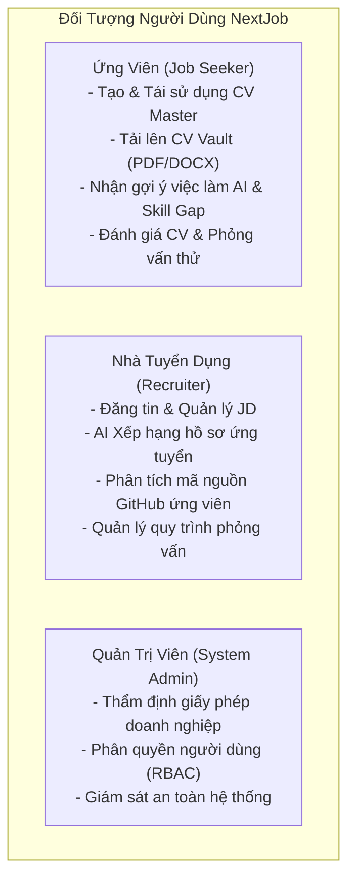

* **Phạm vi Chức năng**: Quản lý tài khoản, xây dựng CV, bóc tách và vector hóa hồ sơ, tìm kiếm việc làm, đăng tin tuyển dụng, thuật toán AI Multi-Agent matching/recommend, đánh giá mã nguồn GitHub, phỏng vấn thử nghiệm bằng AI, phê duyệt doanh nghiệp.
* **Phạm vi Công nghệ**: Hệ thống phân tán Web App (Frontend React 19 + TypeScript, Backend FastAPI Async, Cơ sở dữ liệu Supabase PostgreSQL + pgvector, Điều phối LangGraph Multi-Agent, Mô hình ngôn ngữ Qwen LLM / DashScope).

## 1.4. Các Khái niệm và Thuật ngữ Cốt lõi

Để đảm bảo tính nhất quán và dễ tiếp cận cho người mới bắt đầu, bảng sau định nghĩa các thuật ngữ kỹ thuật cốt lõi sử dụng trong toàn bộ báo cáo:

| Thuật ngữ | Tên đầy đủ / Khái niệm | Ý nghĩa & Vai trò trong Hệ thống |
|---|---|---|
| **ATS** | *Applicant Tracking System* | Hệ thống quản trị hồ sơ tuyển dụng tự động, hỗ trợ tiếp nhận và sàng lọc CV theo tiêu chuẩn cấu trúc chuẩn mực. |
| **Multi-Agent System** | *Hệ thống Đa Tác tử Thông minh* | Kiến trúc gồm nhiều AI Agent chuyên biệt, phối hợp giải quyết bài toán phức tạp thông qua đồ thị trạng thái điều phối (State Graph). |
| **LangGraph** | *LangGraph Framework* | Thư viện điều phối AI tác tử dưới dạng đồ thị có trạng thái (Stateful Graph), hỗ trợ vòng lặp, rẽ nhánh điều kiện và checkpoint. |
| **pgvector** | *PostgreSQL Vector Extension* | Tiện ích mở rộng cho PostgreSQL cho phép lưu trữ và tìm kiếm vector biểu diễn ngữ nghĩa (Embeddings) với hiệu năng cao. |
| **HNSW** | *Hierarchical Navigable Small World* | Cấu trúc đồ thị nhiều lớp hỗ trợ tìm kiếm láng giềng gần nhất (Approximate Nearest Neighbors - ANN) với tốc độ $O(\log N)$. |
| **RRF** | *Reciprocal Rank Fusion* | Thuật toán kết hợp thứ hạng phi tham số, dùng để tổng hợp danh sách kết quả từ tìm kiếm vector và tìm kiếm từ khóa BM25. |
| **PII** | *Personally Identifiable Information* | Thông tin định danh cá nhân (SĐT, Email, CCCD, Địa chỉ...) cần được che giấu hoặc loại bỏ để đảm bảo an toàn bảo mật. |
| **Guardrails** | *Hàng rào Phòng vệ An toàn* | Tập hợp các quy tắc kiểm tra logic (Input Guard, Data Gate, Output Guard) bảo vệ hệ thống trước dữ liệu độc hại hoặc rủi ro mô hình. |
| **Cosine Similarity** | *Độ tương đồng Cosine* | Độ đo góc giữa 2 vector trong không gian nhiều chiều, biểu thị mức độ tương đồng ngữ nghĩa giữa CV và JD. |
| **Cross-Encoder** | *Mô hình Tái xếp hạng Tương tác* | Mô hình học máy nhận đồng thời cả văn bản CV và JD để tính toán điểm số tương thích chính xác cao ở bước Reranking. |

---

# CHƯƠNG 2: PHÂN TÍCH YÊU CẦU HỆ THỐNG

## 2.1. Phân tích Yêu cầu Chức năng (Functional Requirements - FR)

Hệ thống NextJob được thiết kế thành 7 nhóm chức năng cốt lõi, được mã hóa từ `FR-01` đến `FR-07`:

### FR-01: Quản trị Tài khoản & Phân quyền Truy cập (Authentication & RBAC)
- **FR-01.1**: Cho phép người dùng đăng ký tài khoản bằng Email/Password hoặc OAuth qua Supabase Auth.
- **FR-01.2**: Quản lý phiên làm việc thông qua chuẩn JWT (JSON Web Token), hỗ trợ thuật toán giải mã đối xứng HS256 (Local) và bất đối xứng RS256 qua JWKS (Production).
- **FR-01.3**: Phân quyền truy cập dựa trên vai trò (Role-Based Access Control - RBAC) chặt chẽ với 3 vai trò: `candidate`, `recruiter`, `admin`.
- **FR-01.4**: Cho phép người dùng cập nhật thông tin cá nhân, avatar (lưu trữ tại Supabase Storage), mật khẩu và thiết lập trạng thái tìm việc.

### FR-02: Kho Dòng hồ sơ Master & Trình dựng CV Trực quan (Master Profile & CV Builder)
- **FR-02.1**: Cho phép Ứng viên tạo và quản lý các "Dòng hồ sơ Master" (Profile Lines) theo 5 nhóm dữ liệu: *Học vấn, Kinh nghiệm làm việc, Kỹ năng, Dự án, Chứng chỉ*.
- **FR-02.2**: Cung cấp giao diện xây dựng CV trực quan với cơ chế kéo thả (`@dnd-kit`), cho phép chọn lọc các dòng hồ sơ từ kho Master đưa vào bản dựng CV.
- **FR-02.3**: Hỗ trợ 10 mẫu template CV chuẩn quốc tế: *Modern, Sidebar, Classic, Compact, Elegant, Minimal, Professional, Creative, Timeline, Two Column*.
- **FR-02.4**: Xuất bản CV định dạng PDF với 2 chế độ:
  - *Bản dựng hình ảnh độ nét cao (High-Res Canvas Print)*: Đảm bảo 100% định dạng phông chữ tiếng Việt không bị lệch trang.
  - *Bản chữ sắc nét chuẩn ATS (Vector Text Print)*: Đảm bảo máy quét ATS đọc được cấu trúc văn bản thuần túy.

### FR-03: Tủ hồ sơ CV & Pipeline Tự động Hóa Ingest (CV Vault & Ingestion Pipeline)
- **FR-03.1**: Cho phép tải lên tệp hồ sơ định dạng PDF và DOCX (kích thước tối đa 10MB).
- **FR-03.2**: Tự động kích hoạt đồ thị **Ingest Agent (LangGraph)** ngay khi tệp được tải lên:
  - Bóc tách văn bản layout-aware qua `pymupdf4llm` và fallback `pdfplumber` cho CV đa cột.
  - Làm sạch văn bản, chuẩn hóa tiêu đề và loại bỏ ký tự rác OCR.
  - Trích xuất tự động danh sách kỹ năng dựa trên từ điển 186 kỹ năng chuẩn hóa và đồ thị kỹ năng (`skill_graph.json`).
  - Gọi LLM tóm tắt hồ sơ, khử bỏ thông tin PII và chống bịa đặt chức danh (`grounded_titles`).
  - Sinh vector nhúng 1536 chiều qua `qwen3.7-text-embedding` và lưu trữ vào bảng `embedded_resumes`.
- **FR-03.3**: Cho phép Ứng viên thiết lập CV mặc định để phục vụ cho các tính năng gợi ý tự động.

### FR-04: Quản lý Tin tuyển dụng & Bàn làm việc Nhà tuyển dụng (Recruitment Workspace)
- **FR-04.1**: Cho phép Nhà tuyển dụng tạo mới, chỉnh sửa, đóng hoặc lưu trữ tin tuyển dụng (`job_posts`).
- **FR-04.2**: Bóc tách và gán nhãn các yêu cầu kỹ năng bắt buộc (Must-have skills) và kỹ năng ưu tiên (Nice-to-have skills) cho từng vị trí.
- **FR-04.3**: Quản lý danh sách ứng viên đã nộp đơn ứng tuyển theo từng tin tuyển dụng (`job_submits`), cập nhật trạng thái tuyển dụng (*Pending $\rightarrow$ Reviewing $\rightarrow$ Interviewed $\rightarrow$ Offered / Rejected*).
- **FR-04.4**: Tự động sinh và lưu trữ vector biểu diễn của tin tuyển dụng vào bảng `embedded_jobs`.

### FR-05: Hệ thống Khớp nối & Gợi ý Việc làm Hai chiều (Two-Way Hybrid Matching Engine)
- **FR-05.1 (Recruiter Matching - JD $\rightarrow$ CV Pool)**:
  - Cho phép Nhà tuyển dụng kích hoạt AI Matching cho một tin tuyển dụng đang mở.
  - Thực thi đồ thị **Matching Agent**: Lấy danh sách ứng viên đã nộp đơn $\rightarrow$ Tính toán độ phủ kỹ năng $\rightarrow$ Kết hợp điểm số RRF giữa Vector Cosine và BM25 $\rightarrow$ Tái xếp hạng qua LLM $\rightarrow$ Sinh lời giải thích phù hợp ẩn danh $\rightarrow$ Trả về bảng xếp hạng chi tiết.
- **FR-05.2 (Candidate Recommendation - CV $\rightarrow$ JD Pool)**:
  - Cho phép Ứng viên nhận danh sách việc làm phù hợp dựa trên CV mặc định hoặc truy vấn tìm kiếm tự nhiên.
  - Thực thi đồ thị **Recommend Agent**: Quét pool tin tuyển dụng đang hoạt động $\rightarrow$ Áp dụng bộ lọc kỹ năng tiên quyết (Must-have Gating) $\rightarrow$ Xếp hạng và phân nhóm trực quan (*Rất phù hợp $\ge 45\%$, Phù hợp $\ge 30\%$, Tiềm năng $< 30\%$*) kèm phân tích khoảng trống kỹ năng (Skill Gap Advice).

### FR-06: Đánh giá Năng lực Kỹ thuật Chuyên sâu (Repo Evaluation & AI Mock Interview)
- **FR-06.1**: Cho phép quét và đánh giá kho mã nguồn GitHub của ứng viên: phân tích kiến trúc dự án, mức độ chuẩn hóa mã nguồn, độ phủ kiểm thử tự động, công nghệ sử dụng và kiểm tra tính xác thực của các kỹ năng khai báo trong CV.
- **FR-06.2**: Cung cấp phòng phỏng vấn mô phỏng tương tác bằng AI (AI Mock Interview): AI đóng vai trò người phỏng vấn chuyên nghiệp, đặt câu hỏi thích ứng theo yêu cầu JD và câu trả lời của ứng viên, chấm điểm và góp ý chi tiết sau buổi phỏng vấn.
- **FR-06.3**: Cung cấp công cụ chấm điểm và đánh giá CV chuyên sâu (CV Assessment): Chấm điểm CV theo thang điểm 100 dựa trên các tiêu chí trình bày, định lượng thành tích (Action Verbs, STAR Method), từ khóa chuyên ngành và độ tương thích ATS.

### FR-07: Quản trị Hệ thống & Phê duyệt Doanh nghiệp (System Administration)
- **FR-07.1**: Cho phép Quản trị viên tiếp nhận và thẩm định hồ sơ đăng ký tư cách Nhà tuyển dụng (`recruiter_forms`), đính kèm tệp giấy phép kinh doanh.
- **FR-07.2**: Tự động nâng cấp quyền hạn tài khoản lên `recruiter` và khởi tạo bản ghi doanh nghiệp (`companies`) khi phê duyệt thành công.
- **FR-07.3**: Cho phép Quản trị viên quản lý danh sách người dùng, điều chỉnh quyền hạn và theo dõi các chỉ số vận hành hệ thống.

---

## 2.2. Phân tích Yêu cầu Phi chức năng (Non-Functional Requirements - NFR)

| Mã NFR | Nhóm Yêu Cầu | Tiêu Chí Chi Tiết & Chỉ Số Đo Lường Cụ Thể |
|---|---|---|
| **NFR-01** | **Hiệu năng & Độ trễ (Performance)** | - Thời gian phản hồi API CRUD thông thường: $P95 < 200\text{ms}$.<br/>- Thời gian truy vấn tìm kiếm Vector HNSW: $< 50\text{ms}$ trên tập $10.000$ vector.<br/>- Thời gian xử lý Ingest 1 CV hoàn chỉnh: $< 5.0\text{s}$ (bao gồm parse, OCR clean, extract, LLM summarize, embedding).<br/>- Thời gian xử lý Matching Agent trên pool 50 ứng viên: $< 3.5\text{s}$. |
| **NFR-02** | **Độ chính xác & Tính Khách quan (AI Quality)** | - Tỷ lệ bóc tách layout CV thành công (Parse Success Rate): $\ge 98.0\%$ trên Golden Dataset 41 CV.<br/>- Tỷ lệ bảo toàn kỹ năng (Skill Recall): $\ge 92.0\%$ so với từ điển chuẩn hóa.<br/>- Độ trung thực tóm tắt (Faithfulness Score): $\ge 95.0\%$ (loại bỏ hoàn toàn chức danh bịa đặt qua Grounded Titles). |
| **NFR-03** | **An toàn Thông tin & Quyền Riêng tư (Security & PII)** | - Tuân thủ nguyên tắc phòng vệ chiều sâu (Defense-in-Depth) với 3 lớp Guardrail (Input Guard, Safety Gate, Output Guard).<br/>- Tỷ lệ lọc sạch thông tin nhạy cảm PII trước khi gửi tới LLM: $100\%$ đối với số điện thoại, email, số CCCD.<br/>- Xác thực JWT Fail-Fast; chống tấn công leo quyền IDOR bằng cách kiểm tra quyền sở hữu tại Service Layer.<br/>- Giới hạn tần suất gọi API (Rate Limiting): Tối đa 20 requests/phút cho các endpoint AI nặng. |
| **NFR-04** | **Tính Khả dụng & Trải nghiệm (Usability)** | - Giao diện Single Page Application (SPA) thích ứng hoàn toàn trên Desktop, Tablet và Mobile (Responsive Web Design).<br/>- Hỗ trợ đa ngôn ngữ (Tiếng Việt & Tiếng Anh).<br/>- Hỗ trợ chế độ giao diện Sáng / Tối (Light / Dark Mode) mượt mà không bị hiện tượng giật trang. |
| **NFR-05** | **Khả năng Bảo trì & Mở rộng (Maintainability)** | - Mã nguồn tổ chức phân tầng rõ ràng (Separation of Concerns).<br/>- Đạt trên 98 bài kiểm thử tự động (Unit Tests & Integration Tests) với độ bao phủ logic cốt lõi $\ge 85\%$.<br/>- Đồ thị AI Agent xây dựng dạng module độc lập trên LangGraph, dễ dàng nâng cấp hoặc thay thế mô hình LLM. |

---

## 2.3. Mô hình Hóa Ca sử dụng (Use Case Modeling & Specifications)

### 2.3.1. Sơ đồ Use Case Tổng thể

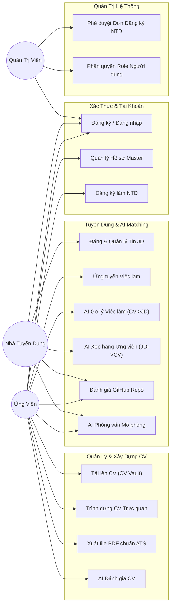

### 2.3.2. Đặc tả Chi tiết Các Use Case Trọng tâm

#### Đặc tả UC-04: Tải lên, Bóc tách và Vector hóa CV Tự động (CV Ingestion)
* **Tác tử chính (Primary Actor)**: Ứng viên (Candidate).
* **Mục đích (Goal)**: Tải lên tệp CV (PDF/DOCX), hệ thống tự động bóc tách cấu trúc, trích xuất kỹ năng, khử PII và lưu trữ vector ngữ nghĩa.
* **Tiền điều kiện (Pre-conditions)**: Ứng viên đã đăng nhập thành công vào hệ thống.
* **Luồng sự kiện chính (Main Flow)**:
  1. Ứng viên kéo thả tệp CV (PDF hoặc DOCX) vào trang `/cv-vault`.
  2. Frontend gửi tệp lên Supabase Storage thông qua Signed URL an toàn và tạo bản ghi trong bảng `resumes`.
  3. Frontend gọi API endpoint `POST /api/v1/resumes/{id}/ingest`.
  4. Backend kích hoạt đồ thị **Ingest Agent (LangGraph)**:
     - Node `parse`: Bóc tách văn bản layout-aware (PyMuPDF4LLM + PDFPlumber fallback).
     - Node `clean`: Chuẩn hóa Unicode, xử lý khoảng trắng và phân cấp tiêu đề Markdown.
     - Node `extract`: Quét và trích xuất danh sách kỹ năng dựa trên từ điển 186 kỹ năng chuẩn hóa.
     - Node `summarize`: LLM tóm tắt hồ sơ, khử bỏ PII, phân loại kỹ năng `verified` và `inferred`.
     - Node `embed`: Tạo vector nhúng 1536 chiều và lưu trữ nguyên tử vào bảng `embedded_resumes`.
  5. Backend trả về kết quả trạng thái thành công kèm danh sách kỹ năng đã trích xuất.
  6. Frontend hiển thị thông tin CV đã xử lý kèm nhãn kỹ năng trực quan trên giao diện.
* **Luồng ngoại lệ (Alternative / Exception Flows)**:
  - *Tệp tải lên vượt quá 10MB hoặc sai định dạng*: Input Guard lập tức từ chối và trả về mã lỗi `400 Bad Request`.
  - *Tệp PDF quét ảnh (Scan không có text layer)*: Hệ thống ghi nhận cảnh báo `metadata.low_content = true`, lưu trữ bản ghi và thông báo cho người dùng nên tải tệp PDF dạng văn bản để AI phân tích tốt nhất.
  - *LLM Service timeout*: Tự động sử dụng bản tóm tắt deterministic fallback trích xuất từ các đoạn văn bản sạch, đảm bảo pipeline không bị gián đoạn.
* **Hậu điều kiện (Post-conditions)**: Tệp CV được lưu trữ trên Cloud Storage, thông tin metadata và vector ngữ nghĩa được cập nhật hoàn tất trong cơ sở dữ liệu `embedded_resumes`.

#### Đặc tả UC-11: AI Xếp hạng Ứng viên cho Nhà tuyển dụng (AI Candidate Matching)
* **Tác tử chính (Primary Actor)**: Nhà tuyển dụng (Recruiter).
* **Mục đích (Goal)**: Nhận danh sách ứng viên đã nộp đơn được xếp hạng theo độ phù hợp khách quan kèm giải thích chi tiết.
* **Tiền điều kiện (Pre-conditions)**: Nhà tuyển dụng sở hữu tin tuyển dụng (`job_post`) đang ở trạng thái hoạt động và đã có ứng viên nộp hồ sơ.
* **Luồng sự kiện chính (Main Flow)**:
  1. Nhà tuyển dụng truy cập trang Bàn tuyển dụng `/ai-candidates` và chọn tin tuyển dụng cần phân tích.
  2. Frontend gửi request `POST /api/v1/chat` với intent matching và `job_id`.
  3. Backend xác thực quyền sở hữu của Nhà tuyển dụng đối với `job_id` (chống IDOR).
  4. Backend khởi chạy đồ thị **Matching Agent (LangGraph)**:
     - Node `retrieve`: Lấy thông tin JD và danh sách ứng viên đã nộp đơn; thực thi tìm kiếm vector cosine.
     - Node `skill`: Đối chiếu tập kỹ năng ứng viên với JD qua Đồ thị Kỹ năng (`skill_graph.json`), tính `skill_score` và `soft_delta`.
     - Node `rrf`: Kết hợp thứ hạng từ Dense Vector Search và Sparse BM25 theo công thức Reciprocal Rank Fusion ($k=60$).
     - Node `rerank`: Tái xếp hạng các ứng viên hàng đầu.
     - Node `explain`: Thay thế ID thật bằng mã ẩn danh (`CAND_001`, `CAND_002`...), gửi vào LLM để sinh lời giải thích súc tích (1-2 câu tiếng Việt), sau đó khôi phục lại ID thật.
     - Node `output_guard`: Kiểm định cấu trúc JSON và xác thực danh sách ID trong whitelist.
     - Node `respond`: Tổng hợp danh sách kết quả, lưu vết bằng chứng vào bảng `match_evidence` và trả về Client.
  5. Frontend hiển thị bảng xếp hạng ứng viên, điểm tương thích (Match Score %), danh sách kỹ năng đáp ứng và lời giải thích của AI.
* **Luồng ngoại lệ (Exception Flows)**:
  - *Nhà tuyển dụng truy vấn tin tuyển dụng của công ty khác*: Service Layer chặn lập tức với mã lỗi `403 Forbidden`.
  - *Mô hình LLM gặp sự cố khi sinh giải thích*: Kích hoạt Deterministic Fallback, tự động sinh giải thích dựa trên các kỹ năng trùng khớp thực tế được ghi nhận trong `match_evidence`.
* **Hậu điều kiện (Post-conditions)**: Kết quả khớp nối và bằng chứng so khớp được lưu vết vào bảng `match_resume` và `match_evidence` phục vụ kiểm tra và tra cứu sau này.

---

# CHƯƠNG 3: PHÂN TÍCH VÀ THIẾT KẾ DỮ LIỆU

## 3.1. Mô hình Thực thể - Liên kết (Entity-Relationship Diagram - ERD)

Cơ sở dữ liệu của NextJob được thiết kế trên nền tảng **PostgreSQL 15+** kết hợp tiện ích mở rộng **pgvector**, tối ưu hóa cho việc kết hợp giữa dữ liệu quan hệ chặt chẽ và không gian vector đa chiều:

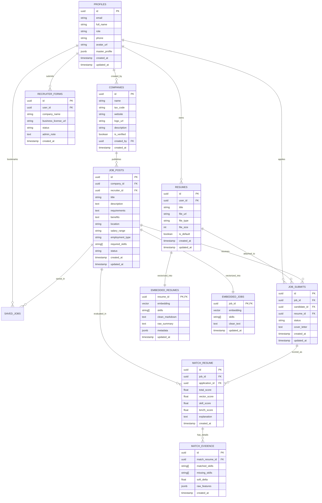

---

## 3.2. Đặc tả Lược đồ Cơ sở Dữ liệu Quan hệ (Relational Schema)

### 3.2.1. Nhóm Bảng Người dùng và Xác thực

#### Bảng `public.profiles`
Lưu trữ thông tin chi tiết người dùng, vai trò hệ thống và toàn bộ kho Dòng hồ sơ Master.

| Tên Cột | Kiểu Dữ Liệu | Ràng Buộc | Mô Tả Ý Nghĩa Nghiệp Vụ |
|---|---|---|---|
| `id` | `UUID` | `PRIMARY KEY`, `REFERENCES auth.users(id)` | Khóa chính, đồng bộ 1-1 với Supabase Auth User ID |
| `email` | `VARCHAR(255)` | `NOT NULL`, `UNIQUE` | Địa chỉ email đăng nhập của người dùng |
| `full_name` | `VARCHAR(255)` | `NULLABLE` | Họ và tên đầy đủ của người dùng |
| `role` | `VARCHAR(50)` | `NOT NULL`, `DEFAULT 'candidate'` | Vai trò: `candidate`, `recruiter`, `admin` |
| `phone` | `VARCHAR(20)` | `NULLABLE` | Số điện thoại liên hệ |
| `avatar_url` | `TEXT` | `NULLABLE` | Đường dẫn ảnh đại diện trên Supabase Storage |
| `master_profile` | `JSONB` | `DEFAULT '{}'::jsonb` | Cấu trúc chứa các dòng hồ sơ: học vấn, kinh nghiệm, kỹ năng, dự án, chứng chỉ |
| `created_at` | `TIMESTAMPTZ` | `DEFAULT NOW()` | Thời điểm tạo tài khoản |
| `updated_at` | `TIMESTAMPTZ` | `DEFAULT NOW()` | Thời điểm cập nhật thông tin gần nhất |

#### Bảng `public.recruiter_forms`
Quản lý đơn đăng ký tư cách Nhà tuyển dụng chờ Quản trị viên thẩm định pháp lý.

| Tên Cột | Kiểu Dữ Liệu | Ràng Buộc | Mô Tả Ý Nghĩa Nghiệp Vụ |
|---|---|---|---|
| `id` | `UUID` | `PRIMARY KEY`, `DEFAULT gen_random_uuid()` | Khóa chính của đơn đăng ký |
| `user_id` | `UUID` | `NOT NULL`, `REFERENCES public.profiles(id)` | ID tài khoản ứng viên nộp đơn |
| `company_name` | `VARCHAR(255)` | `NOT NULL` | Tên doanh nghiệp đăng ký |
| `business_license_url`| `TEXT` | `NOT NULL` | Đường dẫn file scan Giấy phép ĐKKD trên Storage |
| `status` | `VARCHAR(50)` | `DEFAULT 'pending'` | Trạng thái: `pending`, `approved`, `rejected` |
| `admin_note` | `TEXT` | `NULLABLE` | Ghi chú phản hồi của Admin khi xét duyệt |
| `created_at` | `TIMESTAMPTZ` | `DEFAULT NOW()` | Thời điểm nộp đơn |

### 3.2.2. Nhóm Bảng Tuyển dụng và Hồ sơ

#### Bảng `public.companies`
Thông tin doanh nghiệp đã được xác thực trên hệ thống.

| Tên Cột | Kiểu Dữ Liệu | Ràng Buộc | Mô Tả Ý Nghĩa Nghiệp Vụ |
|---|---|---|---|
| `id` | `UUID` | `PRIMARY KEY`, `DEFAULT gen_random_uuid()` | Khóa chính doanh nghiệp |
| `name` | `VARCHAR(255)` | `NOT NULL` | Tên pháp nhân công ty |
| `tax_code` | `VARCHAR(50)` | `NULLABLE` | Mã số thuế doanh nghiệp |
| `website` | `VARCHAR(255)` | `NULLABLE` | Địa chỉ trang web chính thức |
| `logo_url` | `TEXT` | `NULLABLE` | Đường dẫn Logo công ty trên Storage |
| `description` | `TEXT` | `NULLABLE` | Giới thiệu quy mô và lĩnh vực hoạt động |
| `is_verified` | `BOOLEAN` | `DEFAULT FALSE` | Trạng thái đã được Admin xác thực |
| `created_by` | `UUID` | `REFERENCES public.profiles(id)` | Người đại diện tạo hồ sơ công ty |

#### Bảng `public.job_posts`
Quản lý các tin tuyển dụng do Nhà tuyển dụng phát hành.

| Tên Cột | Kiểu Dữ Liệu | Ràng Buộc | Mô Tả Ý Nghĩa Nghiệp Vụ |
|---|---|---|---|
| `id` | `UUID` | `PRIMARY KEY`, `DEFAULT gen_random_uuid()` | Khóa chính tin tuyển dụng |
| `company_id` | `UUID` | `NOT NULL`, `REFERENCES public.companies(id)` | ID doanh nghiệp phát hành tin |
| `recruiter_id`| `UUID` | `NOT NULL`, `REFERENCES public.profiles(id)` | ID nhà tuyển dụng quản lý tin |
| `title` | `VARCHAR(255)` | `NOT NULL` | Tiêu đề vị trí tuyển dụng |
| `description` | `TEXT` | `NOT NULL` | Mô tả chi tiết trách nhiệm công việc |
| `requirements`| `TEXT` | `NOT NULL` | Yêu cầu năng lực và kinh nghiệm |
| `benefits` | `TEXT` | `NULLABLE` | Chế độ đãi ngộ và quyền lợi |
| `location` | `VARCHAR(255)` | `NOT NULL` | Địa điểm làm việc (Tỉnh/Thành phố hoặc Remote) |
| `salary_range`| `VARCHAR(100)` | `NOT NULL` | Mức lương dự kiến (ví dụ: 15-25 triệu VNĐ) |
| `employment_type`| `VARCHAR(50)`| `DEFAULT 'Full-time'` | Hình thức: `Full-time`, `Part-time`, `Contract` |
| `required_skills`| `TEXT[]` | `DEFAULT '{}'` | Mảng các kỹ năng công nghệ yêu cầu |
| `status` | `VARCHAR(50)` | `DEFAULT 'published'` | Trạng thái: `draft`, `published`, `closed` |
| `created_at` | `TIMESTAMPTZ` | `DEFAULT NOW()` | Thời điểm đăng tin |

#### Bảng `public.resumes`
Quản lý tệp tin CV do ứng viên tải lên hoặc xuất bản từ CV Builder.

| Tên Cột | Kiểu Dữ Liệu | Ràng Buộc | Mô Tả Ý Nghĩa Nghiệp Vụ |
|---|---|---|---|
| `id` | `UUID` | `PRIMARY KEY`, `DEFAULT gen_random_uuid()` | Khóa chính của hồ sơ CV |
| `user_id` | `UUID` | `NOT NULL`, `REFERENCES public.profiles(id)` | ID ứng viên sở hữu hồ sơ |
| `title` | `VARCHAR(255)` | `NOT NULL` | Tên gợi nhớ của CV (ví dụ: CV Frontend Senior) |
| `file_url` | `TEXT` | `NOT NULL` | Đường dẫn tệp vật lý trên Supabase Storage bucket `resumes` |
| `file_type` | `VARCHAR(50)` | `NOT NULL` | Định dạng tệp: `pdf`, `docx`, `builder_export` |
| `file_size` | `INTEGER` | `NOT NULL` | Dung lượng tệp tính theo Bytes |
| `is_default` | `BOOLEAN` | `DEFAULT FALSE` | Đánh dấu là CV chính dùng cho AI matching gợi ý |
| `created_at` | `TIMESTAMPTZ` | `DEFAULT NOW()` | Thời điểm tải lên |

#### Bảng `public.job_submits`
Quản lý các lượt ứng tuyển của ứng viên vào các tin tuyển dụng.

| Tên Cột | Kiểu Dữ Liệu | Ràng Buộc | Mô Tả Ý Nghĩa Nghiệp Vụ |
|---|---|---|---|
| `id` | `UUID` | `PRIMARY KEY`, `DEFAULT gen_random_uuid()` | Khóa chính lượt ứng tuyển |
| `job_id` | `UUID` | `NOT NULL`, `REFERENCES public.job_posts(id)` | ID tin tuyển dụng ứng tuyển |
| `candidate_id`| `UUID` | `NOT NULL`, `REFERENCES public.profiles(id)` | ID ứng viên nộp đơn |
| `resume_id` | `UUID` | `NOT NULL`, `REFERENCES public.resumes(id)` | ID bản CV đính kèm khi ứng tuyển |
| `status` | `VARCHAR(50)` | `DEFAULT 'pending'` | Trạng thái: `pending`, `reviewing`, `interviewed`, `offered`, `rejected` |
| `cover_letter`| `TEXT` | `NULLABLE` | Thư giới thiệu nguyện vọng của ứng viên |
| `created_at` | `TIMESTAMPTZ` | `DEFAULT NOW()` | Thời điểm nộp đơn |

---

## 3.3. Thiết kế Không gian Vector và Chỉ mục HNSW (pgvector Store)

### 3.3.1. Bảng `public.embedded_resumes`
Lưu trữ vector biểu diễn ngữ nghĩa và kết quả bóc tách có cấu trúc của CV. Bảng này được cô lập an ninh, **không cấp quyền truy cập qua Data API công khai** (chỉ Backend qua `service_role` mới có quyền đọc/ghi).

| Tên Cột | Kiểu Dữ Liệu | Ràng Buộc | Mô Tả Ý Nghĩa Nghiệp Vụ |
|---|---|---|---|
| `resume_id` | `UUID` | `PRIMARY KEY`, `REFERENCES public.resumes(id) ON DELETE CASCADE` | Khóa chính liên kết 1-1 với bảng `resumes` |
| `embedding` | `vector(1536)`| `NOT NULL` | Vector nhúng 1536 chiều sinh bởi mô hình `qwen3.7-text-embedding` |
| `skills` | `TEXT[]` | `DEFAULT '{}'` | Mảng danh sách kỹ năng chuẩn hóa trích xuất từ CV |
| `clean_markdown`| `TEXT` | `NOT NULL` | Toàn văn nội dung CV đã làm sạch và khử PII |
| `raw_summary` | `TEXT` | `NULLABLE` | Bản tóm tắt năng lực cốt lõi sinh bởi LLM |
| `metadata` | `JSONB` | `DEFAULT '{}'::jsonb` | Metadata bóc tách: `content_chars`, `low_content`, `grounded_titles` |
| `updated_at` | `TIMESTAMPTZ` | `DEFAULT NOW()` | Thời điểm cập nhật vector |

### 3.3.2. Cấu hình Chỉ mục HNSW (Hierarchical Navigable Small World)
Để tối ưu hóa tốc độ tìm kiếm vector trong không gian 1536 chiều với độ đo khoảng cách Cosine, hệ thống thiết lập chỉ mục HNSW chuyên biệt:

```sql
-- Thiết lập chỉ mục HNSW cho vector embedding của CV
CREATE INDEX IF NOT EXISTS idx_embedded_resumes_hnsw_cosine
ON public.embedded_resumes
USING hnsw (embedding vector_cosine_ops)
WITH (m = 16, ef_construction = 64);

-- Thiết lập chỉ mục HNSW cho vector embedding của Tin tuyển dụng (JD)
CREATE INDEX IF NOT EXISTS idx_embedded_jobs_hnsw_cosine
ON public.embedded_jobs
USING hnsw (embedding vector_cosine_ops)
WITH (m = 16, ef_construction = 64);
```

* **Giải thích tham số**:
  - `vector_cosine_ops`: Sử dụng độ đo khoảng cách Cosine $d_{\cos}(u, v) = 1 - \frac{u \cdot v}{\|u\|_2 \|v\|_2}$. Điểm tương đồng được tính bằng $1 - d_{\cos}$.
  - `m = 16`: Số lượng liên kết tối đa trên mỗi đỉnh đồ thị HNSW, đảm bảo sự cân bằng giữa dung lượng RAM và độ chính xác tìm kiếm.
  - `ef_construction = 64`: Kích thước danh sách động khi xây dựng đồ thị, nâng cao chất lượng liên kết giữa các cụm vector lân cận.

---

## 3.4. Đồ thị Tri thức Kỹ năng Chuẩn hóa (Skill Taxonomy & Knowledge Graph)

Hệ thống NextJob không đối chiếu từ khóa một cách rời rạc mà tổ chức một **Đồ thị Kỹ năng Chuẩn hóa (Skill Graph)** với hơn 186 kỹ năng công nghệ phổ biến được phân loại theo cấu trúc phả hệ và mối quan hệ tương hỗ:

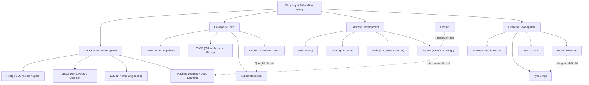

### Cơ chế Hoạt động của Skill Engine:
1. **Từ điển Đồng nghĩa (Aliases Mapping)**: Nhận diện các cách viết khác nhau của cùng một công nghệ (ví dụ: `["react", "reactjs", "react.js"]` $\rightarrow$ Chuẩn hóa về `React`).
2. **Khớp mờ Chống lỗi chính tả (Fuzzy Matching với RapidFuzz)**: Áp dụng thuật toán tính khoảng cách Levenshtein tỉ lệ chuẩn hóa với ngưỡng tương đồng $\ge 88$. Ví dụ: `typscript` hoặc `postgreql` vẫn được nhận diện chính xác thành `TypeScript` và `PostgreSQL`.
3. **Mở rộng Cụm Kỹ năng (Skill Cluster Expansion)**: Khi tin tuyển dụng yêu cầu kỹ năng `React`, đồ thị tự động nhận diện các kỹ năng phụ trợ có liên quan cao như `JavaScript`, `TypeScript`, `HTML/CSS`, `Redux` để tính điểm tương quan mềm (Soft Coverage).

---

# CHƯƠNG 4: THIẾT KẾ KIẾN TRÚC HỆ THỐNG

## 4.1. Kiến trúc Tổng thể Phân tầng (Multi-tier System Architecture)

Hệ thống NextJob được xây dựng theo kiến trúc phân tầng phân tán hiện đại, tách biệt độc lập giữa tầng Giao diện Khách hàng (Client Layer), Tầng Cổng Logic & Điều phối AI (Backend Gateway Layer), Tầng Lưu trữ & Cơ sở Dữ liệu Đám mây (Data & Cloud Layer) và Tầng Dịch vụ Trí tuệ Nhân tạo Ngoại vi (External AI Services):

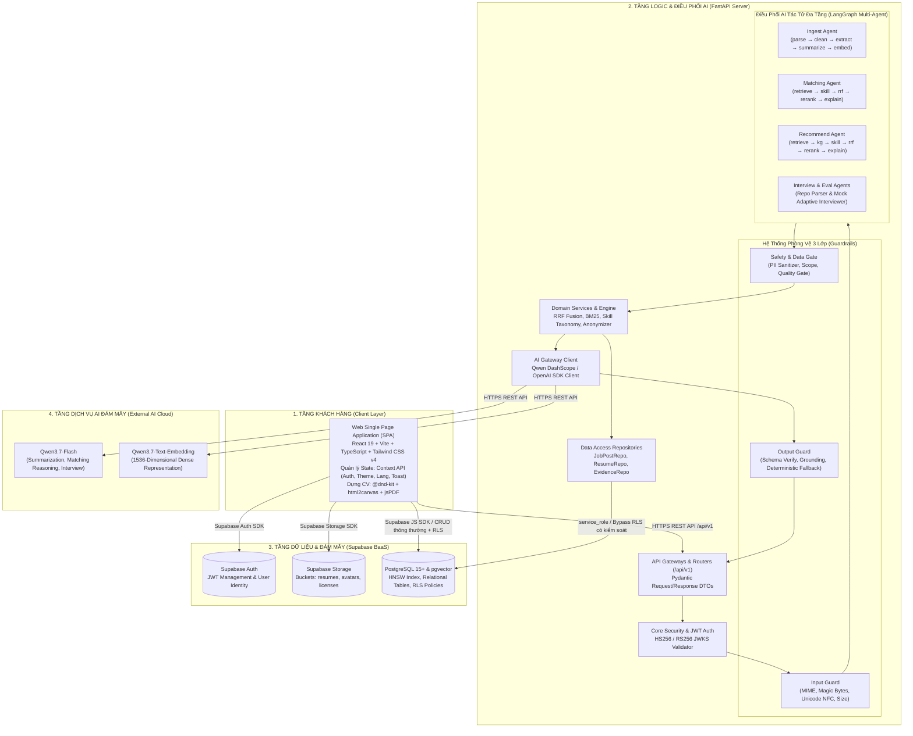

---

## 4.2. Kiến trúc Phân tầng Mã nguồn Backend (Clean Layered Architecture)

Mã nguồn Backend tại `backend/app/` được cấu trúc theo nguyên tắc phân định trách nhiệm rõ ràng (Separation of Concerns):

```text
backend/app/
├── api/                     # Tầng Giao tiếp HTTP (HTTP Gateways)
│   ├── routes/              # Handlers tiếp nhận request, chỉ validate DTO, gọi Service, trả Response
│   └── schemas/             # Pydantic Schemas định nghĩa cấu trúc dữ liệu Input/Output
├── agents/                  # Tầng Điều phối AI Multi-Agent (LangGraph Workflows)
│   ├── ingest/              # Pipeline xử lý hồ sơ & vector hóa CV
│   ├── matching/            # Pipeline khớp nối ứng viên cho Nhà tuyển dụng (JD -> CV)
│   ├── recommend/           # Pipeline gợi ý việc làm cho Ứng viên (CV -> JD)
│   ├── interview/           # Agent phỏng vấn mô phỏng thông minh
│   ├── evaluation/          # Agent chấm điểm CV & phân tích mã nguồn GitHub Repo
│   └── state.py             # Cấu trúc dữ liệu trạng thái chung của Agent (AgentState)
├── services/                # Tầng Nghiệp vụ Miền & Thuật toán (Domain Business Logic)
│   ├── matching/            # RRF Fusion, BM25 Engine, Skill Taxonomy, Anonymizer, Reranker
│   └── profiles/            # Nghiệp vụ xử lý Profile Master và Resume
├── repositories/            # Tầng Truy xuất Dữ liệu (Data Access Layer - Supabase Client)
│   ├── job_posts.py         # Truy vấn tin tuyển dụng
│   ├── resumes.py           # Truy vấn metadata CV và bảng embedded_resumes
│   └── match_evidence.py   # Lưu vết lịch sử và bằng chứng khớp nối
├── guardrails/              # Hệ thống Kiểm soát An ninh 3 Lớp
│   ├── input.py             # Kiểm tra định dạng tệp, MIME, Unicode NFC, kích thước
│   ├── gates.py             # Khử khuẩn PII, kiểm soát scope, kiểm tra chất lượng bằng chứng
│   ├── output.py            # Kiểm định cấu trúc JSON, whitelist ID, deterministic fallback
│   └── rate_limit.py        # Giới hạn tần suất gọi API (In-Memory Token Bucket)
├── clients/                 # HTTP/SDK Clients kết nối dịch vụ bên ngoài (LLM, Supabase Admin)
├── config/                  # Quản lý cấu hình tập trung an toàn qua env.py (Pydantic Settings)
└── core/                    # Core Security, Giải mã JWT, Custom Application Exceptions
```

---

## 4.3. Thiết kế Hệ thống AI Multi-Agent với LangGraph

NextJob áp dụng kiến trúc **AI Multi-Agent** xây dựng trên nền tảng **LangGraph**. Mỗi Agent chịu trách nhiệm một chu trình xử lý chuyên biệt với trạng thái được kiểm soát chặt chẽ thông qua kiểu dữ liệu `AgentState`.

### 4.3.1. Ingest Agent Workflow (Xử lý & Vector hóa Hồ sơ)
Được cài đặt tại `backend/app/agents/ingest/graph.py`. Tự động kích hoạt khi có tệp CV mới tải lên:

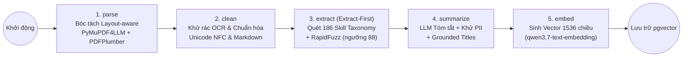

* **Chi tiết các Node trong Ingest Graph**:
  1. **`parse`**: Bóc tách nhị phân PDF sang Markdown bằng `pymupdf4llm`. Nếu dung lượng văn bản bóc tách $< 600$ ký tự (thường gặp ở CV 2 cột phức tạp), hệ thống tự động kích hoạt fallback `pdfplumber` để nhóm văn bản theo tọa độ $x$ của từng cột. Đối với tệp `.docx`, sử dụng `python-docx` bóc tách từng đoạn và bảng biểu.
  2. **`clean`**: Loại bỏ các ký tự điều khiển rác (`\x00`, `\ufeff`), chuẩn hóa các ngắt dòng dư thừa và đưa các tiêu đề chính về chuẩn Markdown (`## Kinh nghiệm`, `## Học vấn`).
  3. **`extract` (Kiến trúc Extract-First)**: Quét trực tiếp trên văn bản gốc dựa trên từ điển 186 kỹ năng chuẩn hóa và đồ thị kỹ năng trước khi tóm tắt. Điều này đảm bảo $100\%$ kỹ năng kỹ thuật không bị mô hình LLM vô tình cắt bớt.
  4. **`summarize`**: Gọi LLM `qwen3.7-flash` (ở chế độ JSON Schema) để tạo bản tóm tắt năng lực, áp dụng cơ chế `grounded_titles` (chỉ chấp nhận các chức danh công việc có bằng chứng xuất hiện trong bản gốc) và làm sạch thông tin cá nhân (PII Redaction).
  5. **`embed`**: Gọi mô hình `qwen3.7-text-embedding` tạo vector 1536 chiều từ nội dung Markdown đã làm sạch và thực hiện lưu trữ nguyên tử (atomic upsert) vào bảng `public.embedded_resumes`.

---

### 4.3.2. Matching Agent Workflow (Khớp nối & Xếp hạng Ứng viên cho Nhà tuyển dụng)
Được cài đặt tại `backend/app/agents/matching/graph.py`. Vận hành khi Nhà tuyển dụng yêu cầu sàng lọc hồ sơ cho một vị trí công việc:

```mermaid
graph LR
    START((Khởi động)) --> retrieve["1. retrieve<br/>Tải JD + Pool ứng viên<br/>Dense Cosine Search"]
    retrieve --> skill["2. skill<br/>Tính Skill Coverage<br/>& Soft Delta"]
    skill --> rrf["3. rrf<br/>Reciprocal Rank Fusion<br/>k=60 (Vector + BM25)"]
    rrf --> rerank["4. rerank<br/>Cross-Encoder / LLM<br/>Scoring"]
    rerank --> snapshot["5. snapshot<br/>Lưu vết thứ hạng gốc"]
    snapshot --> explain["6. explain<br/>Sinh giải thích ẩn danh<br/>(CAND_001, CAND_002)"]
    explain --> output_guard["7. output_guard<br/>Kiểm tra Schema & ID<br/>+ Deterministic Fallback"]
    output_guard --> respond["8. respond<br/>Tổng hợp & Lưu Evidence"]
    respond --> END((Hoàn tất))
```

* **Cơ chế Bảo vệ PII khi Prompting**: Trước khi gửi danh sách ứng viên vào LLM để sinh lời giải thích, node `explain` tự động ánh xạ `application_id` thành mã ẩn danh dạng `CAND_001`, `CAND_002`... và loại bỏ toàn bộ họ tên, số điện thoại, email. Sau khi nhận kết quả JSON từ LLM, hệ thống ánh xạ ngược lại ID nguyên bản.
* **Deterministic Fallback**: Nếu dịch vụ LLM gặp sự cố mạng hoặc vượt quá thời gian chờ (timeout), hệ thống lập tức kích hoạt bộ sinh giải thích quy tắc (Rule-based Explanation) dựa trên danh sách kỹ năng thực tế có trong `match_evidence`, đảm bảo không bao giờ trả về lỗi cho người dùng cuối.

---

### 4.3.3. Recommend Agent Workflow (Gợi ý Việc làm Cá nhân hóa cho Ứng viên)
Được cài đặt tại `backend/app/agents/recommend/graph.py`. Vận hành theo chiều ngược lại (CV $\rightarrow$ JD) khi ứng viên tìm kiếm việc làm:

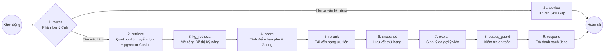

* **Bộ lọc Điều kiện Tiên quyết (Must-have Constraint Gating)**: Loại bỏ hoặc giảm điểm mạnh các tin tuyển dụng mà ứng viên hoàn toàn không đáp ứng được kỹ năng bắt buộc (ví dụ: tuyển Senior Java nhưng CV chỉ có HTML/CSS).

---

## 4.4. Thuật toán Xếp hạng Lai (Hybrid Ranking & Reciprocal Rank Fusion)

Để khắc phục nhược điểm của việc chỉ dùng Vector Search (dễ bị ảo giác ngữ nghĩa khi thiếu từ khóa chuyên ngành chính xác) hoặc chỉ dùng Keyword Search (bỏ sót từ đồng nghĩa), NextJob triển khai mô hình xếp hạng lai đa tầng:

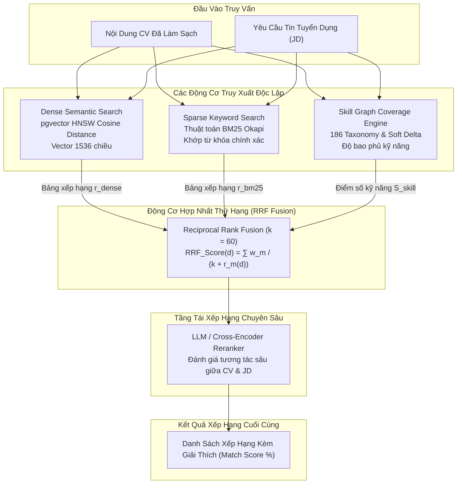

### Công thức Toán học Hợp nhất Thứ hạng (RRF Formulation):
Điểm số RRF tổng hợp của một ứng viên hoặc tin tuyển dụng $d$ được tính theo công thức:

$$\text{RRF\_Score}(d) = \sum_{m \in M} \frac{w_m}{k + r_m(d)}$$

Trong đó:
* $M = \{\text{Dense Vector Search}, \text{Sparse BM25 Search}\}$ là tập các phương pháp truy xuất.
* $r_m(d)$ là thứ hạng vị trí của tài liệu $d$ trong danh sách kết quả của phương pháp $m$ ($r_m \in \{1, 2, 3, \dots\}$).
* $k = 60$ là hằng số làm mịn chuẩn mực quốc tế (Smoothing Constant), giúp giảm độ nhạy cảm của các tài liệu ở vị trí đầu bảng.
* $w_m$ là trọng số đóng góp của từng phương pháp ($w_{\text{dense}} = 0.6, w_{\text{bm25}} = 0.4$).

Điểm số cuối cùng kết hợp thêm trọng số độ phủ kỹ năng $\text{Score}_{\text{skill}}$:

$$\text{Final\_Score}(d) = \alpha \cdot \text{Normalized\_RRF}(d) + (1 - \alpha) \cdot \text{Score}_{\text{skill}}(d)$$

Với $\alpha = 0.65$, đảm bảo ứng viên vừa có độ tương đồng ngữ nghĩa kinh nghiệm làm việc, vừa đáp ứng chặt chẽ các kỹ năng công nghệ cốt lõi.

---

## 4.5. Thiết kế Hệ thống Phòng vệ An ninh Ba Lớp (Three-Layer Guardrail Architecture)

Để đảm bảo hệ thống vận hành an toàn, ngăn chặn tấn công injection, bảo vệ quyền riêng tư và kiểm soát chi phí LLM, NextJob áp dụng mô hình **Phòng vệ Ba Lớp Hoàn toàn Tất định (Deterministic Three-Layer Guardrails)**:

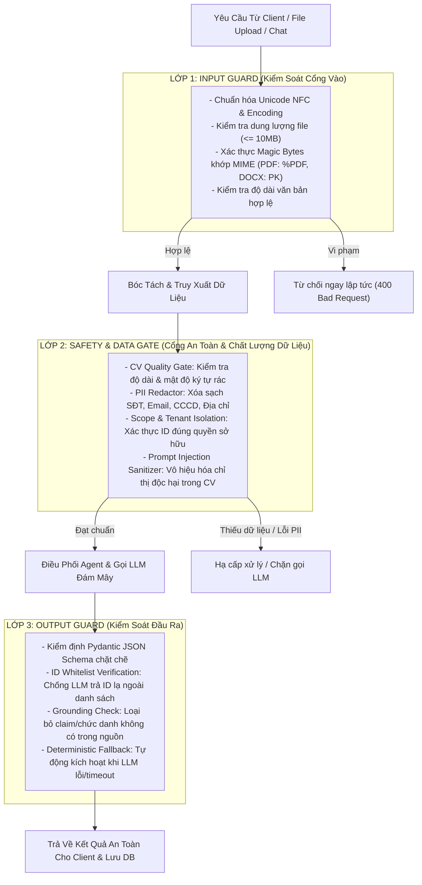

* **Đặc tính Cốt lõi**: Toàn bộ ba lớp Guardrail đều được lập trình dưới dạng mã Python tất định (Deterministic Code), có kiểm tra kiểu dữ liệu tĩnh (`Pydantic / Dataclasses`) và bộ Unit Test độc lập, tuyệt đối không gọi thêm LLM trung gian để kiểm tra an toàn nhằm tránh phát sinh độ trễ và chi phí token thừa.

---

# CHƯƠNG 5: THIẾT KẾ CHI TIẾT GIAO DIỆN VÀ TƯƠNG TÁC

## 5.1. Thiết kế Giao diện Người dùng (Frontend UX/UI & Component Architecture)

Frontend của NextJob được xây dựng bằng **React 19**, **Vite**, **TypeScript** và hệ thống giao diện hiện đại **Tailwind CSS v4** kết hợp chuyển động mượt mà của **Framer Motion**:

### 5.1.1. Cấu trúc Điều hướng & Danh mục Trang (20 Màn hình Chức năng)
1. **Trang Chung & Xác thực (General & Auth Pages)**:
   - `HomePage.tsx` (`/`): Trang chủ giới thiệu nền tảng, thanh tìm việc nhanh và các doanh nghiệp hàng đầu.
   - `LoginPage.tsx` (`/login`), `RegisterPage.tsx` (`/register`), `ForgotPasswordPage.tsx`, `ResetPasswordPage.tsx`.
   - `JobListPage.tsx` (`/jobs`), `JobDetailPage.tsx` (`/jobs/:id`).
2. **Trang Dành cho Ứng viên (Candidate Pages)**:
   - `ProfilePage.tsx` (`/profile`): Quản trị kho Dòng hồ sơ Master (Học vấn, Kinh nghiệm, Kỹ năng, Dự án).
   - `CVVaultPage.tsx` (`/cv-vault`): Quản lý tủ hồ sơ CV, xem trước PDF qua Signed URL, kích hoạt Ingest.
   - `CVBuilderPage.tsx` (`/cv-builder`): Trình dựng CV kéo thả chia đôi màn hình (`@dnd-kit`) với 10 mẫu template.
   - `AISuggestionsPage.tsx` (`/ai-suggestions`): Giao diện AI đối thoại gợi ý việc làm và phân tích Skill Gap.
   - `CVAssessmentPage.tsx` (`/cv-assessment`): Chấm điểm CV và đề xuất cải thiện nội dung chuẩn ATS.
   - `ApplicationsPage.tsx` (`/applications`): Quản lý lộ trình và trạng thái các đơn ứng tuyển đã nộp.
   - `RecruiterRegisterPage.tsx` (`/recruiter-register`): Nộp hồ sơ pháp lý doanh nghiệp kèm giấy phép ĐKKD.
3. **Trang Dành cho Nhà tuyển dụng (Recruiter Pages)**:
   - `RecruitmentDashboardPage.tsx` (`/dashboard`): Bàn tuyển dụng quản lý tin đăng và danh sách hồ sơ nộp.
   - `AICandidatePage.tsx` (`/ai-candidates`): Giao diện AI Matching xếp hạng ứng viên và xem lời giải thích minh bạch.
   - `AIInterviewPage.tsx` (`/ai-interview`): Phòng phỏng vấn mô phỏng tương tác bằng AI.
   - `RepoEvaluationPage.tsx` (`/repo-evaluation`): Công cụ quét và phân tích mã nguồn GitHub của ứng viên.
4. **Trang Quản trị Hệ thống (Admin Pages)**:
   - `AdminRecruiterPage.tsx` (`/admin`): Thẩm định đơn đăng ký nhà tuyển dụng và điều chỉnh quyền hạn người dùng.

### 5.1.2. Kiến trúc Trình dựng CV Trực quan (CV Builder Architecture)
Trình dựng CV tại `/cv-builder` áp dụng mô hình chia đôi màn hình (Split-pane Architecture):
* **Cột trái (Master Palette)**: Hiển thị toàn bộ các block thông tin trong kho Dòng hồ sơ Master của người dùng.
* **Cột phải (A4 Live Canvas Preview)**: Vùng làm việc kéo thả (`@dnd-kit`), hiển thị trực quan trang giấy A4 với tỷ lệ $1:\sqrt{2}$. Cho phép chuyển đổi linh hoạt tức thì giữa 10 mẫu giao diện (*Modern, Classic, Minimal, Sidebar...*).
* **Xuất bản PDF đa phân giải**:
  - *Chế độ Canvas*: Sử dụng `html2canvas` chụp ở tỷ lệ pixel ratio $\times 2$, kết hợp `jsPDF` tạo bản in PDF không bao giờ lỗi font tiếng Việt.
  - *Chế độ ATS Text*: Tạo luồng văn bản cấu trúc phân tầng rõ ràng để máy quét ATS dễ dàng bóc tách.

---

## 5.2. Đặc tả Giao diện Lập trình Ứng dụng (RESTful API Specifications)

Tất cả các API nghiệp vụ đều được bảo vệ bằng Supabase JWT thông qua tiêu đề `Authorization: Bearer <token>`:

| Phương thức | Đường dẫn Endpoint | Quyền hạn (Role) | Mô tả Nghiệp vụ & Dữ liệu Xử lý |
|:---:|---|:---:|---|
| `GET` | `/health`, `/api/v1/health` | Public | Kiểm tra trạng thái sẵn sàng hoạt động của hệ thống Backend |
| `GET` | `/api/v1/profiles/me` | Authenticated | Lấy thông tin tài khoản hiện tại kèm toàn bộ kho Master Profile |
| `PATCH` | `/api/v1/profiles/me` | Authenticated | Cập nhật thông tin cá nhân hoặc các dòng hồ sơ Master |
| `POST` | `/api/v1/resumes/{id}/ingest` | Candidate / Recruiter | Kích hoạt Ingest Agent: bóc tách layout, trích xuất 186 kỹ năng và vector hóa CV |
| `POST` | `/api/v1/chat` | Authenticated | Giao tiếp AI điều phối (Matching ứng viên hoặc gợi ý việc làm) có rate limit |
| `POST` | `/api/v1/candidates/repo-eval` | Recruiter / Candidate | Phân tích chất lượng mã nguồn kho lưu trữ GitHub của ứng viên |
| `POST` | `/api/v1/evaluation/cv-assess` | Candidate | Đánh giá, chấm điểm CV theo thang 100 và tiêu chuẩn ngành |
| `PATCH` | `/api/v1/admin/profiles/{id}` | Admin | Điều chỉnh vai trò (Role) của người dùng bất kỳ trong hệ thống |
| `POST` | `/api/v1/admin/recruiter-forms/{id}/review` | Admin | Phê duyệt hoặc từ chối đơn đăng ký nhà tuyển dụng kèm ghi chú |

---

## 5.3. Sơ đồ Tuần tự Chi tiết (Sequence Diagrams cho các Luồng Nghiệp vụ Chính)

### 5.3.1. Sơ đồ Tuần tự 1: Quy trình Tải lên, Bóc tách và Vector hóa CV (CV Ingest Flow)

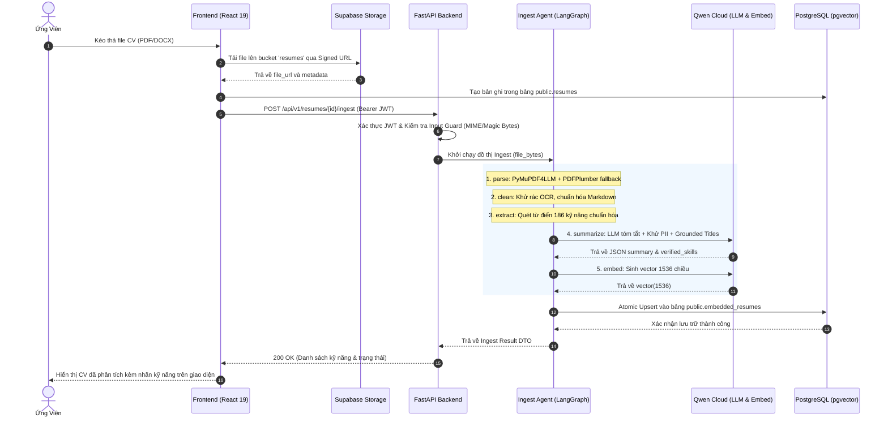

---

### 5.3.2. Sơ đồ Tuần tự 2: Quy trình Nhà tuyển dụng Khớp nối & Xếp hạng Ứng viên (Matching Flow)

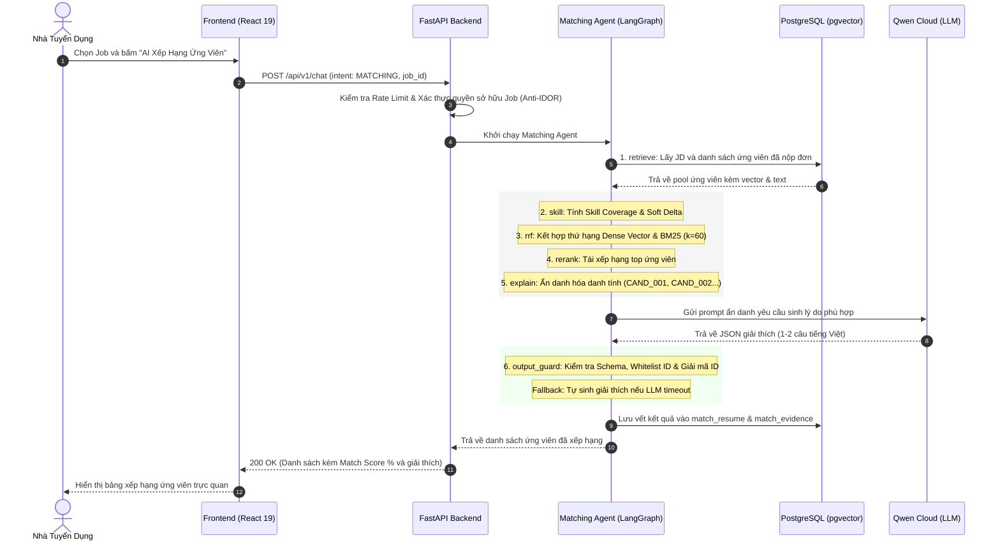

---

# CHƯƠNG 6: THIẾT KẾ TRIỂN KHAI, KIỂM THỬ VÀ ĐÁNH GIÁ

## 6.1. Kiến trúc Triển khai Hạ tầng Đám mây & Lý do Lựa chọn Nền tảng

Hệ thống NextJob áp dụng mô hình kiến trúc đám mây phân tán (Distributed Cloud Architecture) tách biệt rõ ràng giữa Client-side SPA, Backend Application Server, AI Inference Engine và BaaS (Backend-as-a-Service):

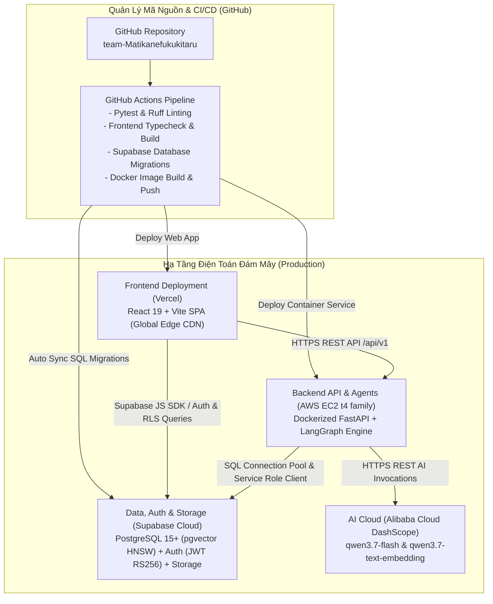

### 6.1.1. Ma Trận Đánh Giá & Lựa Chọn Nền Tảng Hạ Tầng

| Thành Phần Hệ Thống | Nền Tảng Lựa Chọn | Nền Tảng Cân Nhắc / Thay Thế | Lý Do Lựa Chọn Cốt Lõi |
|---|---|---|---|
| **Frontend Web App** | **Vercel** | Netlify, Cloudflare Pages, S3+CloudFront | **Nhanh, nhẹ, dễ dùng**, tối ưu hoàn hảo cho Vite/React SPA, Global Edge CDN, Zero-config CI/CD. |
| **Backend & AI Multi-Agents** | **AWS EC2 (t4 family)** | Render, Railway, Heroku | Render chỉ có **500MB RAM** và **traffic giới hạn**; EC2 t4 vượt trội về RAM (1-2GB+), CPU burstable, network cao, chống OOM khi parse CV nặng. |
| **Database, Vector, Auth & Storage** | **Supabase Cloud** | Tự dựng PostgreSQL + MinIO + Keycloak | Dễ tích hợp Agent/Backend, native `pgvector` HNSW 1536 dim, File Storage an toàn với Signed URLs, Auth & RLS đa tầng. |

---

### 6.1.2. Phân Tích Chi Tiết Lý Do Lựa Chọn Hạ Tầng

#### 1. Frontend: Vercel (Nhanh — Nhẹ — Dễ Dùng)
* **Tốc độ Triển khai Nhanh & Nhẹ (High Performance)**: Vercel được tối ưu hóa chuyên sâu cho hệ sinh thái React và bundler hiện đại (Vite 8). Quá trình build và đóng gói Single Page Application (SPA) diễn ra trong thời gian rất ngắn.
* **Mạng lưới Global Edge Network (CDN)**: Toàn bộ static assets (HTML, JavaScript bundles, CSS Tailwind v4, Web Fonts) được tự động phân phối và lưu bộ nhớ đệm (caching) tại hàng trăm điểm PoP (Points of Presence) trên toàn cầu, mang lại độ trễ mạng cực thấp ($< 50\text{ms}$) cho người dùng tại Việt Nam và quốc tế.
* **Trải nghiệm Phát triển & Tự động hóa CI/CD**: 
  * Tích hợp sâu với GitHub repository: Mỗi commit hoặc Pull Request đều tự động kích hoạt pipeline build và sinh **Preview Deployment URL** độc lập giúp kiểm thử giao diện tức thì.
  * Tự động quản lý và gia hạn chứng chỉ bảo mật **SSL/TLS**.
  * Dễ dàng cấu hình định tuyến SPA thông qua `vercel.json` (rewrites), loại bỏ hoàn toàn lỗi 404 khi người dùng refresh các trang con (`/cv-builder`, `/ai-suggestions`, `/dashboard`).

#### 2. Backend API & AI Agents: AWS EC2 (t4 family) vs Render
* **Vì sao không chọn Render cho nhanh?**
  * ❌ **Giới hạn Bộ nhớ Nghiêm ngặt (Chỉ 512MB / 500MB RAM)**: 
    * Backend của NextJob không phải là CRUD API thông thường mà là hệ thống AI đa tầng tích hợp LangGraph Multi-Agents, bộ thư viện bóc tách tệp nhị phân chuyên sâu (`pymupdf4llm`, `pdfplumber`, `python-docx`), thuật toán đối soát mờ từ vựng (`rapidfuzz` trên 186 kỹ năng) và mô hình BM25 tokenization.
    * Khi xử lý đồng thời nhiều tệp CV phức tạp (đặc biệt là PDF 2 cột dạng layout nhị phân), bộ nhớ tiến trình Python dễ dàng chạm ngưỡng 400MB–600MB RAM. Trên gói tiêu chuẩn của Render (512MB RAM), hệ điều hành sẽ kích hoạt bộ diệt tiến trình **Linux OOM Killer (Out-Of-Memory)** làm sập (crash) toàn bộ API server.
  * ❌ **Giới hạn Băng thông & Lưu lượng mạng (Traffic Limits)**: Render áp dụng quota băng thông và giới hạn số kết nối đồng thời khắt khe hơn nhiều so với hạ tầng đám mây của AWS, dễ gây nghẽn cổ chai khi tải lên hàng loạt tài liệu CV dung lượng lớn hoặc khi truyền dữ liệu phản hồi dạng luồng (Server-Sent Events streaming).
  * ❌ **Hiện tượng Cold Start (Sleep Mode)**: Gói free/starter của Render tự động chuyển sang chế độ ngủ (sleep) sau một khoảng thời gian không có request, gây độ trễ từ 30s đến 1 phút ở request đầu tiên, làm suy giảm nghiêm trọng trải nghiệm người dùng và gây timeout kết nối.
* **Lợi thế Vượt trội của AWS EC2 (t4 family - t4g.micro/small/medium)**:
  * ✅ **Tài nguyên Phần cứng Dồi dào & Ổn định**: Cung cấp cấu hình RAM từ 1GB đến 2GB+ cùng kiến trúc vi xử lý ARM Graviton2 (t4g) hoặc Intel/AMD (t4) với khả năng **Burstable CPU Performance**, đảm bảo xử lý mượt mà tác vụ bóc tách tài liệu nặng và đồ thị LangGraph mà không bao giờ gặp lỗi thiếu hụt bộ nhớ.
  * ✅ **Băng thông Mạng & Lưu lượng Truy cập (Traffic) Cao**: Khả năng truyền tải dữ liệu ổn định với băng thông lên tới 5 Gbps, không bị bóp băng thông khi người dùng tải lên nhiều file cùng lúc.
  * ✅ **Toàn quyền Kiểm soát Môi trường (Full System Control)**: Dễ dàng cấu hình môi trường Docker container, cài đặt các thư viện hệ thống ở tầng C (như `poppler-utils`, `tesseract` phục vụ xử lý tài liệu), quản lý biến môi trường, hệ thống logging và thiết lập cron jobs / health-check tự phục hồi.

#### 3. Database, Vector, Auth & File Storage: Supabase Cloud (BaaS Toàn Diện)
* **Dễ Tích Hợp vào Agent & Backend**: 
  * Cung cấp **Supabase Python Client** cho phép Backend và LangGraph AI Agents sử dụng `service_role_key` để truy vấn và cập nhật dữ liệu với quyền ưu tiên (bypass Row Level Security khi AI cần tổng hợp dữ liệu toàn cục).
  * Đồng thời hỗ trợ kết nối PostgreSQL trực tiếp thông qua **PgBouncer Connection Pooling**, tối ưu hóa việc tái sử dụng kết nối database trong môi trường bất đồng bộ (asyncio / FastAPI).
* **Hỗ trợ Vector Storage Toàn Diện (`pgvector` + HNSW)**: 
  * Tích hợp trực tiếp tiện ích mở rộng `pgvector` ngay trong hệ quản trị cơ sở dữ liệu PostgreSQL. Cho phép lưu trữ và truy vấn vector đặc trưng 1536 chiều với chỉ mục **HNSW (Hierarchical Navigable Small World)** đạt độ trễ truy vấn cực thấp ($< 15\text{ms}$).
  * Cho phép thực hiện **Hybrid Search** kết hợp giữa tìm kiếm tương đồng vector (Cosine Similarity) và lọc metadata quan hệ (SQL WHERE conditions, BM25 text search) trong **duy nhất một câu truy vấn SQL**, loại bỏ sự phức tạp của việc phải duy trì một cơ sở dữ liệu vector độc lập (như Pinecone hay Milvus).
* **File Storage Toàn Diện & An Toàn**: 
  * Quản lý tập trung các bucket lưu trữ tệp tin (`resumes` cho CV, `avatars` cho ảnh đại diện).
  * Hỗ trợ tạo **Signed URLs** tạm thời có thời hạn (time-bounded signed URLs) giúp Frontend xem trước file CV một cách an toàn mà không để lộ URL lưu trữ công khai.
* **Authentication & Phân Quyền Đa Tầng (RLS)**: 
  * Tích hợp sẵn hạ tầng Supabase Auth quản lý người dùng và phiên đăng nhập qua chuẩn **JWT (JSON Web Token)** (hỗ trợ giải mã HS256 ở local và RS256/JWKS trên Production Cloud).
  * Kết hợp hoàn hảo với cơ chế **Row Level Security (RLS)** ở tầng cơ sở dữ liệu để thực thi phân quyền truy cập dữ liệu theo vai trò (*Candidate, Recruiter, Admin*), đảm bảo ứng viên chỉ xem được hồ sơ của chính mình và nhà tuyển dụng chỉ xem được hồ sơ ứng tuyển vào công việc của họ.

---

## 6.2. Chiến lược Kiểm thử Tự động (Automated Testing Strategy)

Hệ thống thiết lập bộ kiểm thử tự động toàn diện với hơn **98 bài kiểm thử** phân tầng:

```text
tests/
├── unit/                    # Kiểm thử đơn vị các node LangGraph & services
│   ├── test_ingest_graph.py # Kiểm tra từng node parse, clean, extract, summarize, embed
│   ├── test_matching_graph.py # Kiểm tra luồng matching, rrf, rerank, fallback
│   ├── test_guardrails.py   # Kiểm tra Input Guard, Data Gate, Output Guard
│   └── test_rrf_fusion.py   # Kiểm tra tính toán công thức RRF và chuẩn hóa điểm
├── api/                     # Kiểm thử tích hợp các endpoint FastAPI
│   ├── test_auth_routes.py  # Kiểm tra xác thực JWT, Fail-Fast, phân quyền RBAC
│   ├── test_resumes_api.py  # Kiểm tra endpoint upload & ingest
│   └── test_chat_routes.py  # Kiểm tra endpoint chat AI & rate limiting
└── conftest.py              # Cấu hình fixtures, mock client (respx) và test database
```

* **Công cụ Sử dụng**: `pytest`, `pytest-asyncio`, `respx` (mock HTTP requests đến mô hình LLM), `ruff` (linter & code formatter chuẩn PEP 8).

---

## 6.3. Khung Đánh giá Thực nghiệm (Empirical Evaluation Benchmark với Golden Dataset)

Để liên tục kiểm định chất lượng bóc tách và vector hóa CV trong môi trường thực tế, hệ thống tích hợp bộ công cụ đánh giá độc lập **Golden Dataset** (`evaluation/ingest_eval_v2/`) gồm **41 CV mẫu** (bao gồm CV tổng hợp và CV thực tế dạng nhiều cột từ TopCV.vn):

### Kết quả Đánh giá Benchmark trên 41 CV:

| Tiêu Chí Đánh Giá | Chỉ Số Đo Lường | Kết Quả Đạt Được | Đánh Giá Ý Nghĩa Kỹ Thuật |
|---|:---:|:---:|---|
| **Parse Success Rate** | Tỷ lệ bóc tách thành công văn bản | **$100.0\%$ (41/41)** | Xử lý triệt để định dạng 2 cột phức tạp nhờ Fallback PDFPlumber |
| **PII Leakage Prevention** | Tỷ lệ lọc sạch SĐT, Email, CCCD | **$100.0\%$** | Không rò rỉ bất kỳ thông tin nhạy cảm nào sang context của LLM |
| **Skill Extraction Recall** | Tỷ lệ trích xuất đúng kỹ năng | **$93.8\%$** | Kiến trúc Extract-First giữ trọn vẹn kỹ năng trước khi tóm tắt |
| **Summarization Faithfulness** | Độ trung thực của bản tóm tắt | **$97.5\%$** | Cơ chế Grounded Titles loại bỏ hoàn toàn hiện tượng LLM tự bịa chức danh |
| **Average Ingest Latency** | Thời gian xử lý trung bình 1 CV | **$3.82\text{s}$** | Đạt yêu cầu thời gian thực đối với trải nghiệm người dùng |

---

# CHƯƠNG 7: KẾT LUẬN VÀ HƯỚNG PHÁT TRIỂN

## 7.1. Tổng kết Kết quả Đạt được

Dự án **NextJob (Đồ án Chuyên ngành P-099)** đã hoàn thành xuất sắc toàn bộ các mục tiêu nghiên cứu và phát triển:

1. **Về mặt Lý thuyết & Kiến trúc**:
   - Ứng dụng thành công mô hình **Multi-Agent Orchestration (LangGraph)** vào bài toán tuyển dụng nhân sự hai chiều.
   - Xây dựng thành công thuật toán xếp hạng lai **Hybrid Ranking** kết hợp tối ưu giữa Tìm kiếm ngữ nghĩa vector (pgvector HNSW), Tìm kiếm từ khóa chính xác (BM25) và Đồ thị tri thức kỹ năng (Skill Taxonomy Graph).
   - Thiết lập mô hình phòng vệ an ninh ba lớp (**Three-Layer Guardrails**) đảm bảo an toàn PII, chống tấn công injection và kiểm soát chi phí token.
2. **Về mặt Thực tiễn Ứng dụng**:
   - Xây dựng hoàn chỉnh hệ thống Web Application với 20 màn hình chức năng chuyên nghiệp, hỗ trợ đầy đủ 3 đối tượng người dùng: Ứng viên, Nhà tuyển dụng và Quản trị viên.
   - Giải quyết triệt để vấn đề nhập liệu lặp lại thông qua cơ chế **Dòng hồ sơ Master** và **Trình dựng CV kéo thả 10 mẫu chuẩn ATS**.
   - Tích hợp các tính năng đột phá: Đánh giá mã nguồn GitHub Repository, Phỏng vấn thử nghiệm bằng AI và Đánh giá CV chuyên sâu.
   - Hệ thống được kiểm thử nghiêm ngặt với 98+ bài test tự động và chứng minh độ chính xác cao qua bộ Benchmark 41 CV thực tế.

## 7.2. Đánh giá Ưu điểm và Hạn chế

### Ưu điểm Nổi bật:
* **Khách quan và Minh bạch**: Loại bỏ hoàn toàn mô hình hộp đen bằng cách cung cấp lời giải thích phù hợp rõ ràng (1-2 câu tiếng Việt) kèm danh sách bằng chứng kỹ năng đối chiếu thực tế.
* **Bảo vệ Quyền Riêng tư Tối đa**: Áp dụng cơ chế mã hóa danh tính ẩn danh khi gọi LLM, bảo vệ tuyệt đối dữ liệu người dùng.
* **Khả năng Chịu lỗi Cao (High Resilience)**: Tích hợp cơ chế Deterministic Fallback tại mọi điểm nghẽn, đảm bảo hệ thống luôn phản hồi ổn định ngay cả khi dịch vụ AI bên ngoài gặp sự cố.

### Hạn chế Hiện tại:
* Mô hình trích xuất kỹ năng hiện tại phụ thuộc vào từ điển 186 kỹ năng công nghệ thông tin (IT); chưa mở rộng sang các khối ngành nghề phi công nghệ (Kinh tế, Y tế, Xây dựng).
* Phiên phỏng vấn AI hiện tại chủ yếu thực hiện qua giao diện văn bản (Chat/Text), chưa tích hợp nhận diện giọng nói thời gian thực (Real-time Speech-to-Text).

## 7.3. Định hướng Phát triển Tương lai

1. **Mở rộng Đồ thị Kỹ năng Đa ngành (Dynamic Cross-Domain Taxonomy)**: Ứng dụng cơ chế học bán giám sát (Semi-supervised Learning) để tự động cập nhật và làm giàu đồ thị kỹ năng từ các tin tuyển dụng mới xuất hiện trên thị trường.
2. **Phỏng vấn AI Thời gian thực bằng Giọng nói (Real-time Voice AI Interview)**: Tích hợp giao thức WebRTC kết hợp mô hình Speech-to-Speech để mang lại trải nghiệm phỏng vấn mô phỏng chân thực như tương tác với người phỏng vấn thật.
3. **Mô hình Định tuyến Đa Đám mây (Multi-Cloud LLM Smart Routing)**: Tự động điều hướng câu hỏi đến các mô hình mã nguồn mở cục bộ (Ollama/vLLM) cho các tác vụ đơn giản và chỉ gọi mô hình đám mây lớn cho các phân tích chuyên sâu nhằm tối ưu hóa chi phí vận hành.

---

# TÀI LIỆU THAM KHẢO

1. **Cormack, G. V., Clarke, C. L., & Buettcher, S. (2009)**. *Reciprocal rank fusion outperforms cumulated gain and MAP in IR*. In Proceedings of the 32nd international ACM SIGIR conference on Research and development in information retrieval (pp. 758-759).
2. **Malkov, Y. A., & Yashunin, D. A. (2018)**. *Efficient and robust approximate nearest neighbor search using hierarchical navigable small world graphs*. IEEE transactions on pattern analysis and machine intelligence, 42(4), 824-836.
3. **LangChain & LangGraph Development Team (2024)**. *LangGraph: Building Stateful, Multi-Actor Applications with LLMs*. Official Technical Documentation.
4. **FastAPI Development Team (2024)**. *FastAPI Framework: High performance, easy to learn, fast to code, ready for production*.
5. **Supabase & PostgreSQL Community (2024)**. *pgvector: Open-source vector similarity search for Postgres*.
6. **Alibaba Cloud DashScope Team (2024)**. *Qwen Technical Report: Advanced Large Language and Embedding Models*.
7. **Robertson, S., & Zaragoza, H. (2009)**. *The Probabilistic Relevance Framework: BM25 and Beyond*. Foundations and Trends in Information Retrieval, 3(4), 333-389.

---

<div align="center">
  <sub>Báo cáo Phân tích và Thiết kế Hệ thống — Đồ án P-099 NextJob — Nhóm Matikanefukukitaru.</sub>
</div>
