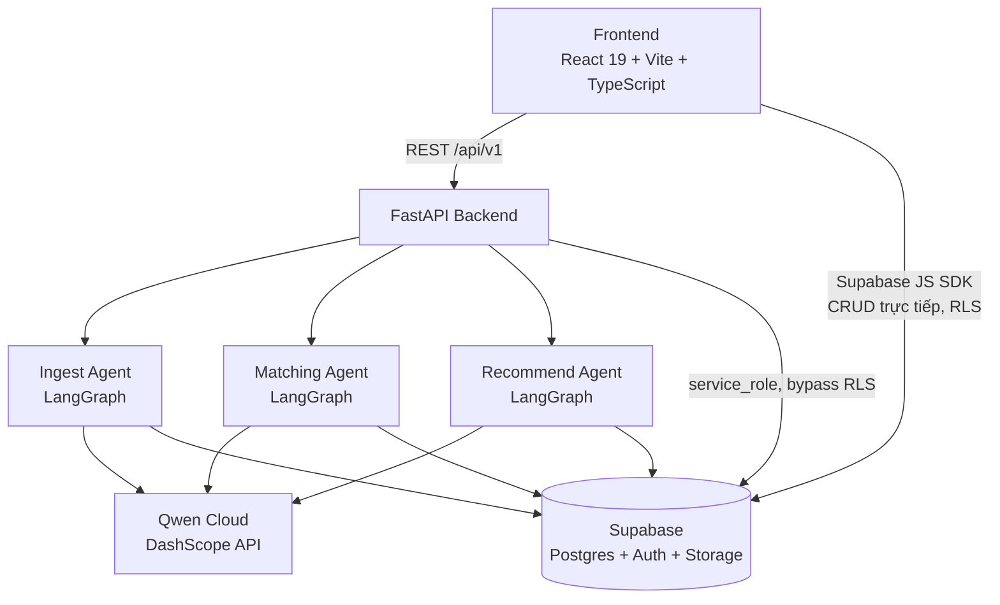
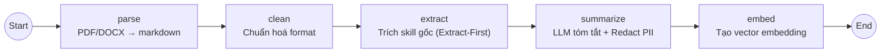
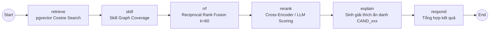
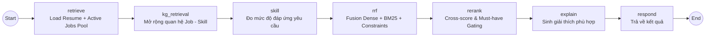

# Đặc Tả Kỹ Thuật Agent & Backend
### NextJob — AI-Powered Two-Way Recruitment Platform
### Đồ án Chuyên ngành P-099 | Team Matikanefukukitaru

---

## 1. Tổng Quan Kiến Trúc Vận Hành

Hệ thống NextJob là nền tảng tuyển dụng hai chiều kết hợp giữa **FastAPI Backend (AI Orchestration)** và **Supabase Cloud (PostgreSQL + pgvector + Auth + Storage)**:

- **Ứng viên (Candidate)**: Xây dựng hồ sơ trực tuyến, tải lên CV (PDF/DOCX); hệ thống kích hoạt **Ingest Agent** để bóc tách layout, làm sạch PII, trích xuất kỹ năng và vector hóa vào `pgvector`. Khi ứng viên tìm việc, **Recommend Agent** sẽ đối chiếu CV với pool việc làm đang mở và gợi ý các công việc phù hợp kèm phân tích khoảng trống kỹ năng.
- **Nhà tuyển dụng (Recruiter)**: Đăng tin tuyển dụng (JD); hệ thống kích hoạt **Matching Agent** quét pool ứng viên, tính toán độ phù hợp theo mô hình lai (Hybrid Ranking RRF) và sinh giải thích chi tiết với danh tính ẩn danh (`CAND_001`...).



---

## 2. Phân Tầng Trách Nhiệm Backend (Backend Layered Architecture)

```
backend/app/
├── api/routes + api/schemas   → HTTP Layer (Validate input DTO, gọi Service, trả Response model)
├── agents/                    → LangGraph Orchestration (Ingest, Matching, Recommend, Interview, Evaluation)
├── services/ + repositories/  → Domain Logic + Ranking Algorithms + Data Access (Supabase)
├── clients/                   → External Clients (Qwen LLM, Supabase Admin Client)
└── config/ + guardrails/ + core/ → Settings tập trung, PII Redaction, JWT Security, Rate Limiter
```

### Nguyên Tắc Bắt Buộc:
- **Routes Layer**: Tuyệt đối không chứa logic nghiệp vụ hay truy vấn Supabase trực tiếp; repository không bắn mã lỗi `HTTPException`.
- **Cấu hình**: `settings` luôn import từ `config/env.py`, tuân thủ cơ chế Fail-Fast từ chối khởi động nếu thiếu key an toàn trên Production.
- **Xác thực & Phân quyền**: Mọi route (trừ `/health`) xác thực Supabase JWT qua header `Authorization: Bearer`, giải mã bằng `backend/app/core/security.py` (hỗ trợ HS256 và RS256/ES256 qua JWKS). Service layer chịu trách nhiệm kiểm tra quyền sở hữu (`owner_id`, `recruiter_id`) trước khi truy xuất dữ liệu.

---

## 3. Ingest Agent Workflow (Xử Lý & Vector Hóa CV)

Được triển khai tại `backend/app/agents/ingest/graph.py`. Tự động kích hoạt khi ứng viên tải lên hoặc cập nhật CV:



| Node | Trách nhiệm chính |
|---|---|
| `parse` | Sử dụng `pymupdf4llm` đọc PDF layout-aware (fallback `pdfplumber` đọc theo cột tọa độ khi nội dung $< 600$ ký tự), `python-docx` đọc DOCX &rarr; sinh Markdown + cờ `metadata.content_chars`/`low_content`. |
| `clean` | Chuẩn hóa khoảng trắng, ký tự rác OCR (`\x00`, `\ufeff`) và chuẩn hóa cấu trúc đề mục. |
| `extract` | **Extract-First Architecture**: Quét trực tiếp trên Markdown **gốc** với từ điển 186 kỹ năng chuẩn hóa + Fuzzy matching (`rapidfuzz`). Đảm bảo $100\%$ kỹ năng được bảo toàn trước khi cho LLM tóm tắt. |
| `summarize` | Gọi LLM (`qwen3.7-flash`, JSON mode) tóm tắt kinh nghiệm làm việc, áp dụng `grounded_titles` chống bịa đặt và `redact_pii` che thông tin cá nhân. |
| `embed` | Gọi mô hình `qwen3.7-text-embedding` tạo vector 1536 chiều và lưu trữ nguyên tử vào `public.embedded_resumes` (pgvector HNSW index). |

---

## 4. Matching Agent Workflow (Khớp Nối Ứng Viên Cho Nhà Tuyển Dụng)

Được triển khai tại `backend/app/agents/matching/graph.py`. Vận hành khi nhà tuyển dụng yêu cầu gợi ý ứng viên cho tin tuyển dụng (`job_id`):



| Node | Trách nhiệm chính |
|---|---|
| `retrieve` | Tải thông tin JD và danh sách ứng viên (`job_submits`); tự động ingest on-the-fly nếu CV chưa vector hóa; sinh embedding kép và gọi RPC Postgres `match_resumes_for_job`. |
| `skill` | Tính toán `coverage_score` và `soft_delta` (kỹ năng còn thiếu) đối chiếu với đồ thị `skill_graph.json`. |
| `rrf` | Áp dụng Reciprocal Rank Fusion kết hợp xếp hạng Semantic (Dense) và Keyword (BM25) thành điểm tổng $[0.0, 1.0]$. |
| `rerank` | Tái xếp hạng top ứng viên bằng mô hình chấm điểm chuyên sâu. |
| `explain` | Ẩn danh hóa danh tính (`CAND_001`, `CAND_002`...) trước khi gửi vào LLM để sinh lý do phù hợp khách quan 1-2 câu tiếng Việt; tự động fallback deterministic nếu LLM gián đoạn. |
| `respond` | Tổng hợp danh sách ứng viên kèm giải thích và lưu bằng chứng vào `public.match_evidence`. |

---

## 5. Recommend Agent Workflow (Gợi Ý Việc Làm Cho Ứng Viên)

Được triển khai tại `backend/app/agents/recommend/graph.py`. Vận hành khi ứng viên yêu cầu tìm kiếm việc làm phù hợp với hồ sơ CV mặc định:



- Tận dụng cache vector `public.embedded_jobs` để tối ưu hóa thời gian phản hồi dưới 1 giây cho ứng viên.
- Áp dụng bộ lọc ràng buộc tiên quyết (**Must-have Constraints Gating**) để phân loại việc làm (*Phù hợp cao, Bình thường, Cần bổ sung kỹ năng*).

---

## 6. Mô Hình Dữ Liệu & Bảo Mật Supabase

- **PostgreSQL 15+ & pgvector**: Chỉ mục HNSW `vector_cosine_ops` (dimension 1536) trên bảng `embedded_resumes` và `embedded_jobs`.
- **Row Level Security (RLS)**: Bật trên toàn bộ bảng công khai (`profiles`, `job_posts`, `job_submits`, `resumes`). Bảng nội bộ `embedded_resumes` chỉ cấp quyền cho backend `service_role`.
- **Skill Taxonomy**: Bộ dữ liệu 186 kỹ năng chuẩn hóa và đồ thị kỹ năng (`skill_graph.json`) nạp trực tiếp in-memory với thuật toán so khớp mờ `rapidfuzz`.

---

## 7. Kiểm Thử & Đảm Bảo Chất Lượng

Hệ thống sở hữu bộ kiểm thử tự động toàn diện với **hơn 803 test cases** (`pytest tests/ -v`):
- **Unit Tests**: Kiểm tra từng node LangGraph (`parse`, `clean`, `extract`, `summarize`, `embed`, `rrf`, `anonymize`).
- **Integration Tests**: Kiểm thử luồng matching end-to-end, API endpoints, bảo mật JWT và Rate Limiter.
- **Linting & Code Style**: `ruff check backend/ tests/` đạt 100% không phát sinh lỗi.
