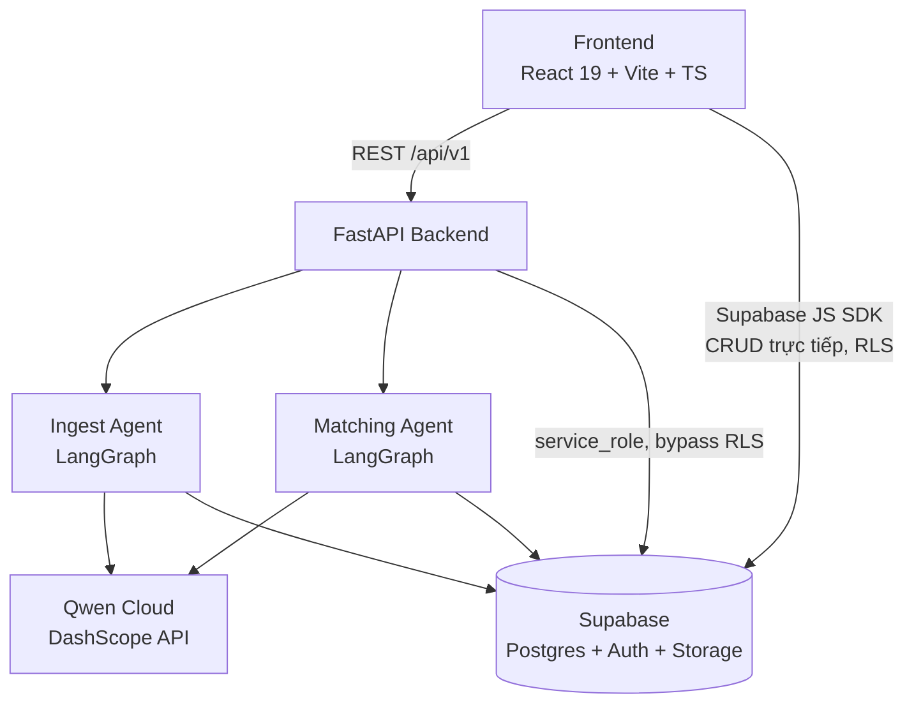
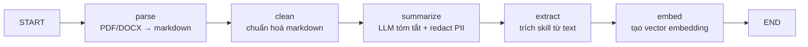
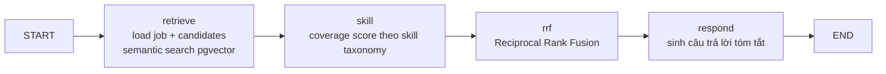

# Kiến trúc Agent & Backend

> Tài liệu này mô tả **hệ thống thật đang chạy** (đọc trực tiếp từ code), không phải bản thiết kế dự kiến.
> Xem thêm: [`docs/ai_agent_matching_system_spec.md`](ai_agent_matching_system_spec.md) (spec chi tiết cho hướng phát triển matching engine), `.cursor/rules/backend-architecture.mdc` (quy ước layer bắt buộc khi code backend).

## 0. Lưu ý quan trọng: thư mục "agent" chết

Repo có **3 nơi** trông giống agent code, nhưng chỉ 1 nơi được dùng thật:

| Thư mục | Trạng thái | Ghi chú |
|---|---|---|
| `backend/app/agents/` | ✅ **Đang dùng** | Agent thật, được `backend/app/main.py` → `dependencies/services.py` import và chạy |
| `/agent/` (gốc repo) | ❌ Chết | File scaffold mẫu (`example_node.py`, `example_tool.py`), không có nơi nào trong `backend/` import nó |
| `/src/agents/` (gốc repo) | ❌ Chết | Chỉ còn `__pycache__/*.pyc`, **file `.py` gốc đã bị xoá** — tàn dư build cũ |

Khi đọc/sửa "agent", luôn thao tác trong `backend/app/agents/`.

## 1. Tổng quan hệ thống

Nền tảng tuyển dụng: candidate xây CV, nộp đơn (`job_submits`) vào `job_posts`; recruiter đăng job và nhận gợi ý ứng viên phù hợp qua AI matching. Frontend đọc/ghi dữ liệu nghiệp vụ **trực tiếp qua Supabase** (RLS bảo vệ), backend chỉ lo phần cần server-side: xác thực JWT, chạy AI agent (ingest CV, matching), và các thao tác cần `service_role` (bypass RLS).



## 2. Backend — layer bắt buộc

```
api/routes + api/schemas   → HTTP (validate input, gọi service, trả response model)
agents/                    → LangGraph: ingest + matching
services/ + repositories/  → domain logic + persistence (Supabase)
clients/                   → LLM (Qwen) + Supabase client
config/ + observability/ + guardrails/ + core/
```

Route không chứa business logic hay query Supabase trực tiếp; repository không raise `HTTPException`. `settings` luôn import từ `config/env.py`, không rải `os.getenv()` (xem `.cursor/rules/backend-architecture.mdc`).

**Auth**: mọi route (trừ `/health`) xác thực Supabase JWT qua header `Authorization: Bearer`, verify bằng `backend/app/core/security.py` (HS256 với secret local, hoặc RS256/ES256 qua JWKS khi dùng Supabase Cloud). Backend dùng `service_role` key nên **tự chịu trách nhiệm check quyền sở hữu/role** trong service layer — RLS không tự bảo vệ được vì service_role bypass nó.

**API surface** (`/api/v1/...`):
- `GET /health`
- `PATCH /profiles/*` — hồ sơ người dùng
- `POST /chat` — job seeker: gợi ý job (hiện là mock ranking); recruiter kèm `job_id`: chạy **Matching Agent** thật để gợi ý ứng viên
- `POST /resumes/{id}/ingest` — chạy **Ingest Agent** trên 1 CV đã upload
- `PATCH /admin/profiles/{id}`, `POST /admin/recruiter-forms/{id}/review` — thao tác admin

## 3. Ingest Agent (LangGraph) — xử lý CV

`backend/app/agents/ingest/graph.py`. Chạy khi candidate ingest 1 resume (PDF/DOC/DOCX đã ở Supabase Storage).



| Node | Việc làm |
|---|---|
| `parse` | `pymupdf`/`pymupdf4llm` đọc PDF/DOCX → markdown thô |
| `clean` | chuẩn hoá whitespace/format markdown |
| `summarize` | gọi LLM (Qwen, JSON mode) tóm tắt CV thành `summary` + `titles`, sau đó `redact_pii` xoá thông tin nhạy cảm khỏi body |
| `extract` | trích danh sách skill từ markdown (rule-based, `services/matching/skills.py`) |
| `embed` | gọi Qwen embedding API → vector, lưu vào `public.embedded_resumes` (pgvector) |

Kết quả ghi vào `public.embedded_resumes` (embedding + markdown đã parse + metadata skills), phục vụ semantic search sau này. Bảng này **không** expose qua Supabase Data API — chỉ backend (service_role) đọc/ghi được.

## 4. Matching Agent (LangGraph) — gợi ý ứng viên

`backend/app/agents/matching/graph.py`. Chạy khi recruiter chat để tìm ứng viên phù hợp cho 1 `job_post`.



| Node | Việc làm |
|---|---|
| `retrieve` | (`services/matching/retrieve.py`) load `job_posts` + danh sách `job_submits` chưa rút đơn; với mỗi resume chưa ingest thì tự ingest on-the-fly; build 2 embedding query (gốc + mở rộng bằng đồng nghĩa skill), gọi RPC Postgres `match_resumes_for_job` (pgvector) để lấy khoảng cách semantic |
| `skill` | tính `coverage_score` — skill ứng viên khớp bao nhiêu % skill JD yêu cầu, dựa trên skill taxonomy JSON nội bộ (không phải bảng DB) |
| `rrf` | Reciprocal Rank Fusion kết hợp rank semantic (gốc + mở rộng) và skill score thành 1 điểm tổng, deterministic |
| `respond` | sinh câu trả lời text ngắn ("Gợi ý N ứng viên phù hợp") |

Sau khi graph chạy xong, `dependencies/services.py` gọi `persist_match_resume_rows` ghi lịch sử vào `public.match_resume` + evidence từng cặp vào `public.match_evidence` (best-effort, lỗi ghi không làm fail response).

Lưu ý: nhánh gợi ý **job cho candidate** (`POST /chat` không kèm `job_id`) hiện **chưa** dùng agent thật — dùng `mock_recommend()` (ranking giả lập). Chỉ nhánh recruiter → candidate đã nối vào Matching Agent thật.

## 5. LLM & Embedding

Client duy nhất: `backend/app/clients/llm.py`, gọi **Qwen Cloud qua DashScope** (OpenAI-compatible endpoint), dùng cho cả chat completion (tóm tắt CV) và text embedding (semantic search).

- Model chat mặc định: `qwen3.7-flash`
- Model embedding mặc định: `qwen3.7-text-embedding`, dimension 1536 (giới hạn HNSW pgvector index tối đa 2000)
- `OPENAI_API_KEY` / `MODEL_NAME` trong `.env` là biến **legacy**, gần như không còn được dùng trong pipeline agent hiện tại.

## 6. Data layer — Supabase

Postgres (qua Supabase) là nguồn dữ liệu chính, migrations ở `supabase/migrations/`.

**Bảng chính** (RLS bật, frontend đọc/ghi trực tiếp qua Supabase JS):
```
public.profiles        -- user: role (candidate/recruiter/admin) + default_resume_id
public.profile_lines    -- name/value dùng dựng CV
public.resumes           -- metadata CV, file PDF ở Storage bucket "resumes"
public.companies / job_posts
public.job_submits       -- candidate nộp resume vào job_post
public.match_resume / match_job / match_evidence  -- lịch sử + bằng chứng matching
```

**Bảng nội bộ** (chỉ backend service_role, không qua Data API):
```
public.embedded_resumes  -- vector(1536) pgvector HNSW + markdown đã parse + skills
```

**Skill taxonomy/graph**: file JSON tĩnh trong `backend/app/services/matching/resources/`, agent load in-process — không phải bảng DB, không có REST endpoint.

## 7. Frontend

React 19 + Vite + TypeScript + Tailwind v4, gọi Supabase trực tiếp (`@supabase/supabase-js`) cho CRUD nghiệp vụ và gọi FastAPI backend cho `/chat`, `/resumes/{id}/ingest`, `/admin/*`. Có module dựng/xuất CV (`@dnd-kit`, `jspdf`, `html2canvas`). Deploy qua Vercel (`frontend/vercel.json`).

> Ghi chú: `@google/genai` có trong `package.json` nhưng không thấy được import ở `frontend/src` — có thể là dependency thừa/chưa dùng, cần xác nhận lại nếu định dọn dẹp.

## 8. Danh sách biến `.env`

### `backend/.env` (copy từ `backend/.env.example`)

| Biến | Bắt buộc | Mặc định / Nguồn | Ghi chú |
|---|---|---|---|
| `APP_ENV` | Không | `development` | `production` bắt buộc `SUPABASE_JWT_SECRET` khác giá trị default (startup fail nếu không) |
| `CORS_ORIGINS` | Không | `http://localhost:5173,http://localhost:3000` | danh sách origin, phân tách bằng dấu phẩy |
| `SUPABASE_URL` | **Có** | `npx supabase status` (local) hoặc project settings (cloud) | |
| `SUPABASE_ANON_KEY` | Có (nếu dùng) | `npx supabase status` | |
| `SUPABASE_SERVICE_ROLE_KEY` | **Có** | `npx supabase status` / project settings | bypass RLS — tuyệt đối không lộ ra frontend/logs |
| `SUPABASE_JWT_SECRET` | **Có** (bắt buộc khác default khi production) | `npx supabase status` | dùng verify JWT thuật toán HS256 (local) |
| `QWEN_API_KEY` | **Có** (để agent chạy thật) | DashScope console | thiếu key → ingest/matching agent gọi LLM sẽ lỗi |
| `QWEN_BASE_URL` | Không | `https://dashscope-intl.aliyuncs.com/compatible-mode/v1` | |
| `LLM_MODEL` | Không | `qwen3.7-flash` | |
| `EMBEDDING_MODEL` | Không | `qwen3.7-text-embedding` | |
| `OPENAI_API_KEY` | Không (legacy) | — | không còn dùng trong pipeline agent chính |
| `MODEL_NAME` | Không (legacy) | `gpt-4o-mini` | đi kèm `OPENAI_API_KEY` legacy |

### `frontend/.env` (copy từ `frontend/.env.example`)

| Biến | Bắt buộc | Ghi chú |
|---|---|---|
| `NEXT_PUBLIC_SUPABASE_URL` | **Có** | Vite expose prefix `VITE_`/`NEXT_PUBLIC_` (xem `vite.config.ts`) |
| `NEXT_PUBLIC_SUPABASE_ANON_KEY` | **Có** | anon/publishable key — an toàn để lộ (RLS bảo vệ) |
| `VITE_API_BASE_URL` | **Có** | mặc định `http://localhost:8000`, trỏ tới FastAPI backend |

## 9. Chạy local

```bash
npx supabase start              # Postgres + Auth + Storage local
uvicorn backend.app.main:app --reload --port 8000   # hoặc: uvicorn backend.main:app
cd frontend && npm run dev      # Vite dev server, port 3000
```

Deploy: `Dockerfile` build image Python 3.11-slim chạy `uvicorn backend.main:app`; `docker-compose.yml` chạy container backend đơn (health check `/health`). Frontend deploy riêng qua Vercel.

## 10. Test

`tests/` (pytest) bao phủ: matching graph end-to-end, từng bước pipeline (`rrf`, `skills`, `parse`, `embed`, `retrieve`, `summarize`, `ingest`), API routes, rate limiting (`guardrails/rate_limit.py` — giới hạn 20 request/60s cho `/chat`, in-memory nên chỉ đúng khi chạy 1 process).
