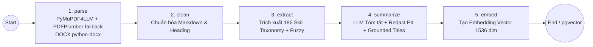
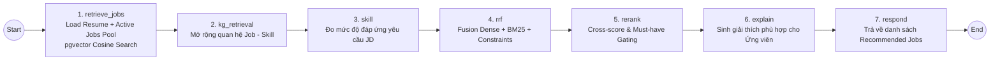

# Kiến trúc Hệ thống Tổng thể (System Architecture)

> **Tài liệu tham chiếu**: Tích hợp và đồng bộ từ [`docs/architecture-agent-backend.md`](file:///c:/Users/Admin/AI%20IA/team-Matikanefukukitaru/docs/architecture-agent-backend.md), đặc tả hệ thống [`docs/ai_agent_matching_system_spec.md`](file:///c:/Users/Admin/AI%20IA/team-Matikanefukukitaru/docs/ai_agent_matching_system_spec.md) và các quy chuẩn phân tầng tại `.cursor/rules/backend-architecture.mdc`.
> **Trạng thái**: Hệ thống thực tế đang vận hành (Production-Ready Codebase).

---

## 0. Quy ước Thư mục Agent trong Codebase

Để tránh nhầm lẫn với các thư mục scaffold cũ hoặc tàn dư build:

| Đường dẫn thư mục | Trạng thái | Ghi chú & Vai trò |
|---|---|---|
| `backend/app/agents/` |  **Đang hoạt động (Active)** | Toàn bộ mã nguồn LangGraph Agent thật (Ingest Agent, Matching Agent, Recommend Agent), được `backend/app/main.py` và `dependencies/services.py` nạp thực thi. |
| `/agent/` (gốc repo) | ❌ Không sử dụng (Legacy Scaffold) | Chứa các file mẫu sơ khai (`example_node.py`, `example_tool.py`), không được backend import. |
| `/src/agents/` (gốc repo) | ❌ Không sử dụng (Build Artifact) | Tàn dư build cũ (`__pycache__/*.pyc`), các file `.py` đã được dọn sạch. |

> **Quy tắc**: Mọi thao tác phát triển, kiểm thử và bảo trì AI Agent luôn thực hiện bên trong `backend/app/agents/`.

---

## 1. Tổng quan Hệ thống (System Overview)

Hệ thống Tuyển dụng Thông minh (**NextJob**) là nền tảng kết nối ứng viên và nhà tuyển dụng thông qua sức mạnh của **Multi-Agent Orchestration** (LangGraph) và **Hybrid Search Retrieval** (pgvector + BM25 + Skill Graph).

- **Ứng viên (Job Seeker)**: Xây dựng CV trực tuyến, tải lên file PDF/DOCX, hệ thống tự động bóc tách kỹ năng, làm sạch PII và gợi ý danh sách việc làm phù hợp nhất kèm giải thích chi tiết.
- **Nhà tuyển dụng (Recruiter)**: Đăng tin tuyển dụng (JD), hệ thống tự động quét pool hồ sơ ứng viên đã nộp hoặc pool toàn sàn, tính toán độ phù hợp theo mô hình lai (Hybrid Ranking) và cung cấp lý do phù hợp khách quan (Explainability).
- **Mô hình Hybrid Data Flow**:
  - **Frontend (Client-side)**: Tương tác trực tiếp với **Supabase (PostgreSQL + Auth + Storage)** thông qua Supabase JS SDK với sự bảo vệ của Row Level Security (RLS) cho các tác vụ CRUD thông thường.
  - **Backend (FastAPI)**: Đóng vai trò là Server-side Orchestrator, xử lý xác thực JWT, thực thi AI LangGraph pipelines, giao tiếp LLM/Embedding API, và thực thi các logic quản trị qua `service_role` (bypass RLS với kiểm soát phân quyền chặt chẽ tại service layer).

```mermaid
graph TB
    subgraph Client Layer
        UI[Frontend Web App<br/>React 19 + Vite + TypeScript + Tailwind v4]
    end

    subgraph Backend Layer (FastAPI)
        API[API Gateways & Routers<br/>FastAPI /api/v1]
        Security[Security & Guardrails<br/>JWT HS256/RS256, Rate Limiter, PII Redactor]
        
        subgraph Agent Orchestration (LangGraph)
            IngestAgent[Ingest Agent<br/>parse -> clean -> extract -> summarize -> embed]
            MatchingAgent[Matching Agent<br/>retrieve -> kg -> skill -> rrf -> rerank -> explain]
            RecommendAgent[Recommend Agent<br/>retrieve -> kg -> skill -> rrf -> rerank -> explain]
        end
        
        ServiceLayer[Domain Services & Ranking Engine<br/>RRF Fusion, BM25, Skill Taxonomy, Anonymizer]
        RepoLayer[Repositories & Data Access Layer<br/>Match Evidence, Profile, Job Post, Ingest Batcher]
        LLMClient[LLM & Embedding Client<br/>Qwen Cloud DashScope / OpenAI compatible]
    end

    subgraph Data & Cloud Layer (Supabase)
        Auth[(Supabase Auth<br/>JWT, Session Management)]
        Storage[(Supabase Storage<br/>Buckets: resumes, avatars)]
        Postgres[(PostgreSQL + pgvector<br/>HNSW Vector Index, Tables, RLS)]
    end

    subgraph External AI Services
        DashScope[Qwen Cloud API<br/>qwen3.7-flash, qwen3.7-text-embedding]
    end

    UI -->|REST API /api/v1| API
    UI -->|Supabase JS SDK / CRUD + RLS| Postgres
    UI -->|Auth SDK| Auth
    UI -->|Storage SDK| Storage

    API --> Security
    Security --> IngestAgent
    Security --> MatchingAgent
    Security --> RecommendAgent

    IngestAgent --> ServiceLayer
    MatchingAgent --> ServiceLayer
    RecommendAgent --> ServiceLayer

    ServiceLayer --> RepoLayer
    ServiceLayer --> LLMClient
    
    RepoLayer -->|service_role / bypass RLS| Postgres
    LLMClient -->|HTTPS REST| DashScope
```

---

## 2. Kiến trúc Phân tầng Backend (Backend Layered Architecture)

Backend tuân thủ nghiêm ngặt mô hình phân tầng hướng đối tượng và cô lập trách nhiệm (Separation of Concerns):

```
backend/app/
├── api/
│   ├── routes/              # HTTP Endpoints (Chỉ validate DTO, gọi Service, trả Response)
│   └── schemas/             # Pydantic Input/Output Schemas
├── agents/                  # LangGraph Multi-Agent Workflows
│   ├── ingest/              # Pipeline xử lý hồ sơ ứng viên
│   ├── matching/            # Pipeline gợi ý ứng viên cho nhà tuyển dụng (JD -> CV)
│   └── recommend/           # Pipeline gợi ý việc làm cho ứng viên (CV -> JD)
├── services/                # Domain Business Logic & Algorithms (RRF, BM25, Taxonomy, Explain)
├── repositories/            # Data Access Layer (Truy vấn cơ sở dữ liệu Supabase)
├── clients/                 # HTTP/SDK Clients (Qwen LLM, Supabase Admin Client)
├── config/                  # Quản lý cấu hình tập trung (Pydantic Settings từ env.py)
├── guardrails/              # Rate limiting, PII Protection, Input sanitization
├── observability/           # Logging tập trung, Redaction nhạy cảm
└── core/                    # Core Security, JWT Verification, Custom Exceptions
```

### Nguyên tắc Bắt buộc:
1. **Routes**: Không chứa logic nghiệp vụ, không truy vấn Supabase trực tiếp.
2. **Repositories**: Không bắn mã lỗi `HTTPException`, chỉ xử lý persistence và mapping dữ liệu.
3. **Configuration**: Tuyệt đối không gọi `os.getenv()` rải rác; mọi biến môi trường đều được load và validate qua `backend/app/config/env.py`.
4. **Authorization**: Do backend sử dụng `service_role` key (để ghi các bảng nội bộ như `embedded_resumes`), Service layer **bắt buộc kiểm tra quyền sở hữu** (`owner_id`, `recruiter_id`) trước khi thực hiện thao tác dữ liệu.

---

## 3. Ingest Agent Workflow (Xử lý & Vector hóa Hồ sơ)

Được định nghĩa tại `backend/app/agents/ingest/graph.py`. Tự động kích hoạt khi ứng viên tải lên CV (PDF/DOCX) hoặc cập nhật hồ sơ cá nhân.



### Chi tiết từng Node:
1. **`parse`**:
   - Chuyển đổi nhị phân sang Markdown layout-aware bằng `pymupdf4llm`.
   - Fallback `pdfplumber` tự động phân tách cột theo tọa độ trục hoành ($x$-coordinates) khi sản lượng ký tự $< 600$ ký tự (xử lý triệt để CV nhiều cột của TopCV).
   - Đọc tệp `.docx` bằng `python-docx` (bóc tách cấu trúc paragraph, bullet, table).
   - Gán cờ `metadata.content_chars` và `metadata.low_content`.
2. **`clean`**:
   - Chuẩn hóa khoảng trắng, loại bỏ ký tự rác OCR (`\x00`, `\ufeff`), chuẩn hóa các section chính thành `## Heading`.
3. **`extract` (Extract-First Architecture)**:
   - Quét từ điển **186 kỹ năng chuẩn hóa** và cấu trúc quan hệ đồ thị (`skill_graph.json`) trên văn bản gốc.
   - Sử dụng `rapidfuzz` (ngưỡng 88) để nhận diện lỗi chính tả nhẹ.
   - **Đặc điểm cốt lõi**: Chạy **trước** bước summarize để bảo toàn $100\%$ kỹ năng gốc, tránh hiện tượng LLM cắt bớt.
4. **`summarize`**:
   - Gọi LLM (Qwen3.7-flash, JSON mode) với System Prompt chống bịa đặt (Anti-hallucination).
   - Trích xuất `summary`, `body` tóm tắt.
   - Áp dụng `grounded_titles` (loại bỏ chức danh LLM tự suy diễn không có trong nguồn).
   - Thực thi `redact_pii` che thông tin cá nhân.
   - Phân loại kỹ năng thành `verified_skills` và `inferred_skills`.
5. **`embed`**:
   - Gọi mô hình `qwen3.7-text-embedding` tạo vector 1536 chiều từ nội dung đã làm sạch.
   - Lưu trữ nguyên tử (atomic upsert) vào bảng `public.embedded_resumes` trên pgvector.

---

## 4. Matching Agent Workflow (Gợi ý Ứng viên cho Tuyển dụng)

Được định nghĩa tại `backend/app/agents/matching/graph.py`. Vận hành khi nhà tuyển dụng yêu cầu tìm kiếm ứng viên cho một vị trí công việc (`job_post`).

```mermaid
graph LR
    START((Start)) --> router[1. router<br/>Phân tích intent & context]
    router --> retrieve[2. retrieve<br/>Load Job + Candidates pool<br/>Dense pgvector search]
    retrieve --> kg_retrieval[3. kg_retrieval<br/>Truy vấn Skill Graph / Đồ thị tri thức]
    kg_retrieval --> skill[4. skill<br/>Tính Skill Coverage & Soft Delta]
    skill --> rrf[5. rrf<br/>Reciprocal Rank Fusion k=60]
    rrf --> rerank[6. rerank<br/>Cross-Encoder / LLM Re-ranking]
    rerank --> explain[7. explain<br/>Sinh giải thích ẩn danh CAND_xxx]
    explain --> respond[8. respond<br/>Tổng hợp câu trả lời cho Recruiter]
    respond --> END((End))
```



### Các bước xử lý trọng tâm:
1. **`retrieve`**:
   - Tải thông tin JD và danh sách ứng viên đã nộp đơn (`job_submits`).
   - Tự động ingest on-the-fly cho các hồ sơ chưa được vector hóa.
   - Sinh embedding kép: Truy vấn gốc và Truy vấn mở rộng kỹ năng đồng nghĩa.
   - Gọi hàm PostgreSQL RPC `match_resumes_for_job` (pgvector cosine distance).
2. **`skill` & `kg_retrieval`**:
   - Đối chiếu tập kỹ năng của ứng viên với yêu cầu JD dựa trên Đồ thị kỹ năng (`skill_graph.json`).
   - Tính toán `skill_score` (tỷ lệ bao phủ) và `soft_delta` (kỹ năng còn thiếu).
3. **`rrf` (Reciprocal Rank Fusion)**:
   - Kết hợp bảng xếp hạng Semantic Search (Dense distance) và Keyword Search (BM25) theo công thức:
     $$\text{RRF\_Score}(d) = \sum_{m \in M} \frac{w_m}{k + r_m(d)} \quad (k = 60)$$
   - Chuẩn hóa điểm về dải $[0.0, 1.0]$.
4. **`rerank`**:
   - Tái xếp hạng top ứng viên tiềm năng bằng mô hình Cross-Encoder chuyên sâu hoặc LLM Scoring.
5. **`explain`**:
   - Cơ chế bảo mật: Ánh xạ `application_id` sang mã ẩn danh `CAND_001`, `CAND_002`... trước khi gửi prompt vào LLM.
   - LLM sinh lý do ngắn gọn (1-2 câu tiếng Việt) nêu bật điểm mạnh kỹ năng và độ phù hợp.
   - Khôi phục ID gốc sau khi nhận kết quả JSON.
   - Tích hợp **Deterministic Fallback**: Tự động sinh lý do dựa trên bằng chứng kỹ năng thực tế nếu LLM gặp sự cố hoặc timeout.
6. **`respond` & Persistence**:
   - Ghi lịch sử xếp hạng vào `public.match_resume` và bằng chứng chi tiết vào `public.match_evidence`.

---

## 5. Recommend Agent Workflow (Gợi ý Việc làm cho Ứng viên)

Được định nghĩa tại `backend/app/agents/recommend/graph.py`. Vận hành theo chiều ngược lại (CV -> JD) khi ứng viên tìm kiếm cơ hội nghề nghiệp phù hợp.



- Sử dụng bảng đệm `public.embedded_jobs` để lưu cache vector embedding của tin tuyển dụng, tối ưu tốc độ phản hồi.
- Tự động áp dụng bộ lọc điều kiện tiên quyết (Must-have Skill Constraints Gating).

---

## 6. Mô hình Cơ sở Dữ liệu & Vector Store (Supabase & pgvector)

Hệ thống sử dụng **PostgreSQL** trên nền tảng Supabase với tiện ích mở rộng **pgvector**:

```
                              ┌────────────────────────┐
                              │    public.profiles     │ (User Role: candidate/recruiter/admin)
                              └───────────┬────────────┘
                                          │ 1:N
               ┌──────────────────────────┴──────────────────────────┐
               ▼                                                     ▼
┌─────────────────────────────┐                       ┌─────────────────────────────┐
│       public.resumes        │                       │      public.companies       │
│ (Metadata file CV, Storage) │                       └──────────────┬──────────────┘
└──────────────┬──────────────┘                                      │ 1:N
               │ 1:1                                                 ▼
┌──────────────┴──────────────┐                       ┌─────────────────────────────┐
│  public.embedded_resumes    │                       │     public.job_posts        │
│ (vector 1536 HNSW, Skills,  │                       │ (Tiêu đề, Yêu cầu, Skills)  │
│  Parsed Clean Markdown)     │                       └──────────────┬──────────────┘
└─────────────────────────────┘                                      │
               │                                                     │
               └──────────────────────────┬──────────────────────────┘
                                          │ N:M (Apply)
                                          ▼
                               ┌─────────────────────┐
                               │ public.job_submits  │
                               └──────────┬──────────┘
                                          │ 1:N
                               ┌──────────┴──────────┐
                               ▼                     ▼
                     ┌──────────────────┐  ┌──────────────────┐
                     │public.match_resume│  │public.match_evidence│
                     └──────────────────┘  └──────────────────┘
```

### Chi tiết Chỉ mục & Phân quyền:
- **`embedded_resumes`**:
  - `resume_id` (UUID, Primary Key, Foreign Key -> `resumes.id`).
  - `embedding` (`vector(1536)` index bằng **HNSW** `vector_cosine_ops` với tham số `m=16, ef_construction=64`).
  - `skills` (`text[]`), `clean_markdown` (`text`), `metadata` (`jsonb`).
  - **Bảo mật**: Bảng này **không expose** qua Data API công khai; chỉ backend `service_role` mới có quyền truy xuất.
- **`embedded_jobs`**: Lưu cache vector biểu diễn của các `job_posts` phục vụ chiều tìm kiếm CV -> JD.

---

## 7. Bảo mật Đa tầng & Guardrails (Security & Guardrails)

Hệ thống thiết lập nguyên tắc **Phòng vệ theo chiều sâu (Defense-in-Depth)**:

1. **Bảo mật Xác thực (Authentication & JWT)**:
   - Xác thực mọi request bằng Supabase JWT qua `backend/app/core/security.py`.
   - Hỗ trợ thuật toán **HS256** cho môi trường Local và **RS256/ES256** qua JWKS cho môi trường Cloud Production.
   - Cơ chế **Fail-Fast**: Khởi động server sẽ lập tức dừng nếu phát hiện `SUPABASE_JWT_SECRET` mang giá trị mặc định ở môi trường production hoặc cấu hình `CORS_ORIGINS` chứa wildcard (`*`).
2. **Quyền riêng tư Dữ liệu Ứng viên (PII Protection)**:
   - **Tầng Ingest**: Lọc sạch email, số điện thoại, URL mạng xã hội, ngày sinh, CCCD trước khi lưu trữ vector và gửi vào context của LLM.
   - **Tầng Matching Prompting**: Thay thế toàn bộ định danh thật bằng ID ẩn danh (`CAND_001`, `JOB_001`). LLM không bao giờ tiếp cận thông tin cá nhân nhạy cảm.
3. **Chống Chi tiêu Vượt mức (LLM Cost Guard & Rate Limiting)**:
   - Áp dụng `InMemoryRateLimiter` tại `backend/app/guardrails/rate_limit.py` (giới hạn tối đa 20 requests/60s cho endpoint `/chat` và `/ingest`).
4. **Kiểm soát Truy cập Dữ liệu Nội bộ (Recruiter Authorization Check)**:
   - Kiểm tra quyền sở hữu Job của Recruiter ngay tại tầng Data Access trước khi thực hiện Matching, ngăn chặn triệt để tấn công IDOR (Insecure Direct Object References).

---

## 8. Cấu hình Biến Môi trường (.env Configuration)

### Backend (`backend/.env`):

| Tên biến | Bắt buộc | Mặc định | Ý nghĩa |
|---|---|---|---|
| `APP_ENV` | Không | `development` | Môi trường chạy (`development` / `production`) |
| `CORS_ORIGINS` | Không | `http://localhost:5173,http://localhost:3000` | Danh sách White-listed domains |
| `SUPABASE_URL` | **Có** | `http://127.0.0.1:54321` | URL dự án Supabase |
| `SUPABASE_ANON_KEY` | Có | — | Public Anon Key của Supabase |
| `SUPABASE_SERVICE_ROLE_KEY`| **Có** | — | Secret Key dùng cho Backend (Bypass RLS) |
| `SUPABASE_JWT_SECRET` | **Có** | — | Secret để xác thực JWT token |
| `QWEN_API_KEY` | **Có** | — | DashScope API Key cho mô hình Qwen |
| `QWEN_BASE_URL` | Không | `https://dashscope-intl.aliyuncs.com/compatible-mode/v1` | Base URL của Qwen OpenAI compatible |
| `LLM_MODEL` | Không | `qwen3.7-flash` | Tên mô hình Chat LLM mặc định |
| `EMBEDDING_MODEL` | Không | `qwen3.7-text-embedding` | Tên mô hình Embedding mặc định |

### Frontend (`frontend/.env`):

| Tên biến | Bắt buộc | Mặc định | Ý nghĩa |
|---|---|---|---|
| `NEXT_PUBLIC_SUPABASE_URL` | **Có** | `http://127.0.0.1:54321` | URL Supabase cho Frontend Client |
| `NEXT_PUBLIC_SUPABASE_ANON_KEY` | **Có** | — | Supabase Anon Key (An toàn public) |
| `VITE_API_BASE_URL` | **Có** | `http://localhost:8000` | Đường dẫn gọi Backend API |

---

## 9. Hướng dẫn Triển khai & Vận hành (Deployment & Operations)

### Chạy Môi trường Phát triển (Local Development):
```bash
# 1. Khởi động hạ tầng Supabase Local (Postgres, Storage, Auth)
npx supabase start

# 2. Khởi chạy Backend FastAPI Server
uvicorn backend.app.main:app --reload --port 8000

# 3. Khởi chạy Frontend React Dev Server
cd frontend && npm run dev
```

### Kiểm thử Tự động (Automated Testing):
```bash
# Chạy toàn bộ 98 unit tests & integration tests
pytest tests/ -v

# Chạy kiểm thử luồng Ingest & Matching End-to-End
pytest tests/unit/test_matching_graph.py tests/unit/test_ingest_graph.py
```
