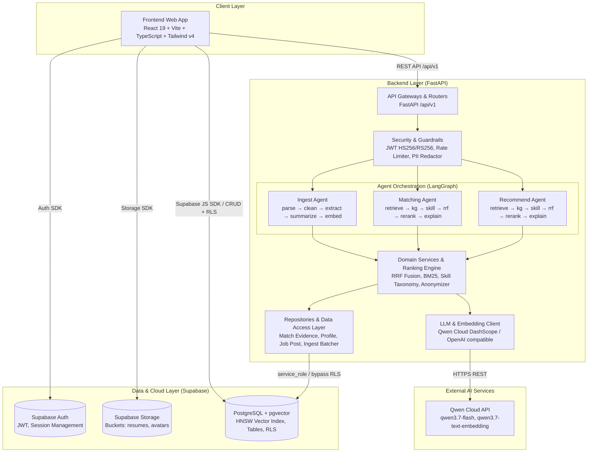
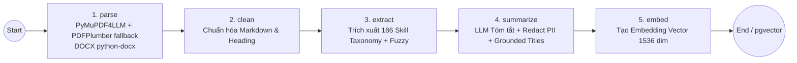
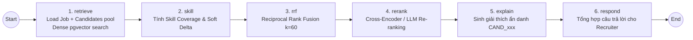
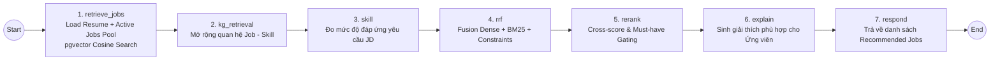

# Kiến trúc Hệ thống Tổng thể (System Architecture)
### NextJob — AI-Powered Two-Way Recruitment Platform
### Đồ án Chuyên ngành P-099 | Team Matikanefukukitaru

---

## 1. Tổng Quan Hệ Thống (System Overview)

Hệ thống Tuyển dụng Thông minh (**NextJob**) là nền tảng kết nối ứng viên và nhà tuyển dụng thông qua sức mạnh của **Multi-Agent Orchestration (LangGraph)** và **Hybrid Search Retrieval (pgvector + BM25 + Skill Graph + RRF Fusion)**.

- **Ứng viên (Candidate)**: Xây dựng CV trực tuyến từ kho dòng hồ sơ Master Profile tái sử dụng, tải lên file PDF/DOCX (hỗ trợ layout nhiều cột phức tạp của TopCV), tự động bóc tách kỹ năng, làm sạch PII và nhận gợi ý việc làm kèm giải thích chi tiết.
- **Nhà tuyển dụng (Recruiter)**: Quản lý tin tuyển dụng (JD), tự động quét pool hồ sơ ứng viên, tính toán độ phù hợp theo mô hình lai (Hybrid Ranking) kết hợp ẩn danh hóa bảo vệ dữ liệu cá nhân (`CAND_001`...) và phỏng vấn mô phỏng thích ứng.
- **Mô hình Hybrid Data Flow**:
  - **Frontend (Client-side)**: Tương tác trực tiếp với **Supabase (PostgreSQL + Auth + Storage)** thông qua Supabase JS SDK với sự bảo vệ của Row Level Security (RLS) cho các tác vụ CRUD thông thường.
  - **Backend (FastAPI)**: Đóng vai trò là Server-side Orchestrator, xử lý xác thực JWT đa thuật toán, thực thi AI LangGraph workflows, giao tiếp LLM/Embedding Cloud API, và thực thi các logic quản trị qua `service_role` (kiểm soát phân quyền chặt chẽ tại service layer).



---

## 2. Kiến Trúc Phân Tầng Backend (Backend Layered Architecture)

Backend tuân thủ nghiêm ngặt mô hình phân tầng hướng đối tượng và cô lập trách nhiệm (Separation of Concerns):

```
backend/app/
├── api/
│   ├── routes/              # HTTP Endpoints (Chỉ validate DTO, gọi Service, trả Response)
│   └── schemas/             # Pydantic Request/Response DTO Schemas
├── agents/                  # LangGraph Multi-Agent Workflows
│   ├── ingest/              # Pipeline xử lý & vector hóa CV
│   ├── matching/            # Pipeline gợi ý ứng viên cho nhà tuyển dụng (JD -> CV)
│   ├── recommend/           # Pipeline gợi ý việc làm cho ứng viên (CV -> JD)
│   ├── interview/           # Agent phỏng vấn mô phỏng thông minh
│   ├── evaluation/          # Agent đánh giá mã nguồn GitHub & CV
│   └── routing/             # Intent classifier & request router
├── services/                # Domain Business Logic & Algorithms (RRF, BM25, Taxonomy, Explain)
├── repositories/            # Data Access Layer (Truy vấn cơ sở dữ liệu Supabase)
├── clients/                 # HTTP/SDK Clients (Qwen LLM, Supabase Admin Client)
├── config/                  # Quản lý cấu hình tập trung (Pydantic Settings từ env.py)
├── guardrails/              # Rate limiting, PII Protection, Input sanitization
├── observability/           # Logging tập trung, Redaction nhạy cảm
└── core/                    # Core Security, JWT Verification, Custom Exceptions
```

### Nguyên Tắc Thiết Kế Cốt Lõi:
1. **Routes Layer**: Tuyệt đối không chứa logic nghiệp vụ; chỉ tiếp nhận HTTP request, parse/validate Pydantic schemas, gọi service tương ứng và trả về response model.
2. **Repositories Layer**: Đóng gói các truy vấn Postgres/Supabase; không bắn mã lỗi `HTTPException`, đảm bảo tính độc lập và khả năng tái sử dụng.
3. **Configuration Management**: Cấu hình tập trung qua `backend/app/config/env.py`. Cơ chế Fail-Fast từ chối khởi động nếu thiếu key an toàn trên Production.
4. **Data Access Authorization**: Backend thực thi quyền truy cập qua `service_role` key (để đọc ghi các bảng nhạy cảm như `embedded_resumes`), Service Layer bắt buộc kiểm tra quyền sở hữu (`owner_id`, `recruiter_id`) trước khi trả dữ liệu về client, triệt tiêu nguy cơ tấn công IDOR.

---

## 3. Ingest Agent Workflow (Xử Lý & Vector Hóa Hồ Sơ)

Được định nghĩa tại `backend/app/agents/ingest/graph.py`. Tự động kích hoạt khi ứng viên tải lên CV (PDF/DOCX) hoặc xuất file từ CV Builder.



### Chi Tiết Từng Node:
1. **`parse`**:
   - Chuyển đổi nhị phân sang Markdown layout-aware bằng `pymupdf4llm`.
   - Cơ chế Fallback `pdfplumber` tự động phân tách cột theo tọa độ trục hoành ($x$-coordinates) khi sản lượng ký tự $< 600$ ký tự (xử lý triệt để CV nhiều cột của TopCV).
   - Đọc tệp `.docx` bằng `python-docx` (bóc tách cấu trúc paragraph, bullet, table).
2. **`clean`**:
   - Chuẩn hóa khoảng trắng, loại bỏ ký tự rác OCR (`\x00`, `\ufeff`), chuẩn hóa các section chính thành `## Heading`.
3. **`extract` (Extract-First Architecture)**:
   - Quét từ điển **186 kỹ năng chuẩn hóa** và cấu trúc quan hệ đồ thị (`skill_graph.json`) trên văn bản gốc.
   - Sử dụng `rapidfuzz` (ngưỡng 88) để nhận diện lỗi chính tả nhẹ.
   - **Ưu điểm vượt trội**: Chạy **trước** bước summarize để bảo toàn $100\%$ kỹ năng gốc, loại bỏ hoàn toàn hiện tượng LLM cắt bớt chi tiết kỹ thuật.
4. **`summarize`**:
   - Gọi LLM (`qwen3.7-flash`, JSON mode) với System Prompt chống bịa đặt (Anti-hallucination).
   - Áp dụng `grounded_titles` (loại bỏ chức danh LLM tự suy diễn không có trong nguồn).
   - Thực thi `redact_pii` che thông tin cá nhân và phân loại kỹ năng thành `verified_skills` và `inferred_skills`.
5. **`embed`**:
   - Gọi mô hình `qwen3.7-text-embedding` tạo vector 1536 chiều từ nội dung đã làm sạch.
   - Lưu trữ nguyên tử (atomic upsert) vào bảng `public.embedded_resumes` trên pgvector với HNSW index.

---

## 4. Matching Agent Workflow (Gợi Ý Ứng Viên Cho Tuyển Dụng)

Được định nghĩa tại `backend/app/agents/matching/graph.py`. Vận hành khi nhà tuyển dụng yêu cầu tìm kiếm ứng viên cho một vị trí công việc (`job_post`).



### Các Bước Xử Lý Trọng Tâm:
1. **`retrieve`**:
   - Tải thông tin JD và danh sách ứng viên đã nộp đơn (`job_submits`).
   - Tự động ingest on-the-fly cho các hồ sơ chưa được vector hóa.
   - Sinh embedding kép: Truy vấn gốc và Truy vấn mở rộng kỹ năng đồng nghĩa.
   - Gọi hàm PostgreSQL RPC `match_resumes_for_job` (pgvector cosine distance).
2. **`skill`**:
   - Đối chiếu tập kỹ năng của ứng viên với yêu cầu JD dựa trên Đồ thị kỹ năng (`skill_graph.json`).
   - Tính toán `skill_score` (tỷ lệ bao phủ) và `soft_delta` (kỹ năng còn thiếu).
3. **`rrf` (Reciprocal Rank Fusion)**:
   - Kết hợp bảng xếp hạng Semantic Search (Dense distance) và Keyword Search (BM25) theo công thức:
     $$\text{RRF\_Score}(d) = \sum_{m \in M} \frac{w_m}{k + r_m(d)} \quad (k = 60)$$
   - Chuẩn hóa điểm về dải $[0.0, 1.0]$.
4. **`rerank`**:
   - Tái xếp hạng top ứng viên tiềm năng bằng mô hình Cross-Encoder chuyên sâu hoặc LLM Scoring.
5. **`explain`**:
   - Cơ chế bảo mật PII: Ánh xạ `application_id` sang mã ẩn danh `CAND_001`, `CAND_002`... trước khi gửi prompt vào LLM.
   - LLM sinh lý do ngắn gọn (1-2 câu tiếng Việt) nêu bật điểm mạnh kỹ năng và độ phù hợp.
   - Khôi phục ID gốc sau khi nhận kết quả JSON.
   - Tích hợp **Deterministic Fallback**: Tự động sinh lý do dựa trên bằng chứng kỹ năng thực tế nếu LLM gặp sự cố hoặc timeout.
6. **`respond` & Persistence**:
   - Ghi lịch sử xếp hạng vào `public.match_resume` và bằng chứng chi tiết vào `public.match_evidence`.

---

## 5. Recommend Agent Workflow (Gợi Ý Việc Làm Cho Ứng Viên)

Được định nghĩa tại `backend/app/agents/recommend/graph.py`. Vận hành theo chiều ngược lại (CV -> JD) khi ứng viên tìm kiếm cơ hội nghề nghiệp phù hợp.



- Sử dụng bảng đệm `public.embedded_jobs` để lưu cache vector embedding của tin tuyển dụng, tối ưu tốc độ phản hồi.
- Tự động áp dụng bộ lọc điều kiện tiên quyết (**Must-have Skill Constraints Gating**).

---

## 6. Mô Hình Cơ Sở Dữ Liệu & Vector Store (Supabase & pgvector)

Hệ thống sử dụng **PostgreSQL 15+** trên nền tảng Supabase với tiện ích mở rộng **pgvector**:

```
                              ┌────────────────────────┐
                              │    public.profiles     │ (User Role: candidate/recruiter/admin)
                              └───────────┬────────────┘
                                          │ 1:N
               ┌──────────────────────────┴──────────────────────────┐
               ▼                                                     ▼
┌─────────────────────────────┐                       ┌─────────────────────────────┐
│       public.resumes        │                       │      public.companies       │
│ (Metadata file CV, Storage) │                       └──────────────┬──────────────┘
└──────────────┬──────────────┘                                      │ 1:N
               │ 1:1                                                 ▼
┌──────────────┴──────────────┐                       ┌─────────────────────────────┐
│  public.embedded_resumes    │                       │     public.job_posts        │
│ (vector 1536 HNSW, Skills,  │                       │ (Tiêu đề, Yêu cầu, Skills)  │
│  Parsed Clean Markdown)     │                       └──────────────┬──────────────┘
└─────────────────────────────┘                                      │
               │                                                     │
               └──────────────────────────┬──────────────────────────┘
                                          │ N:M (Apply)
                                          ▼
                               ┌─────────────────────┐
                               │ public.job_submits  │
                               └──────────┬──────────┘
                                          │ 1:N
                               ┌──────────┴──────────┐
                               ▼                     ▼
                     ┌──────────────────┐  ┌──────────────────┐
                     │public.match_resume│  │public.match_evidence│
                     └──────────────────┘  └──────────────────┘
```

### Chi Tiết Chỉ Mục & Phân Quyền:
- **`embedded_resumes`**:
  - `resume_id` (UUID, Primary Key, Foreign Key -> `resumes.id`).
  - `embedding` (`vector(1536)` index bằng **HNSW** `vector_cosine_ops` với tham số `m=16, ef_construction=64`).
  - `skills` (`text[]`), `clean_markdown` (`text`), `metadata` (`jsonb`).
  - **Bảo mật**: Bảng này được cô lập hoàn toàn khỏi Data API công khai; chỉ backend `service_role` mới có quyền truy xuất.
- **`embedded_jobs`**: Lưu cache vector biểu diễn của các `job_posts` phục vụ chiều tìm kiếm CV -> JD.

---

## 7. Bảo Mật Đa Tầng & Guardrails (Security & Guardrails)

Hệ thống thiết lập nguyên tắc **Phòng vệ theo chiều sâu (Defense-in-Depth)**:

1. **Bảo Mật Xác Thực (Authentication & JWT)**:
   - Xác thực mọi request bằng Supabase JWT qua `backend/app/core/security.py`.
   - Hỗ trợ thuật toán **HS256** cho môi trường Local và **RS256/ES256** qua JWKS cho môi trường Cloud Production.
   - Cơ chế **Fail-Fast**: Khởi động server sẽ lập tức dừng nếu phát hiện `SUPABASE_JWT_SECRET` mang giá trị mặc định ở môi trường production hoặc cấu hình `CORS_ORIGINS` chứa wildcard (`*`).
2. **Quyền Riêng Tư Dữ Liệu Ứng Viên (PII Protection)**:
   - **Tầng Ingest**: Lọc sạch email, số điện thoại, URL mạng xã hội, ngày sinh, CCCD trước khi lưu trữ vector và gửi vào context của LLM.
   - **Tầng Matching Prompting**: Thay thế toàn bộ định danh thật bằng ID ẩn danh (`CAND_001`, `JOB_001`). LLM không bao giờ tiếp cận thông tin cá nhân nhạy cảm.
3. **Chống Chi Tiêu Vượt Mức (LLM Cost Guard & Rate Limiting)**:
   - Áp dụng `InMemoryRateLimiter` tại `backend/app/guardrails/rate_limit.py` (giới hạn tối đa 20 requests/60s cho endpoint `/chat` và `/ingest`).
4. **Kiểm Soát Truy Cập Dữ Liệu Nội Bộ (Recruiter Authorization Check)**:
   - Kiểm tra quyền sở hữu Job của Recruiter ngay tại tầng Data Access trước khi thực hiện Matching, ngăn chặn triệt để tấn công IDOR (Insecure Direct Object References).

---

## 8. Kiểm Thử Tự Động & Vận Hành (Testing & Operations)

```bash
# Chạy toàn bộ 803 unit tests & integration tests
pytest tests/ -v

# Kiểm tra định dạng & Linting mã nguồn Python
ruff check backend/ tests/
ruff format --check backend/ tests/

# Kiểm thử Typecheck Frontend
cd frontend && pnpm lint
```
