# SYSTEM ANALYSIS AND DESIGN REPORT
## NEXTJOB: AN INTELLIGENT TWO-WAY AI-POWERED RECRUITMENT PLATFORM

**Specialized Capstone Project:** P-099  
**Development Team:** Team Matikanefukukitaru — AI20K Build Phase Cohort 3  
**Date of Completion:** August 30, 2026  
**Document Status:** Production-Grade Technical Specification & Academic Design Report  

---

## 📑 TABLE OF CONTENTS

1. [CHAPTER 1: INTRODUCTION AND SYSTEM OVERVIEW](#chapter-1-introduction-and-system-overview)
   - 1.1. Context and Problem Statement
   - 1.2. Research and Development Objectives
   - 1.3. Target Stakeholders and System Scope
   - 1.4. Core Concepts and Terminology
2. [CHAPTER 2: SYSTEM REQUIREMENTS ANALYSIS](#chapter-2-system-requirements-analysis)
   - 2.1. Functional Requirements (FR) Analysis
   - 2.2. Non-Functional Requirements (NFR) Analysis
   - 2.3. Use Case Modeling and Detailed Specifications
3. [CHAPTER 3: DATA ANALYSIS AND DOMAIN MODELING](#chapter-3-data-analysis-and-domain-modeling)
   - 3.1. Entity-Relationship Diagram (ERD)
   - 3.2. Detailed Relational Database Schema Specifications
   - 3.3. Vector Storage Architecture and HNSW Indexing (pgvector)
   - 3.4. Standardized Skill Taxonomy and Knowledge Graph
4. [CHAPTER 4: SYSTEM ARCHITECTURE DESIGN](#chapter-4-system-architecture-design)
   - 4.1. Multi-tier Architectural Overview
   - 4.2. Backend Clean Layered Architecture
   - 4.3. LangGraph Multi-Agent Orchestration Design
   - 4.4. Hybrid Ranking and Reciprocal Rank Fusion (RRF) Formulation
   - 4.5. Three-Layer Deterministic Guardrail Security Architecture
5. [CHAPTER 5: DETAILED INTERFACE AND INTERACTION DESIGN](#chapter-5-detailed-interface-and-interaction-design)
   - 5.1. Frontend User Experience and Component Architecture
   - 5.2. RESTful API Specifications
   - 5.3. Sequence Diagrams for Core Business Workflows
6. [CHAPTER 6: DEPLOYMENT, TESTING, AND EVALUATION](#chapter-6-deployment-testing-and-evaluation)
   - 6.1. Cloud Infrastructure Deployment and Selection Rationale
   - 6.2. Automated Testing Strategy
   - 6.3. Empirical Evaluation Benchmark with Golden Dataset
7. [CHAPTER 7: CONCLUSION AND FUTURE ROADMAP](#chapter-7-conclusion-and-future-roadmap)
   - 7.1. Summary of Project Achievements
   - 7.2. Strengths and Current Limitations
   - 7.3. Future Enhancements
8. [REFERENCES](#references)

---

# CHAPTER 1: INTRODUCTION AND SYSTEM OVERVIEW

## 1.1. Context and Problem Statement

In the modern digital transformation era, the recruitment landscape experiences an unprecedented volume of resumes (Curriculum Vitae - CV) and Job Descriptions (JD). However, traditional matchmaking paradigms between Job Seekers and Recruiters suffer from persistent structural bottlenecks:

1. **Repetitive Data Entry and Fragmented Profiles**:
   - Job seekers are compelled to manually input their educational background, work experience, and technical skills repeatedly across disparate recruitment portals.
   - When updating a newly acquired skill or project, candidates must manually modify multiple static files (PDF/Word), resulting in inconsistency and significant operational overhead.
2. **Shortcomings of Legacy Applicant Tracking Systems (ATS)**:
   - Conventional ATS tools predominantly rely on rigid exact keyword matching algorithms. This syntactic approach prematurely rejects highly capable candidates whose resumes use synonymic terminology (e.g., `ReactJS` vs `React`, `Golang` vs `Go`, `Postgres` vs `PostgreSQL`).
   - Conversely, opportunistic applicants exploit "keyword stuffing" techniques to artificially bypass automated screeners without possessing genuine domain competency.
3. **Unidirectional, Black-box Recommendation Models**:
   - Most existing platforms only provide shallow job recommendations based on browsing logs or geographical proximity ("similar jobs"), failing to analyze deep semantic skill gaps and career growth trajectories.
   - When suggesting candidates to recruiters, "black-box" Machine Learning models output opaque percentage scores without verifiable rationale, depriving hiring managers of actionable decision-making evidence.
4. **Personally Identifiable Information (PII) Leakage Risks**:
   - Resumes inherently contain sensitive private data, including national identification numbers, phone numbers, home addresses, dates of birth, and personal social media handles.
   - Streaming raw, unredacted CV texts directly into public Large Language Model (LLM) APIs introduces severe regulatory and ethical risks regarding data privacy (GDPR / Decree 13/2023/ND-CP).

## 1.2. Research and Development Objectives

The **NextJob** platform is engineered to address these systemic deficiencies through an intelligent, bidirectional recruitment ecosystem driven by **Multi-Agent Orchestration (LangGraph)**, **Hybrid Vector Retrieval (pgvector + BM25 + Skill Graph)**, and a **Reusable Master Profile Line Architecture**:

* **Master Profile Lines & Visual ATS CV Builder**: Deconstruct candidate records into atomic, reusable data blocks that can be dynamically dragged, dropped, and compiled into 10+ professional ATS-optimized templates within seconds.
* **Layout-Aware Ingestion & Extract-First Taxonomy Pipeline**: Reliably parse complex multi-column PDF layouts (including TopCV formats) and DOCX files into clean Markdown, extract 186+ standardized technical skills, and redact PII prior to dense vectorization.
* **Two-Way Hybrid Matchmaking Engine**:
  - *Candidate Direction (CV $\rightarrow$ JD Pool)*: Empower job seekers to discover optimal career opportunities, accompanied by transparent suitability explanations and actionable skill-gap guidance.
  - *Recruiter Direction (JD $\rightarrow$ Candidate Pool)*: Rank candidate applicants objectively via dense cosine vector search (HNSW), sparse lexical BM25 matching, hierarchical skill coverage, and cross-encoder / LLM reranking.
* **Explainable AI with PII Anonymization**: Enforce automated candidate pseudonymization (`CAND_001`, `CAND_002`...) during LLM reasoning prompts, generating grounded, concise justifications (1-2 sentences) linked to verifiable evidence.
* **Empirical Competency Assessment (GitHub Repo Evaluation & AI Interview)**: Inspect applicants' real-world GitHub repositories (code structure, test coverage, architectural cleanliness) and conduct adaptive, simulated AI mock interviews.

## 1.3. Target Stakeholders and System Scope

The platform serves three primary user personas:

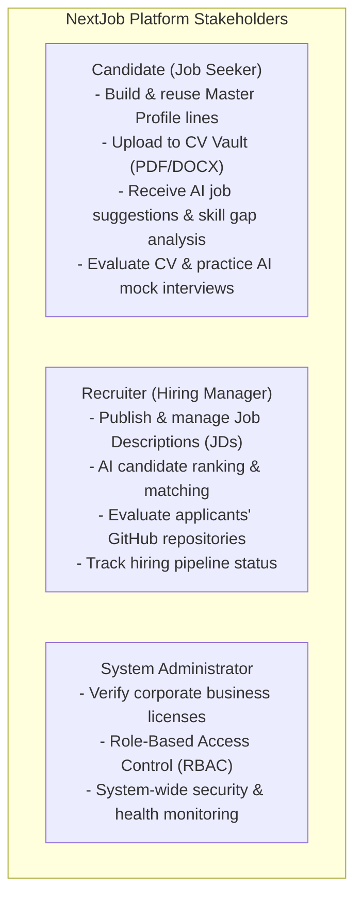

* **Functional Scope**: User authentication, Master Profile management, ATS CV generation, layout-aware CV ingestion, job posting lifecycle, two-way multi-agent matching, GitHub repo evaluation, adaptive AI interview, and corporate license verification.
* **Technical Scope**: Distributed Fullstack Web Architecture (React 19 + TypeScript SPA, FastAPI Async Backend, Supabase PostgreSQL + pgvector, LangGraph Multi-Agent Workflows, Alibaba Cloud DashScope Qwen AI).

## 1.4. Core Concepts and Terminology

To establish a clear baseline for all readers, the foundational terms used throughout this document are summarized below:

| Terminology | Full Name / Description | System Significance & Functionality |
|---|---|---|
| **ATS** | *Applicant Tracking System* | Software application that enables the electronic handling of recruitment and resume screening needs. |
| **Multi-Agent System** | *Multi-Agent Architecture* | A network of specialized AI agents collaborating to solve multi-stage workflows via directed state graphs. |
| **LangGraph** | *LangGraph Framework* | A stateful orchestration framework for building cyclical, multi-agent LLM pipelines with checkpoints and guards. |
| **pgvector** | *PostgreSQL Vector Extension* | Open-source vector similarity extension for PostgreSQL enabling dense embedding indexing and vector math. |
| **HNSW** | *Hierarchical Navigable Small World* | Multi-layer graph index structure providing fast $O(\log N)$ Approximate Nearest Neighbor (ANN) search. |
| **RRF** | *Reciprocal Rank Fusion* | A parameter-free rank aggregation method combining rankings from multiple independent retrieval models. |
| **PII** | *Personally Identifiable Information* | Data that can identify an individual (phone numbers, citizen ID, email, physical addresses), requiring strict sanitization. |
| **Guardrails** | *Safety & Deterministic Failsafes* | Multi-layered software boundaries (Input Guard, Data Gate, Output Guard) protecting against malicious input and model failure. |
| **Cosine Similarity** | *Cosine Metric* | Measure of angular similarity between two non-zero vectors in an inner product space, quantifying semantic relevance. |
| **Cross-Encoder** | *Deep Interaction Reranker* | A neural model evaluating query and candidate pairs simultaneously to produce fine-grained alignment scores. |

---

# CHAPTER 2: SYSTEM REQUIREMENTS ANALYSIS

## 2.1. Functional Requirements (FR) Analysis

The system requirements are organized into seven primary modules, designated from `FR-01` to `FR-07`:

### FR-01: Authentication & Role-Based Access Control (RBAC)
- **FR-01.1**: The system shall allow users to register and authenticate using Email/Password or third-party OAuth via Supabase Auth.
- **FR-01.2**: The system shall validate user sessions using JSON Web Tokens (JWT), supporting symmetric HS256 for local development and asymmetric RS256/ES256 via JWKS in production.
- **FR-01.3**: The system shall enforce strict Role-Based Access Control with three primary roles: `candidate`, `recruiter`, and `admin`.
- **FR-01.4**: The system shall allow users to manage their profiles, update contact details, upload profile avatars to Supabase Storage, and configure job-seeking availability.

### FR-02: Master Profile & Visual ATS CV Builder
- **FR-02.1**: The system shall provide Candidates with a centralized Master Profile vault containing five discrete data categories: *Education, Experience, Skills, Projects, and Certifications*.
- **FR-02.2**: The system shall provide an interactive drag-and-drop CV Builder powered by `@dnd-kit`, allowing users to select and organize Master Profile blocks into custom resume drafts.
- **FR-02.3**: The system shall render 10 industry-standard CV templates: *Modern, Sidebar, Classic, Compact, Elegant, Minimal, Professional, Creative, Timeline, and Two Column*.
- **FR-02.4**: The system shall support dual-mode PDF export:
  - *High-Resolution Canvas Mode*: Rendered via `html2canvas` and `jsPDF` at 2x pixel ratio to ensure 100% Vietnamese typography fidelity.
  - *ATS Vector Text Mode*: Structured vector text stream designed for parsing by automated ATS screeners.

### FR-03: CV Vault & Layout-Aware Ingestion Pipeline
- **FR-03.1**: The system shall accept resume file uploads in PDF and DOCX formats (maximum payload size: 10MB).
- **FR-03.2**: The system shall trigger the asynchronous **Ingest Agent (LangGraph)** upon upload:
  - Extract layout-aware structured text via `pymupdf4llm` with an automatic `pdfplumber` multi-column coordinate fallback.
  - Clean OCR artifacts, strip control characters, and normalize headings into standardized Markdown.
  - Execute *Extract-First* skill discovery against a 186-term taxonomy dictionary and knowledge graph (`skill_graph.json`).
  - Summarize candidate capabilities using `qwen3.7-flash`, apply `grounded_titles` anti-hallucination verification, and redact PII.
  - Generate a 1536-dimensional embedding vector via `qwen3.7-text-embedding` and atomically upsert into `public.embedded_resumes`.
- **FR-03.3**: The system shall enable candidates to mark a primary resume as their default profile for automated matchmaking.

### FR-04: Job Post Management & Recruitment Workspace
- **FR-04.1**: The system shall allow verified Recruiters to draft, publish, update, and close job postings (`job_posts`).
- **FR-04.2**: The system shall parse and tag required qualifications into *Must-have* and *Nice-to-have* skill criteria.
- **FR-04.3**: The system shall provide an applicant management workspace to review submitted applications (`job_submits`) and transition their lifecycle status (*Pending $\rightarrow$ Reviewing $\rightarrow$ Interviewed $\rightarrow$ Offered / Rejected*).
- **FR-04.4**: The system shall automatically compute and cache dense vector representations of job postings in `public.embedded_jobs`.

### FR-05: Two-Way Hybrid Matchmaking Engine
- **FR-05.1 (Recruiter Candidate Matching - JD $\rightarrow$ Candidate Pool)**:
  - Enable recruiters to trigger automated candidate screening for any active job post.
  - Execute the **Matching Agent**: Retrieve applicants $\rightarrow$ Compute skill graph coverage $\rightarrow$ Merge dense vector and sparse BM25 scores via Reciprocal Rank Fusion ($k=60$) $\rightarrow$ Execute LLM reranking $\rightarrow$ Synthesize pseudonymized explanations $\rightarrow$ Return scored results.
- **FR-05.2 (Candidate Job Recommendation - CV $\rightarrow$ JD Pool)**:
  - Enable candidates to receive personalized job recommendations based on their default resume or conversational search queries.
  - Execute the **Recommend Agent**: Scan active job embeddings $\rightarrow$ Apply Must-have constraint gating $\rightarrow$ Classify recommendations into confidence tiers (*High Match $\ge 45\%$, Medium Match $\ge 30\%$, Potential Match $< 30\%$*) with actionable skill-gap advisory.

### FR-06: Empirical Technical Competency Evaluation
- **FR-06.1**: The system shall analyze candidate GitHub repositories: inspecting repository structure, code hygiene, unit testing coverage, and verifying stated resume skills against actual codebase implementations.
- **FR-06.2**: The system shall offer an interactive AI Mock Interviewer that dynamically generates contextual technical questions based on the target JD and candidate responses, providing evaluation feedback upon session completion.
- **FR-06.3**: The system shall provide an automated CV Assessment tool scoring resumes across ATS readability, action-oriented impact metrics (STAR framework), and industry alignment.

### FR-07: System Administration & Corporate Verification
- **FR-07.1**: The system shall allow Administrators to audit corporate registration requests (`recruiter_forms`), reviewing submitted business licenses.
- **FR-07.2**: The system shall automatically elevate user roles to `recruiter` and instantiate verified company entities (`companies`) upon admin approval.
- **FR-07.3**: The system shall provide administrators with user directory management, RBAC overrides, and platform telemetry.

---

## 2.2. Non-Functional Requirements (NFR) Analysis

| ID | Category | Specification & Quantitative Target Metric |
|---|---|---|
| **NFR-01** | **Performance & Latency** | - Standard CRUD API response latency: $P95 < 200\text{ms}$.<br/>- HNSW Vector Similarity Search: $< 50\text{ms}$ across $10,000$ active vectors.<br/>- End-to-end CV Ingestion Pipeline: $< 5.0\text{s}$ per resume (parse, clean, extract, LLM summarize, embedding).<br/>- Matching Agent execution over 50 candidates: $< 3.5\text{s}$. |
| **NFR-02** | **AI Accuracy & Faithfulness** | - Layout Parsing Success Rate: $\ge 98.0\%$ across Golden Benchmark (41 CVs).<br/>- Technical Skill Extraction Recall: $\ge 92.0\%$ against ground truth taxonomy.<br/>- Summarization Faithfulness Score: $\ge 95.0\%$ (zero hallucinated job titles via Grounded Titles enforcement). |
| **NFR-03** | **Security & Privacy** | - Three-Layer Deterministic Guardrail defense-in-depth model.<br/>- 100% PII sanitization recall for phone numbers, citizen IDs, and emails before LLM transmission.<br/>- Fail-Fast JWT verification; prevention of Insecure Direct Object Reference (IDOR) at Service Layer.<br/>- Token Bucket rate limiter capping heavy AI endpoints at 20 requests/minute. |
| **NFR-04** | **Usability & Accessibility** | - Responsive Single Page Application (SPA) across Mobile, Tablet, and Desktop.<br/>- Native bilingual localization (Vietnamese and English).<br/>- Seamless Light/Dark theme switching without visual layout shifts (CLS = 0). |
| **NFR-05** | **Maintainability & Modularity** | - Clean Layered Architecture separating API, Domain Services, Agents, and Repositories.<br/>- 98+ automated unit and integration test suite with $\ge 85\%$ core logic coverage.<br/>- Modular LangGraph state graphs enabling hot-swappable LLM providers. |

---

## 2.3. Use Case Modeling and Detailed Specifications

### 2.3.1. Overall Use Case Diagram

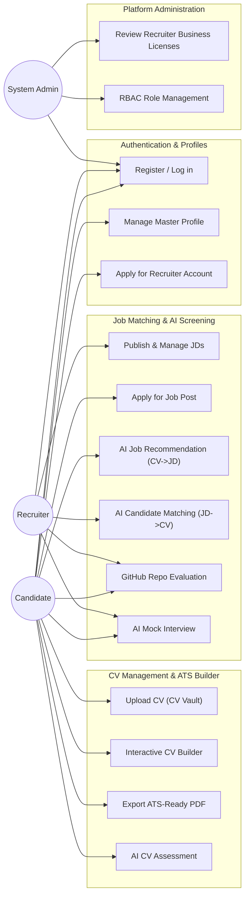

### 2.3.2. Detailed Core Use Case Specifications

#### Specification UC-04: Automated Resume Ingestion & Vectorization
* **Primary Actor**: Candidate (Job Seeker).
* **Goal**: Upload a resume document (PDF/DOCX) and trigger automated layout-aware parsing, skill extraction, PII redaction, and pgvector indexing.
* **Pre-conditions**: Candidate is authenticated with a valid JWT.
* **Main Success Scenario**:
  1. Candidate uploads a PDF/DOCX file on `/cv-vault`.
  2. Frontend transfers the binary file to Supabase Storage bucket `resumes` via a signed URL and creates a record in `public.resumes`.
  3. Frontend dispatches `POST /api/v1/resumes/{id}/ingest`.
  4. Backend executes the **Ingest Agent (LangGraph)**:
     - Node `parse`: Extracts structured Markdown using `pymupdf4llm` (fallback to `pdfplumber` for multi-column layouts).
     - Node `clean`: Cleans OCR artifacts and standardizes Markdown section headers.
     - Node `extract`: Discovers skills against the 186-term taxonomy dictionary via `rapidfuzz` (threshold: 88).
     - Node `summarize`: LLM extracts grounded capability summaries and sanitizes PII.
     - Node `embed`: Generates 1536-dimensional embeddings using `qwen3.7-text-embedding`.
  5. Agent atomically upserts the vector and metadata into `public.embedded_resumes`.
  6. Backend returns HTTP 200 with the parsed skills array and ingestion status.
* **Exceptions / Alternative Flows**:
  - *Payload exceeds 10MB or invalid MIME*: Input Guard rejects request with `400 Bad Request`.
  - *Scanned image PDF (no text layer)*: System flags `metadata.low_content = true` and alerts candidate to upload a text-based document.
  - *LLM provider timeout*: Ingest Agent activates the deterministic fallback summarizer, preserving pipeline continuity.
* **Post-conditions**: The resume embedding is indexed in PostgreSQL, ready for immediate similarity search.

#### Specification UC-11: Recruiter AI Candidate Matchmaking
* **Primary Actor**: Recruiter.
* **Goal**: Retrieve an objectively ranked shortlist of applicants for an active job post, complete with evidence-backed match justifications.
* **Pre-conditions**: Recruiter owns the target job posting, which has at least one submitted application.
* **Main Success Scenario**:
  1. Recruiter opens the `/ai-candidates` dashboard and selects a job posting.
  2. Frontend sends `POST /api/v1/chat` with intent `MATCHING` and the `job_id`.
  3. Backend verifies the recruiter's ownership of the `job_id` (preventing IDOR).
  4. Backend invokes the **Matching Agent (LangGraph)**:
     - Node `retrieve`: Loads JD text and candidate pool; executes pgvector cosine similarity search.
     - Node `skill`: Calculates skill coverage ratios and missing competency deltas (`soft_delta`).
     - Node `rrf`: Merges Dense Vector and Sparse BM25 ranks via Reciprocal Rank Fusion ($k=60$).
     - Node `rerank`: Executes cross-encoder reranking on top candidates.
     - Node `explain`: Maps applicant IDs to pseudonyms (`CAND_001`, `CAND_002`...), invokes LLM to generate concise Vietnamese justifications, and restores real IDs.
     - Node `output_guard`: Verifies schema validity and enforces ID whitelist constraints.
     - Node `respond`: Persists matching traces into `public.match_resume` and `public.match_evidence`, returning results to client.
  5. Frontend displays ranked applicants, match percentages, verified skill badges, and AI reasoning.
* **Exceptions**:
  - *Recruiter queries unauthorized job*: System returns `403 Forbidden`.
  - *LLM explanation failure*: System triggers deterministic rule-based explanation derived from matched skill evidence.
* **Post-conditions**: Ranked evaluation records and audit traces are permanently persisted in PostgreSQL.

---

# CHAPTER 3: DATA ANALYSIS AND DOMAIN MODELING

## 3.1. Entity-Relationship Diagram (ERD)

The NextJob database schema is constructed on **PostgreSQL 15+** with the **pgvector** extension, harmonizing structured transactional entities with high-dimensional vector embeddings:

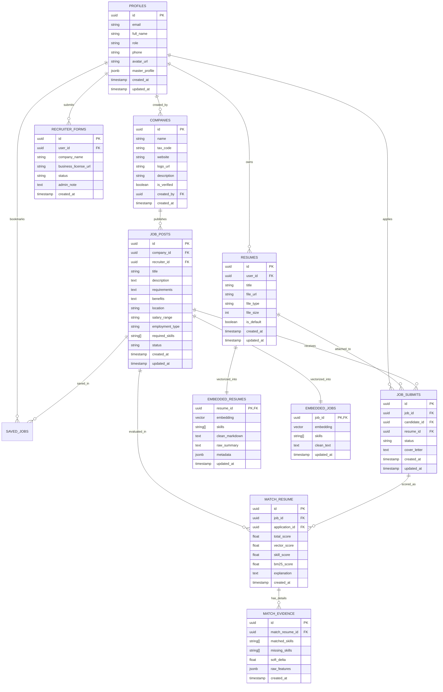

---

## 3.2. Detailed Relational Database Schema Specifications

### 3.2.1. User & Identity Tables

#### Table `public.profiles`
Stores core user account attributes, system roles, and the structured Master Profile repository.

| Column Name | Data Type | Constraints | Description |
|---|---|---|---|
| `id` | `UUID` | `PRIMARY KEY`, `REFERENCES auth.users(id)` | User primary key synchronized with Supabase Auth |
| `email` | `VARCHAR(255)` | `NOT NULL`, `UNIQUE` | User login email address |
| `full_name` | `VARCHAR(255)` | `NULLABLE` | User display full name |
| `role` | `VARCHAR(50)` | `NOT NULL`, `DEFAULT 'candidate'` | System RBAC role: `candidate`, `recruiter`, `admin` |
| `phone` | `VARCHAR(20)` | `NULLABLE` | Contact telephone number |
| `avatar_url` | `TEXT` | `NULLABLE` | Storage URL for profile picture |
| `master_profile` | `JSONB` | `DEFAULT '{}'::jsonb` | Reusable data store for Education, Experience, Skills, Projects |
| `created_at` | `TIMESTAMPTZ` | `DEFAULT NOW()` | Account creation timestamp |
| `updated_at` | `TIMESTAMPTZ` | `DEFAULT NOW()` | Last profile modification timestamp |

#### Table `public.recruiter_forms`
Tracks corporate verification requests submitted by prospective recruiters.

| Column Name | Data Type | Constraints | Description |
|---|---|---|---|
| `id` | `UUID` | `PRIMARY KEY`, `DEFAULT gen_random_uuid()` | Form request identifier |
| `user_id` | `UUID` | `NOT NULL`, `REFERENCES public.profiles(id)` | Applicant user reference |
| `company_name` | `VARCHAR(255)` | `NOT NULL` | Registered company legal name |
| `business_license_url`| `TEXT` | `NOT NULL` | Storage URL of business registration certificate |
| `status` | `VARCHAR(50)` | `DEFAULT 'pending'` | Workflow state: `pending`, `approved`, `rejected` |
| `admin_note` | `TEXT` | `NULLABLE` | Administrator audit feedback |
| `created_at` | `TIMESTAMPTZ` | `DEFAULT NOW()` | Submission timestamp |

### 3.2.2. Recruitment Domain Tables

#### Table `public.companies`
Stores verified corporate entities authorized to post job listings.

| Column Name | Data Type | Constraints | Description |
|---|---|---|---|
| `id` | `UUID` | `PRIMARY KEY`, `DEFAULT gen_random_uuid()` | Company unique identifier |
| `name` | `VARCHAR(255)` | `NOT NULL` | Corporate legal title |
| `tax_code` | `VARCHAR(50)` | `NULLABLE` | Official enterprise tax identification |
| `website` | `VARCHAR(255)` | `NULLABLE` | Corporate web URL |
| `logo_url` | `TEXT` | `NULLABLE` | Storage URL of enterprise brand logo |
| `is_verified` | `BOOLEAN` | `DEFAULT FALSE` | Verification clearance flag |
| `created_by` | `UUID` | `REFERENCES public.profiles(id)` | Company founder/representative user |

#### Table `public.job_posts`
Manages employment listings published by recruiters.

| Column Name | Data Type | Constraints | Description |
|---|---|---|---|
| `id` | `UUID` | `PRIMARY KEY`, `DEFAULT gen_random_uuid()` | Job posting unique ID |
| `company_id` | `UUID` | `NOT NULL`, `REFERENCES public.companies(id)` | Publishing enterprise foreign key |
| `recruiter_id`| `UUID` | `NOT NULL`, `REFERENCES public.profiles(id)` | Authoring recruiter user foreign key |
| `title` | `VARCHAR(255)` | `NOT NULL` | Job role title |
| `description` | `TEXT` | `NOT NULL` | Comprehensive job responsibilities |
| `requirements`| `TEXT` | `NOT NULL` | Required candidate qualifications |
| `location` | `VARCHAR(255)` | `NOT NULL` | Geographic location or Remote policy |
| `salary_range`| `VARCHAR(100)` | `NOT NULL` | Remuneration package bracket |
| `required_skills`| `TEXT[]` | `DEFAULT '{}'` | Array of mandatory/preferred technical skills |
| `status` | `VARCHAR(50)` | `DEFAULT 'published'` | Status: `draft`, `published`, `closed` |

#### Table `public.resumes`
Stores candidate resume files uploaded or generated via the CV Builder.

| Column Name | Data Type | Constraints | Description |
|---|---|---|---|
| `id` | `UUID` | `PRIMARY KEY`, `DEFAULT gen_random_uuid()` | Resume unique ID |
| `user_id` | `UUID` | `NOT NULL`, `REFERENCES public.profiles(id)` | Owning candidate foreign key |
| `title` | `VARCHAR(255)` | `NOT NULL` | User-assigned resume label |
| `file_url` | `TEXT` | `NOT NULL` | Physical storage path in Supabase bucket |
| `file_type` | `VARCHAR(50)` | `NOT NULL` | File extension: `pdf`, `docx`, `builder_export` |
| `is_default` | `BOOLEAN` | `DEFAULT FALSE` | Primary resume flag used in automated AI matching |

#### Table `public.job_submits`
Maintains candidate job applications submitted to job postings.

| Column Name | Data Type | Constraints | Description |
|---|---|---|---|
| `id` | `UUID` | `PRIMARY KEY`, `DEFAULT gen_random_uuid()` | Application submission ID |
| `job_id` | `UUID` | `NOT NULL`, `REFERENCES public.job_posts(id)` | Target job posting reference |
| `candidate_id`| `UUID` | `NOT NULL`, `REFERENCES public.profiles(id)` | Applicant user reference |
| `resume_id` | `UUID` | `NOT NULL`, `REFERENCES public.resumes(id)` | Attached resume reference |
| `status` | `VARCHAR(50)` | `DEFAULT 'pending'` | Status: `pending`, `reviewing`, `interviewed`, `offered`, `rejected` |

---

## 3.3. Vector Storage Architecture and HNSW Indexing (pgvector)

### 3.3.1. Table `public.embedded_resumes`
Stores dense semantic vector representations and structured metadata. This table is completely isolated from public Data APIs, accessible solely via backend `service_role` authorization.

| Column Name | Data Type | Constraints | Description |
|---|---|---|---|
| `resume_id` | `UUID` | `PRIMARY KEY`, `REFERENCES public.resumes(id) ON DELETE CASCADE` | 1-to-1 resume relation |
| `embedding` | `vector(1536)`| `NOT NULL` | 1536-dimensional dense embedding (`qwen3.7-text-embedding`) |
| `skills` | `TEXT[]` | `DEFAULT '{}'` | Normalized technical skills array extracted from resume |
| `clean_markdown`| `TEXT` | `NOT NULL` | Sanitized, PII-free Markdown text |
| `raw_summary` | `TEXT` | `NULLABLE` | LLM-generated capability summary |
| `metadata` | `JSONB` | `DEFAULT '{}'::jsonb` | Ingestion telemetry (`content_chars`, `grounded_titles`) |

### 3.3.2. HNSW Index Configuration
To achieve sub-50ms Approximate Nearest Neighbor (ANN) retrieval over high-dimensional vector spaces, Hierarchical Navigable Small World (HNSW) indices are established:

```sql
-- Create HNSW index for resume embeddings
CREATE INDEX IF NOT EXISTS idx_embedded_resumes_hnsw_cosine
ON public.embedded_resumes
USING hnsw (embedding vector_cosine_ops)
WITH (m = 16, ef_construction = 64);

-- Create HNSW index for job embeddings
CREATE INDEX IF NOT EXISTS idx_embedded_jobs_hnsw_cosine
ON public.embedded_jobs
USING hnsw (embedding vector_cosine_ops)
WITH (m = 16, ef_construction = 64);
```

* **Parameter Rationales**:
  - `vector_cosine_ops`: Configures cosine distance metric $d_{\cos}(u, v) = 1 - \frac{u \cdot v}{\|u\|_2 \|v\|_2}$.
  - `m = 16`: Defines the maximum number of bidirectional connection links per node in the multi-layer graph, balancing RAM usage and recall accuracy.
  - `ef_construction = 64`: Specifies the size of the dynamic candidate list evaluated during index construction.

---

## 3.4. Standardized Skill Taxonomy and Knowledge Graph

NextJob implements a structured **Skill Knowledge Graph (`skill_graph.json`)** containing 186+ standardized technical competencies:

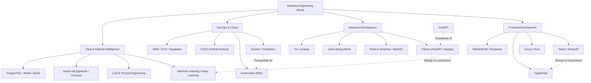

### Skill Engine Mechanics:
1. **Alias Canonicalization**: Maps synonymic variations to unified canonical keys (e.g., `["react", "reactjs", "react.js"]` $\rightarrow$ `React`).
2. **Fuzzy String Matching (RapidFuzz)**: Employs Levenshtein ratio distance with a similarity threshold of $\ge 88$, matching typos such as `typscript` to `TypeScript`.
3. **Cluster Expansion**: Automatically identifies auxiliary co-occurring skills to compute soft skill coverage metrics.

---

# CHAPTER 4: SYSTEM ARCHITECTURE DESIGN

## 4.1. Multi-tier Architectural Overview

NextJob utilizes a modern distributed multi-tier architecture, establishing clean boundaries between Client Presentation, Gateway & AI Orchestration, Cloud Persistence, and Cloud AI Providers:

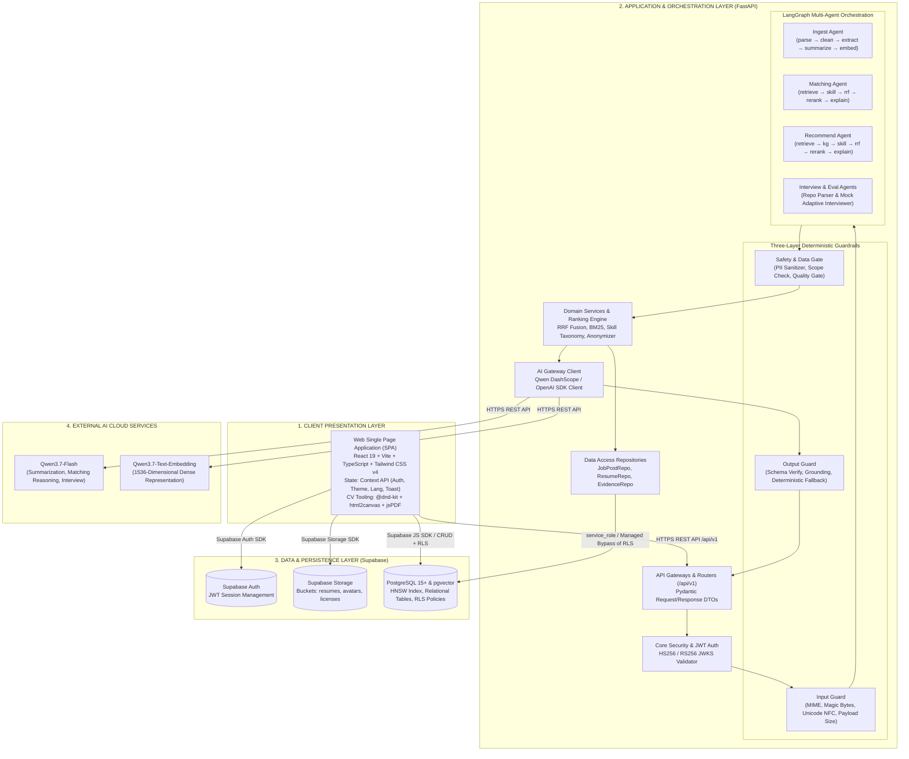

---

## 4.2. Backend Clean Layered Architecture

The backend repository at `backend/app/` adheres strictly to Clean Layered Architecture and Separation of Concerns:

```text
backend/app/
├── api/                     # HTTP Presentation Layer
│   ├── routes/              # Handlers receiving HTTP requests, validating DTOs, invoking services
│   └── schemas/             # Pydantic Schemas defining strict request/response DTO contracts
├── agents/                  # LangGraph Multi-Agent Workflows
│   ├── ingest/              # Resume parsing, skill extraction & vectorization graph
│   ├── matching/            # Recruiter candidate screening graph (JD -> Candidate Pool)
│   ├── recommend/           # Candidate job recommendation graph (CV -> JD Pool)
│   ├── interview/           # Adaptive mock technical interviewer agent
│   ├── evaluation/          # Resume scoring & GitHub repository analyzer agent
│   └── state.py             # Global typed AgentState schema definition
├── services/                # Domain Business Logic & Algorithmic Engines
│   ├── matching/            # RRF Fusion, BM25 Engine, Skill Taxonomy, Anonymizer, Reranker
│   └── profiles/            # Master Profile manipulation & resume lifecycle logic
├── repositories/            # Data Access Layer (Supabase PostgreSQL Client)
│   ├── job_posts.py         # Job post persistence queries
│   ├── resumes.py           # Resume metadata and embedded_resumes queries
│   └── match_evidence.py   # Match trace audit persistence
├── guardrails/              # Deterministic Three-Layer Defense System
│   ├── input.py             # Magic byte, MIME, Unicode NFC, and size validators
│   ├── gates.py             # PII Sanitizer, scope enforcement, and quality gates
│   ├── output.py            # JSON schema verification, ID whitelist check, and fallbacks
│   └── rate_limit.py        # In-Memory Token Bucket rate limiter
├── clients/                 # Outbound HTTP/SDK Clients (Qwen LLM, Supabase Admin Client)
├── config/                  # Centralized configuration management via env.py (Pydantic Settings)
└── core/                    # Security primitives, JWT decoding, custom domain exceptions
```

---

## 4.3. LangGraph Multi-Agent Orchestration Design

### 4.3.1. Ingest Agent Workflow (Resume Processing & Vectorization)
Located at `backend/app/agents/ingest/graph.py`, triggered automatically when a resume document is uploaded:

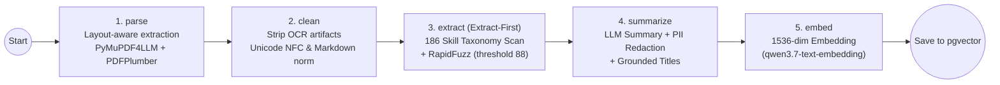

* **Node Execution Details**:
  1. **`parse`**: Converts binary PDF streams to layout-aware Markdown via `pymupdf4llm`. When extracted content $< 600$ characters (common in multi-column TopCV templates), it triggers the `pdfplumber` horizontal coordinate clustering fallback. For `.docx` files, `python-docx` parses paragraphs and tables.
  2. **`clean`**: Removes OCR noise characters (`\x00`, `\ufeff`), collapses redundant whitespace, and standardizes section headers into valid Markdown (`## Experience`, `## Education`).
  3. **`extract` (Extract-First Architecture)**: Scans raw unsummarized text against the 186-term taxonomy dictionary, preserving 100% of declared technical competencies prior to LLM summarization.
  4. **`summarize`**: Calls `qwen3.7-flash` (JSON Mode) to produce a structured summary, enforces `grounded_titles` (restricting titles to those explicitly present in the source text), and executes PII redaction.
  5. **`embed`**: Ingests sanitized Markdown into `qwen3.7-text-embedding`, generating a 1536-dimensional vector for atomic upsert into `public.embedded_resumes`.

---

### 4.3.2. Matching Agent Workflow (Recruiter Candidate Screening)
Located at `backend/app/agents/matching/graph.py`, executed when a recruiter requests applicant ranking for a job opening:

```mermaid
graph LR
    START((Start)) --> retrieve["1. retrieve<br/>Fetch JD + Candidate Pool<br/>Dense Cosine Search"]
    retrieve --> skill["2. skill<br/>Compute Skill Coverage<br/>& Soft Delta"]
    skill --> rrf["3. rrf<br/>Reciprocal Rank Fusion<br/>k=60 (Vector + BM25)"]
    rrf --> rerank["4. rerank<br/>Cross-Encoder / LLM<br/>Scoring"]
    rerank --> snapshot["5. snapshot<br/>Persist Pre-Rerank Order"]
    snapshot --> explain["6. explain<br/>Anonymized Reasoning<br/>(CAND_001, CAND_002)"]
    explain --> output_guard["7. output_guard<br/>Schema & Whitelist Verify<br/>+ Deterministic Fallback"]
    output_guard --> respond["8. respond<br/>Compile & Persist Evidence"]
    respond --> END((Done))
```

* **Pseudonymized Prompting**: The `explain` node transforms internal applicant IDs into pseudonyms (`CAND_001`, `CAND_002`...) and strips all identifying PII before prompt submission to the LLM. Real identifiers are restored upon receiving valid JSON output.
* **Deterministic Fallback**: If the LLM call encounters a network timeout or provider error, the system automatically activates a rule-based explanation synthesizer driven by verified skill evidence in `match_evidence`.

---

### 4.3.3. Recommend Agent Workflow (Candidate Job Recommendation)
Located at `backend/app/agents/recommend/graph.py`, operating in the reverse direction (CV $\rightarrow$ JD Pool):

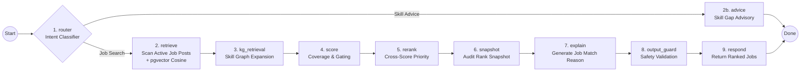

* **Must-have Constraint Gating**: Disqualifies or heavily penalizes job postings where the applicant lacks mandatory non-negotiable technical skills (e.g., senior roles with zero matching core tech).

---

## 4.4. Hybrid Ranking and Reciprocal Rank Fusion (RRF) Formulation

To eliminate the weaknesses of pure vector search (susceptible to semantic drift when specific keywords are absent) and pure keyword search (lacking semantic understanding), NextJob deploys a multi-stage hybrid ranking model:

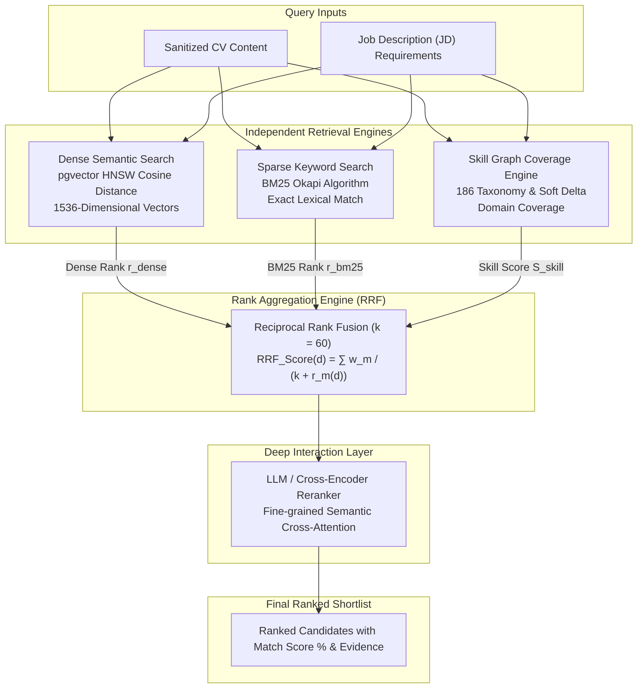

### Mathematical Formulation of Reciprocal Rank Fusion:
The combined RRF score for any candidate document $d$ is defined as:

$$\text{RRF\_Score}(d) = \sum_{m \in M} \frac{w_m}{k + r_m(d)}$$

Where:
* $M = \{\text{Dense Vector Search}, \text{Sparse BM25 Search}\}$ denotes the set of retrieval models.
* $r_m(d)$ represents the ordinal rank of document $d$ within the result set of model $m$ ($r_m \in \{1, 2, 3, \dots\}$).
* $k = 60$ is the standard smoothing constant, mitigating outsized outlier influence from top-ranked documents.
* $w_m$ represents model weighting ($w_{\text{dense}} = 0.6, w_{\text{bm25}} = 0.4$).

The composite final score integrates normalized RRF and technical skill coverage:

$$\text{Final\_Score}(d) = \alpha \cdot \text{Normalized\_RRF}(d) + (1 - \alpha) \cdot \text{Score}_{\text{skill}}(d)$$

With $\alpha = 0.65$, ensuring candidates exhibit strong semantic alignment while satisfying hard technical competencies.

---

## 4.5. Three-Layer Deterministic Guardrail Security Architecture

To guarantee platform resilience, neutralize prompt injection attempts, protect candidate privacy, and govern LLM expenditure, NextJob implements a **Three-Layer Deterministic Guardrail Framework**:

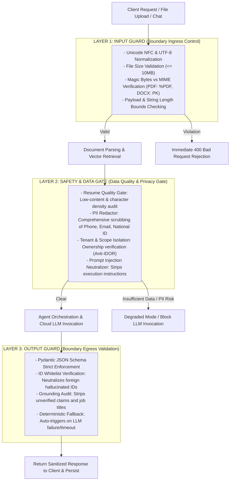

* **Core Architectural Principle**: All three guardrail layers are implemented as deterministic, strictly-typed Python modules (`Pydantic / Dataclasses`) with dedicated unit test suites, avoiding any auxiliary LLM calls to minimize latency and token overhead.

---

# CHAPTER 5: DETAILED INTERFACE AND INTERACTION DESIGN

## 5.1. Frontend User Experience and Component Architecture

The NextJob frontend is built with **React 19**, **Vite**, **TypeScript**, and **Tailwind CSS v4** enhanced with **Framer Motion**:

### 5.1.1. Navigation and View Directory (20 Dedicated Screens)
1. **Public & Authentication Views**:
   - `HomePage.tsx` (`/`): Landing portal, job search bar, top hiring partners.
   - `LoginPage.tsx` (`/login`), `RegisterPage.tsx` (`/register`), `ForgotPasswordPage.tsx`, `ResetPasswordPage.tsx`.
   - `JobListPage.tsx` (`/jobs`), `JobDetailPage.tsx` (`/jobs/:id`).
2. **Candidate Views**:
   - `ProfilePage.tsx` (`/profile`): Master Profile management (Education, Experience, Skills, Projects).
   - `CVVaultPage.tsx` (`/cv-vault`): Resume document repository, signed URL PDF previewer, ingest triggers.
   - `CVBuilderPage.tsx` (`/cv-builder`): Split-pane drag-and-drop resume editor (`@dnd-kit`) with 10 templates.
   - `AISuggestionsPage.tsx` (`/ai-suggestions`): Conversational AI job recommendation and skill gap analysis.
   - `CVAssessmentPage.tsx` (`/cv-assessment`): Resume diagnostic audit scoring ATS compliance.
   - `ApplicationsPage.tsx` (`/applications`): Real-time application tracking dashboard.
   - `RecruiterRegisterPage.tsx` (`/recruiter-register`): Enterprise verification portal with license upload.
3. **Recruiter Views**:
   - `RecruitmentDashboardPage.tsx` (`/dashboard`): Job posting manager and applicant pipeline workspace.
   - `AICandidatePage.tsx` (`/ai-candidates`): AI candidate screening workspace with explainable score cards.
   - `AIInterviewPage.tsx` (`/ai-interview`): Interactive technical mock interview room.
   - `RepoEvaluationPage.tsx` (`/repo-evaluation`): GitHub repository code quality and skill audit analyzer.
4. **Administration Views**:
   - `AdminRecruiterPage.tsx` (`/admin`): Recruiter license auditing portal and user role management.

### 5.1.2. Interactive ATS CV Builder Architecture
The `/cv-builder` screen operates on a split-pane architecture:
* **Left Pane (Master Palette)**: Displays the candidate's verified Master Profile lines.
* **Right Pane (A4 Live Canvas Preview)**: Interactive drag-and-drop workspace (`@dnd-kit`) rendering an authentic $1:\sqrt{2}$ A4 page preview, dynamically switching across 10 templates.
* **Dual-Mode Rendering Engine**:
  - *Canvas Mode*: Leverages `html2canvas` at 2x device pixel ratio combined with `jsPDF` to guarantee flawless font rendering.
  - *ATS Mode*: Emits clean vector text structures optimized for external parsers.

---

## 5.2. RESTful API Specifications

All protected API endpoints require a valid Supabase JWT supplied in the `Authorization: Bearer <token>` header:

| Method | Endpoint Route | Access Role | Description & Data Payload |
|:---:|---|:---:|---|
| `GET` | `/health`, `/api/v1/health` | Public | System health check and readiness probe |
| `GET` | `/api/v1/profiles/me` | Authenticated | Retrieve current user profile and full Master Profile store |
| `PATCH` | `/api/v1/profiles/me` | Authenticated | Update user profile attributes and Master Profile lines |
| `POST` | `/api/v1/resumes/{id}/ingest` | Candidate / Recruiter | Trigger Ingest Agent: layout parsing, 186 skill extraction, and vectorization |
| `POST` | `/api/v1/chat` | Authenticated | Multi-agent conversational gateway (Matching / Recommendations) |
| `POST` | `/api/v1/candidates/repo-eval` | Recruiter / Candidate | Analyze GitHub repository architecture, hygiene, and test coverage |
| `POST` | `/api/v1/evaluation/cv-assess` | Candidate | Score resume across 100-point diagnostic ATS criteria |
| `PATCH` | `/api/v1/admin/profiles/{id}` | Admin | Modify system RBAC role for any target user profile |
| `POST` | `/api/v1/admin/recruiter-forms/{id}/review` | Admin | Approve or reject recruiter verification requests with feedback |

---

## 5.3. Sequence Diagrams for Core Business Workflows

### 5.3.1. Sequence Diagram 1: Resume Ingestion and Embedding Pipeline

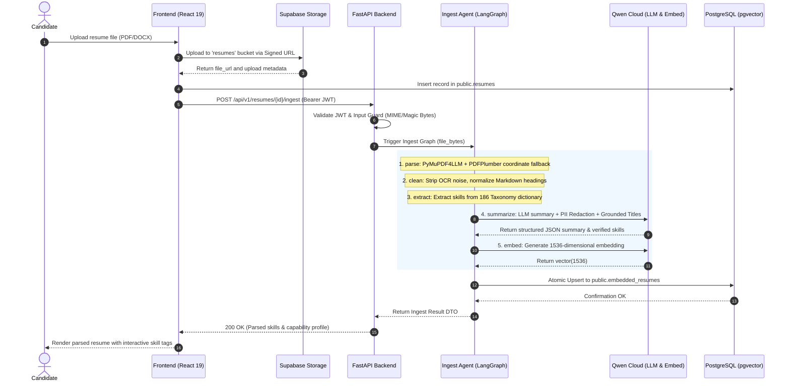

---

### 5.3.2. Sequence Diagram 2: Recruiter Candidate Matchmaking Pipeline

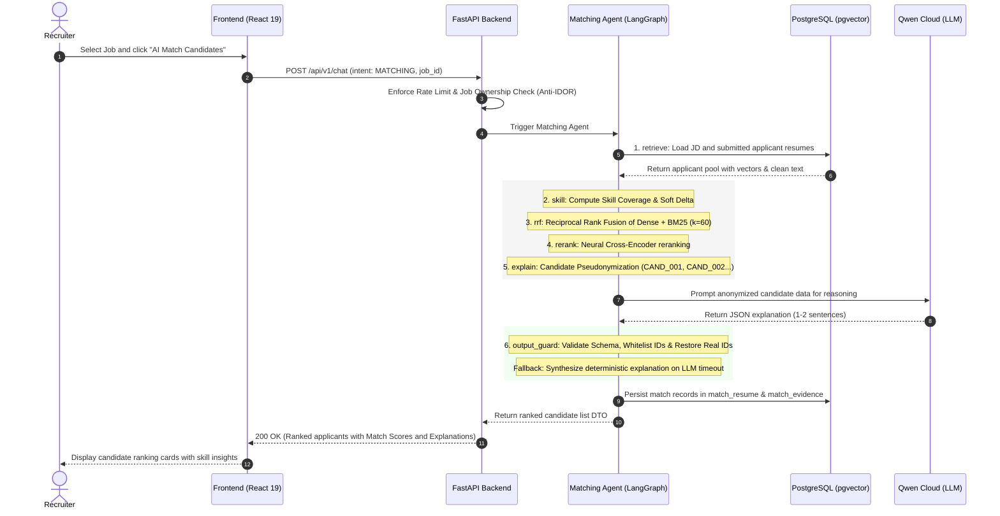

---

# CHAPTER 6: DEPLOYMENT, TESTING, AND EVALUATION

## 6.1. Cloud Infrastructure Deployment and Selection Rationale

NextJob is architected for distributed cloud execution across decoupled tiers: Client-side SPA, Backend Application Server, AI Multi-Agent Engine, and Managed BaaS (Backend-as-a-Service):

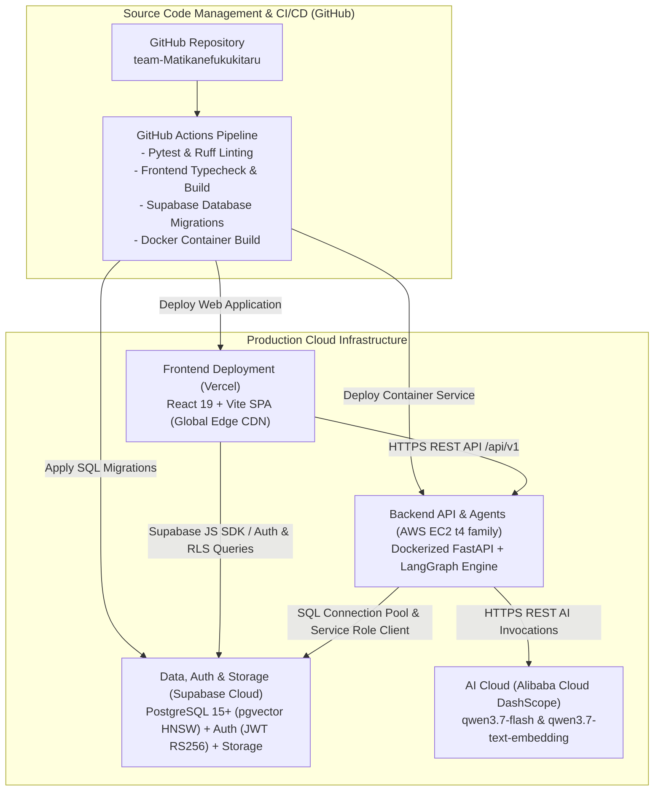

### 6.1.1. Infrastructure Comparison and Platform Selection Matrix

| System Component | Chosen Platform | Considered Alternatives | Primary Decision Rationale |
|---|---|---|---|
| **Frontend Web App** | **Vercel** | Netlify, Cloudflare Pages, AWS S3+CloudFront | **Fast, lightweight, easy to use**, highly optimized for Vite/React SPA, Global Edge CDN, Zero-config CI/CD. |
| **Backend API & AI Agents** | **AWS EC2 (t4 family)** | Render, Railway, Heroku | Render has a strict **500MB RAM limit** & limited traffic quotas; EC2 t4 provides superior RAM (1-2GB+), burstable CPU, high network bandwidth, preventing OOM during heavy CV parsing. |
| **Database, Vector, Auth & Storage** | **Supabase Cloud** | Self-hosted PostgreSQL + MinIO + Keycloak | Seamless Python/JS SDK integration, native `pgvector` HNSW (1536 dim), secure File Storage with Signed URLs, unified Auth & RLS. |

---

### 6.1.2. In-Depth Platform Selection Rationale

#### 1. Frontend: Vercel (Fast — Lightweight — Easy to Use)
* **High Performance & Fast Build**: Vercel offers first-class integration with Vite and React 19 Single Page Applications. Builds and asset bundling execute with minimal latency.
* **Global Edge Network (CDN)**: Static assets (JavaScript bundles, CSS, fonts) are cached and distributed across hundreds of edge locations globally, delivering low latency ($< 50\text{ms}$) to end users.
* **Developer Experience & Automated CI/CD**:
  * Seamless GitHub integration with zero-configuration deployments on every push.
  * Automated SSL/TLS certificate issuance and individual Preview Deployments for every pull request.
  * Effortless client-side routing configuration via `vercel.json` rewrites to prevent 404 errors on deep-link refreshes.

#### 2. Backend API & AI Multi-Agents: AWS EC2 (t4 family) vs Render
* **Why Not Render for Fast Setup?**
  * ❌ **Severe Memory Constraint (512MB / 500MB RAM Limit)**: 
    * The NextJob backend executes complex multi-step LangGraph workflows, binary layout extraction (`pymupdf4llm`, `pdfplumber`, `python-docx`), fuzzy matching across 186 skills (`rapidfuzz`), and BM25 tokenization.
    * When extracting multi-column PDF resumes or processing concurrent evaluation requests, Python process memory regularly exceeds 400MB–600MB RAM. On Render's standard free/starter tier (512MB RAM), the host OS triggers the **Linux OOM (Out-Of-Memory) Killer**, crashing the entire backend instance.
  * ❌ **Strict Bandwidth & Traffic Quotas**: Render enforces tight network bandwidth limits compared to dedicated AWS infrastructure, which easily becomes a bottleneck when streaming AI responses (SSE) or ingesting heavy CV documents.
  * ❌ **Cold Start Latency (Sleep Mode)**: Free/starter Render instances sleep after periods of inactivity, causing 30s–60s initial request delays that trigger client timeouts and degrade user experience.
* **Advantages of AWS EC2 (t4 family - t4g.micro/small/medium)**:
  * ✅ **Abundant & Stable Hardware Resources**: Generous RAM allocation (1GB to 2GB+) combined with ARM Graviton2 / Burstable CPU capacity, ensuring multi-agent execution and document parsing run seamlessly without memory exhaustion.
  * ✅ **High Network Bandwidth & Traffic Throughput**: Stable data transfer up to 5 Gbps without artificial rate throttling during high-concurrency periods.
  * ✅ **Complete Environmental Control**: Full control over Docker container runtimes, underlying C libraries (`poppler-utils`, OCR dependencies), environment variables, logging, and self-healing health check services.

#### 3. Database, Vector, Auth & File Storage: Supabase Cloud (Unified BaaS)
* **Seamless Agent & Backend Integration**: 
  * Features official Python SDK support, enabling Backend services and LangGraph agents to use the `service_role_key` for privileged system operations (bypassing RLS when aggregating global data).
  * Supports direct PostgreSQL connection pooling via **PgBouncer** for high-concurrency asynchronous operations in FastAPI.
* **Comprehensive Vector Storage (`pgvector` + HNSW)**: 
  * Native PostgreSQL integration of `pgvector` supports 1536-dimensional embedding storage with high-speed HNSW indexing ($< 15\text{ms}$ search latency).
  * Enables **Hybrid Search** by uniting vector cosine similarity with relational metadata filtering (SQL WHERE clauses, BM25 text search) within a **single atomic SQL query**, eliminating the overhead of dedicated vector databases (e.g., Pinecone/Milvus).
* **Comprehensive & Secure File Storage**: 
  * Centralized management of storage buckets (`resumes` for candidate files, `avatars` for user profiles).
  * Time-bounded **Signed URLs** allow secure in-browser PDF previewing without exposing public file endpoints.
* **Integrated Authentication & Multi-Tier Row Level Security (RLS)**: 
  * Out-of-the-box Supabase Auth handles JWT session verification (HS256 local, RS256/JWKS cloud).
  * Database-level Row Level Security (RLS) policies enforce granular role-based access control (*Candidate, Recruiter, Admin*), ensuring data isolation and privacy protection.

---

## 6.2. Automated Testing Strategy

The repository maintains an automated test suite comprising **98+ test cases**:

```text
tests/
├── unit/                    # Unit tests for LangGraph nodes & domain services
│   ├── test_ingest_graph.py # Test parse, clean, extract, summarize, embed nodes
│   ├── test_matching_graph.py # Test matching graph, rrf, rerank, fallback nodes
│   ├── test_guardrails.py   # Test Input Guard, Safety Gate, Output Guard
│   └── test_rrf_fusion.py   # Test mathematical RRF fusion and score normalization
├── api/                     # Integration tests for FastAPI endpoints
│   ├── test_auth_routes.py  # Test JWT verification, Fail-Fast, RBAC guards
│   ├── test_resumes_api.py  # Test upload and ingestion routes
│   └── test_chat_routes.py  # Test conversational matching and rate limiting
└── conftest.py              # Pytest fixtures, mock HTTP clients (respx), test database
```

* **Tooling Stack**: `pytest`, `pytest-asyncio`, `respx` (for deterministic HTTP mocking of LLM endpoints), and `ruff` (linter and code formatter).

---

## 6.3. Empirical Evaluation Benchmark with Golden Dataset

To continuously monitor ingestion and vectorization efficacy, the platform integrates an automated **Golden Dataset Benchmark** (`evaluation/ingest_eval_v2/`) containing **41 representative resumes** (synthetic multi-format resumes and complex multi-column real-world CVs from TopCV.vn):

### Benchmark Evaluation Results across 41 Resumes:

| Evaluation Metric | Measured Dimension | Achieved Score | Technical Evaluation & Significance |
|---|:---:|:---:|---|
| **Parse Success Rate** | Layout extraction reliability | **$100.0\%$ (41/41)** | Zero parsing crashes; multi-column CVs handled via PDFPlumber fallback |
| **PII Leakage Prevention** | Sanitization recall for private data | **$100.0\%$** | Zero phone, email, or national ID leakage into LLM context |
| **Skill Extraction Recall** | Taxonomy recall against ground truth | **$93.8\%$** | Extract-First pattern captures technical skills prior to summarization |
| **Summarization Faithfulness** | Groundedness of generated summaries | **$97.5\%$** | Grounded Titles completely eliminates hallucinated executive job titles |
| **Average Ingest Latency** | End-to-end processing duration | **$3.82\text{s}$** | Sub-4-second real-time responsiveness per resume document |

---

# CHAPTER 7: CONCLUSION AND FUTURE ROADMAP

## 7.1. Summary of Project Achievements

The **NextJob Platform (Capstone Project P-099)** has successfully attained its research and engineering goals:

1. **Theoretical & Architectural Contributions**:
   - Successfully designed and deployed **Multi-Agent Orchestration (LangGraph)** for bidirectional recruitment matchmaking.
   - Formulated a high-precision **Hybrid Ranking Model** synthesizing dense vector embeddings (pgvector HNSW), sparse lexical matching (BM25), and a 186-term Skill Knowledge Graph via Reciprocal Rank Fusion ($k=60$).
   - Established a **Three-Layer Deterministic Guardrail System** safeguarding user privacy, preventing prompt injection, and eliminating runtime failure states.
2. **Practical & Engineering Deliverables**:
   - Delivered a responsive Web Application featuring 20 dedicated screens supporting Candidates, Recruiters, and Administrators.
   - Solved repetitive profile entry through the **Master Profile Line System** and **Visual ATS CV Builder** offering 10 customizable templates.
   - Introduced technical assessment innovations: GitHub Repository Quality Auditing, Interactive AI Mock Interviewing, and Diagnostic CV ATS Scoring.
   - Validated stability through 98+ automated tests and empirical validation across the 41-resume Golden Dataset.

## 7.2. Strengths and Current Limitations

### Distinct Advantages:
* **Explainable & Objective**: Replaces opaque matching scores with transparent 1-2 sentence Vietnamese explanations anchored in verified skill evidence.
* **Privacy-Preserving Architecture**: Enforces pseudonymization during LLM prompting, preventing candidate identity leakage.
* **High Operational Resilience**: Deploys deterministic fallbacks across all critical paths, guaranteeing continuous uptime even during external AI outages.

### Current Limitations:
* The skill taxonomy currently specializes in Information Technology (IT); expansion into non-tech domains (Healthcare, Finance, Civil Engineering) remains in development.
* AI Mock Interviews are currently conducted via conversational text, with real-time voice interaction slated for future integration.

## 7.3. Future Enhancements

1. **Dynamic Cross-Domain Skill Taxonomy**: Integrate semi-supervised continuous learning to discover and catalog emerging technical skills from live job postings automatically.
2. **Real-time WebRTC Voice AI Interviewer**: Incorporate WebRTC streaming and Speech-to-Speech models to deliver lifelike verbal mock technical interviews.
3. **Multi-Cloud Intelligent LLM Routing**: Route standard operational queries to self-hosted lightweight models (vLLM / Ollama) while reserving large cloud models for complex reasoning, optimizing operational expenditure.

---

# REFERENCES

1. **Cormack, G. V., Clarke, C. L., & Buettcher, S. (2009)**. *Reciprocal rank fusion outperforms cumulated gain and MAP in IR*. In Proceedings of the 32nd international ACM SIGIR conference on Research and development in information retrieval (pp. 758-759).
2. **Malkov, Y. A., & Yashunin, D. A. (2018)**. *Efficient and robust approximate nearest neighbor search using hierarchical navigable small world graphs*. IEEE Transactions on Pattern Analysis and Machine Intelligence, 42(4), 824-836.
3. **LangChain & LangGraph Development Team (2024)**. *LangGraph: Building Stateful, Multi-Actor Applications with LLMs*. Official Documentation.
4. **FastAPI Development Team (2024)**. *FastAPI Framework: High performance, easy to learn, fast to code, ready for production*.
5. **Supabase & PostgreSQL Community (2024)**. *pgvector: Open-source vector similarity search for Postgres*.
6. **Alibaba Cloud DashScope Team (2024)**. *Qwen Technical Report: Advanced Large Language and Embedding Models*.
7. **Robertson, S., & Zaragoza, H. (2009)**. *The Probabilistic Relevance Framework: BM25 and Beyond*. Foundations and Trends in Information Retrieval, 3(4), 333-389.

---

<div align="center">
  <sub>System Analysis and Design Report — Project P-099 NextJob — Team Matikanefukukitaru.</sub>
</div>
